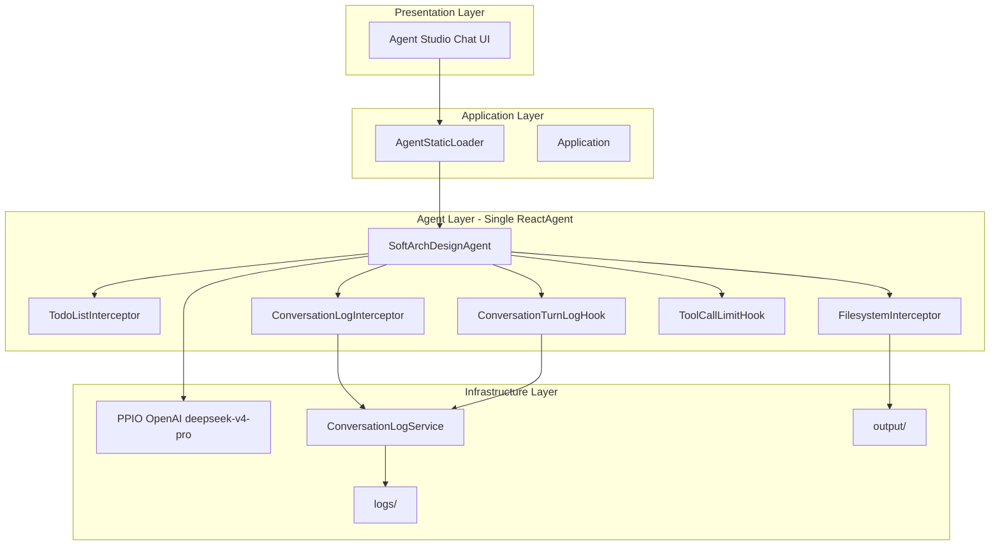
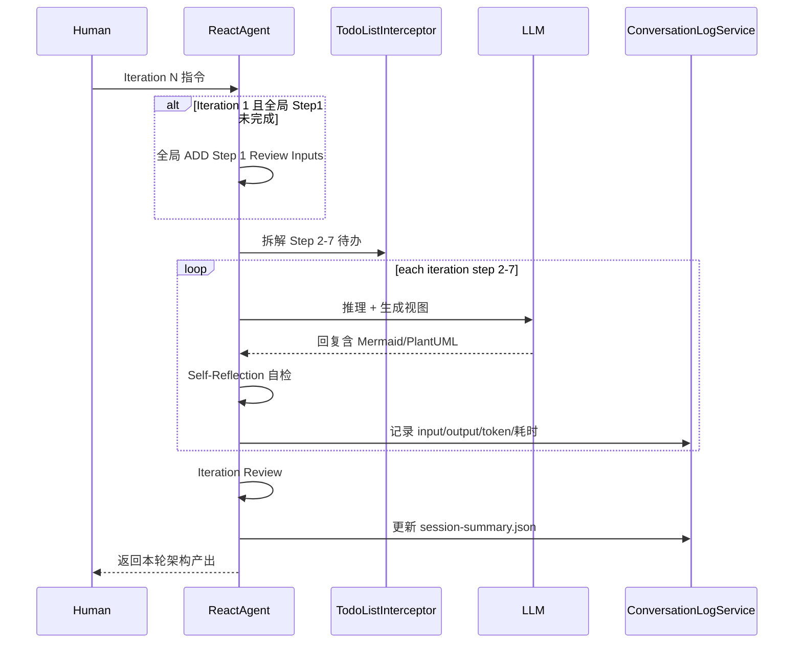

# SoftArch Designer Agent

基于 Spring AI Alibaba 的**单智能体**软件架构设计 Agent，用于 2026 软件架构课程作业 2（选项 2：顺序推理 + 自我反思）。

使用 ADD 3.0 方法，对**酒店定价系统（Hotel Pricing System）**案例进行四轮架构设计迭代。

## 作业对应关系

| 项目 | 本示例 |
|------|--------|
| AI 范式 | 选项 2：单智能体（Sequential Reasoning + Self-Reflection） |
| LLM | `deepseek/deepseek-v4-pro`（经 PPIO OpenAI 兼容接口） |
| API 中转 | `https://api.ppio.com/openai` |
| 案例 | 酒店定价系统（Greenfield） |
| 方法 | ADD 3.0，四轮迭代 |

## 系统架构

### 四层架构总览



| 层级 | 组件 | 职责 |
|------|------|------|
| Presentation | Agent Studio Chat UI | 学生在浏览器中人工驱动 4 轮迭代对话 |
| Application | `Application`、`AgentStaticLoader` | Spring Boot 启动、注册 Agent 到 Studio |
| Agent | 单 `ReactAgent` + Interceptor + Hook | ADD 3.0 顺序推理、自我反思、任务规划、文件输出 |
| Infrastructure | PPIO API、`ConversationLogService` | 大模型调用、完整日志与架构产物持久化 |

**明确不使用**：`SubAgentInterceptor`（多智能体）、MCP 搜索、外部领域知识检索。

### Agent 内部工作流



### 日志架构

采用 **AgentHook（对话轮次）+ Interceptor（LLM 调用细节）+ ConversationLogService** 三层记录：

| 粒度 | 触发点 | 记录内容 |
|------|--------|----------|
| 对话轮次（Turn） | 用户在 Chat UI 发送一条消息 | 完整 **input** + **output** |
| LLM 调用（Call） | Agent 内部每次模型调用 | 完整请求消息、模型回复、token、耗时 |

| 文件（均在 `logs/{时间戳}/` 下，与 `output/{时间戳}/` 一一对应） | 内容 |
|------|------|
| `conversation-turns.jsonl` | 每次对话的完整 input + output（JSON 逐行，作业提交核心） |
| `conversation-turns.log` | 同上，人类可读格式 |
| `llm-calls.log` | 每次 LLM 调用的完整请求输入 + 模型输出 + token + 反思段落 |
| `system-prompt.txt` | 完整系统指令（先验知识 + 约束 + 反思协议） |
| `session-summary.json` | 会话汇总：人工交互次数、token 消耗（千令牌）、各迭代耗时 |

`session-summary.json` 可直接用于报告附录「交互成本分析」表格。

## 快速开始

### 前置条件

- **JDK 17+**（必须，项目使用 Java 17 文本块等特性）
- API Key 已配置在 `src/main/resources/application.yml` 的 `spring.ai.openai.api-key`

```bash
# Windows PowerShell（需 JDK 17）
$env:JAVA_HOME = "C:\Program Files\Java\jdk-17"
```

### 启动

```bash
cd examples/SoftArchDseigner
mvn spring-boot:run
```

启动后访问：**http://localhost:8082/chatui/index.html**

选择 Agent：`softarch_designer`

### 推荐使用方式（4 轮迭代）

在 Chat UI 中依次发送以下 4 条英文指令（每轮一条）：

```
Execute ADD Iteration 1: Establish overall system structure
```

```
Execute ADD Iteration 2: Identify structures supporting primary functionality
```

```
Execute ADD Iteration 3: Address reliability and availability quality attributes
```

```
Execute ADD Iteration 4: Address development and operations
```

**ADD 工作流（作业模板）**：全局 **Step 1（Review Inputs）仅做一次**；四轮迭代各执行 **Step 2–7**。
第 1 条 Iteration 1 指令会在**同一轮**内先完成全局 Step 1，再执行 Iteration 1 的 Step 2–7；Iteration 2–4 各只做 Step 2–7。
每步后写入 `## Self-Reflection`，每轮 Step 7 后输出 `## Iteration Review`。

## 配置说明

| 配置项 | 值 | 位置 |
|--------|-----|------|
| base_url | `https://api.ppio.com/openai` | `OpenAiModelConfig.java` / `application.yml` |
| model | `deepseek/deepseek-v4-pro` | `OpenAiModelConfig.java` / `application.yml` |
| API Key | `application.yml` 中硬编码 | `application.yml` / `OpenAiModelConfig.java` |
| 日志目录 | `logs/` | `application.yml` → `softarch.logs-dir` |
| 输出根目录 | `output/` | `application.yml` → `softarch.output-dir` |

## 会话目录结构（output + logs 共用时间戳）

### 会话语义（重要）

| 行为 | 结果 |
|------|------|
| 在 Chat UI **新建会话（新 Thread）** | 分配**新的**时间戳目录 |
| 在**同一会话**中连续发送 Iteration 1–4 | **共用同一时间戳**的 `output/{ts}/` 与 `logs/{ts}/` |
| 应用启动时 | **不会**预创建目录；目录在**该 Thread 首条消息**到达时创建 |

**作业建议**：4 轮迭代请在**同一个 Chat 会话**中依次发送 4 条指令，不要每轮新建 Thread。

### 路径强制绑定

`SessionPathToolInterceptor` 在工具层强制将 `read_file` / `edit_file` / `ls` 等路径重写到当前会话的 `output/{时间戳}/` 下。Agent **无法**再自建如 `output/2025-01-15_000000/` 这类目录；`write_file` 对 `step-1-review-inputs.md` 及 `iteration-N/step-2.md`…`step-7.md` 会被拒绝，必须使用 `read_file` + `edit_file`。

每次在 Chat UI **新建会话（新 Thread）** 时，会自动创建**相同时间戳**的 output 与 logs 子目录，避免不同次运行互相覆盖：

```
output/2026-06-10_164530/          logs/2026-06-10_164530/
├── session-info.md                ├── conversation-turns.jsonl
├── step-1-review-inputs.md        ├── conversation-turns.log
├── iteration-1/                   ├── llm-calls.log
│   ├── step-2.md … step-7.md      ├── system-prompt.txt
├── iteration-2/ …                 └── session-summary.json
├── iteration-3/ …
└── iteration-4/ …
```

- **output**：1 个全局 Step 1 文件 + 4×6 个迭代 step 文件（含 `__SOFTARCH_PENDING__` 占位符）
- **logs**：同一会话的全部对话日志与 LLM 调用记录

Agent 对每个 step：**read_file → edit_file** 将 `__SOFTARCH_PENDING__` 替换为完整内容（`write_file` 不能覆盖已存在文件）。

同一 Thread 内多次发消息（如 Iteration 1 完成后继续 Iteration 2）共用同一时间戳目录。

## 交付物对应

| 作业要求 | 本项目的产出位置 |
|----------|------------------|
| 源代码 (15 分) | 本目录全部源码 |
| 完整对话日志含时间戳 (15 分) | `logs/{时间戳}/conversation-turns.log` + `logs/{时间戳}/llm-calls.log` |
| 报告 (20 分) | 将 `output/{时间戳}/` 中架构设计整理为英文报告；`logs/{时间戳}/session-summary.json` 填入成本分析 |
| 交互成本分析 | `logs/{时间戳}/session-summary.json` → `humanInteractionCount`、`tokenUsage.totalTokensK` |

### 提交检查清单

1. 在同一 Chat 会话中完成 Iteration 1–4（共 4 条用户消息）。
2. 确认 `output/{时间戳}/` 与 `logs/{时间戳}/` 使用**相同**时间戳（查看 `output/{ts}/session-info.md`）。
3. 提交 `output/{时间戳}/` 全部迭代产物 + `logs/{时间戳}/` 全部日志。
4. 若存在无对应 `logs/` 的 `output/` 目录，说明是修复前 Agent 自建路径，请重新跑一轮或手动对齐时间戳。

## 报告导出

会话完成后，可将 `output/{时间戳}/` 与 `logs/{时间戳}/` 合并为作业报告草稿。

**报告结构（已对齐作业附录）**：

1. `## ADD Step 1: Review Inputs (Global)` ← `step-1-review-inputs.md`
2. `## Iteration 1` … `### ADD Step 2` … `### ADD Step 7`
3. `## Iteration 2–4` … 各轮仅 `### ADD Step 2` … `### ADD Step 7`（无重复 Step 1）
4. `## Interaction Cost Analysis` ← `session-summary.json`
5. `## Personal Reflection`（需手工填写）

将 `{时间戳}` 换成你本次会话目录名（须 output 与 logs 成对存在）：

```powershell
cd examples/SoftArchDseigner
$env:JAVA_HOME = "C:\Program Files\Java\jdk-17"
mvn -q compile exec:java `
  "-Dexec.mainClass=com.alibaba.cloud.ai.examples.softarchdesigner.report.ReportExportCli" `
  "-Dexec.args=output/2026-06-10_192349 logs/2026-06-10_192349"
```

生成 `output/{时间戳}/REPORT.md`。

> **注意**：旧 session（如 `2026-06-10_170539`，4×7 结构、无 `step-1-review-inputs.md`）导出时 Global Step 1 会显示 `_Step file not found_`。请用**新工作流**跑完四轮后再导出。

## 日志修复说明（2026-06-10 后）

`ConversationLogInterceptor` 已修复流式（Flux）场景下的日志记录：

- 每次 LLM 调用的 RESPONSE 包含文本或 `[tool_calls only]` 段
- duration 在流结束后计算，不再为 0ms
- `selfReflectionCount` 支持 `## Self-Reflection (Step N)` 格式

**建议**：修复后在新 Chat 会话中重跑 Iteration 1–4，使 `llm-calls.log` 记录完整工具循环。Mock 验证：`mvn test -Dtest=MockSessionIntegrationTest`

## Mock 模式（本地无 API）

```powershell
mvn spring-boot:run "-Dspring-boot.run.profiles=mock"
```

端口 **8083**，产物目录 `output-mock/`、`logs-mock/`。

## 项目结构

```
examples/SoftArchDseigner/
├── pom.xml
├── README.md
└── src/main/java/.../softarchdesigner/
    ├── Application.java
    ├── OpenAiModelConfig.java
    ├── SoftArchDesignAgent.java
    ├── AgentStaticLoader.java
    ├── knowledge/
    │   ├── Add30Knowledge.java
    │   └── HotelPricingSystemKnowledge.java
    ├── hook/
    │   ├── ConversationTurnLogHook.java
    │   └── OutputSessionHook.java
    ├── output/
    │   └── OutputSessionService.java
    ├── interceptor/
    │   ├── ConversationLogInterceptor.java
    │   ├── OutputPathInterceptor.java
    │   ├── SessionPathToolInterceptor.java
    │   └── RateLimitRetryInterceptor.java
    ├── logging/
    │   ├── ConversationLogService.java
    │   ├── SessionMetrics.java
    │   └── ConversationTurn.java
    └── report/
        ├── ReportExportService.java
        └── ReportExportCli.java
```

## 编译

```bash
# 确保使用 JDK 17
mvn compile -DskipTests
```

## 常见问题

### 400 Bad Request（切换到 `pa/gpt-5.4` 等推理模型）

日志示例：

```
400 Bad Request from POST https://api.ppio.com/openai/v1/chat/completions
Streaming model call failed after 1 attempt(s)
```

**常见原因**：

1. **工具参数 schema 不合规**（最常见）：`pa/gpt-5.4` 要求每个工具的 parameters 必须是 `type: "object"`。若日志出现：
   ```
   Invalid schema for function 'ls': schema must be a JSON Schema of 'type: "object"', got 'type: "string"'
   ```
   说明 `ls`/`glob` 等工具的参数格式不对（已修复为 `{"path": "..."}` / `{"pattern": "..."}` 对象格式）。

2. **推理模型参数限制**：`pa/gpt-5.4` 对 `temperature`、`max_tokens` 也更严格，通常只接受 `temperature: 1` 和 `max_completion_tokens`。

**已内置处理**（`OpenAiModelConfig.java`）：

- 检测到 `pa/gpt-*`、`gpt-5*`、`o1/o3/o4` 等推理模型时，自动设置 `temperature=1.0`、`maxCompletionTokens=16384`
- 排除 `OpenAiChatAutoConfiguration`，避免自动配置再注入一份带默认 `temperature=0.7` 的 ChatModel

若仍报 400，请查看日志中的 `PPIO response body:` 行，里面会有具体字段错误说明。

### 403 Forbidden from `api.ppio.com/openai/v1/chat/completions`

应用和 URL 配置正常时，403 通常**不是代码问题**，而是 PPIO 账号权限问题。

PPIO 返回示例：

```json
{"code":403, "reason":"ACCESS_DENY", "message":"access deny", "metadata":{"reason":"model: deepseek/deepseek-v4-pro access denied"}}
```

常见原因（参见 [PPIO 文档](https://ppio.com/docs/model/FAQs)）：

| 原因 | 处理方式 |
|------|----------|
| 模型 `deepseek/deepseek-v4-pro` 未开通 | 登录 [PPIO 控制台](https://ppio.com) 申请该模型访问权限（加白） |
| 账号余额不足 | 充值后重试（可在控制台查看余额） |
| API Key 无效 | 检查 `application.yml` 中的 key 是否与控制台一致 |

自检命令（PowerShell）：

```powershell
curl.exe -X POST "https://api.ppio.com/openai/v1/chat/completions" `
  -H "Content-Type: application/json" `
  -H "Authorization: Bearer <你的API_KEY>" `
  -d "{\"model\":\"deepseek/deepseek-v4-pro\",\"messages\":[{\"role\":\"user\",\"content\":\"hi\"}],\"max_tokens\":5}"
```

若返回 `ACCESS_DENY`，需联系 PPIO 或课程助教开通 `deepseek/deepseek-v4-pro` 模型权限后再使用。

### 429 Too Many Requests（请求过于频繁）

Agent 每轮迭代会多次调用 LLM（工具循环 + ADD 七步 + 自反思），容易触发 PPIO 的 RPM 限流。

日志示例：

```
429 Too Many Requests from POST https://api.ppio.com/openai/v1/chat/completions
```

**已内置处理**：`RateLimitRetryInterceptor`（自定义，兼容流式 Flux；框架自带的 `ModelRetryInterceptor` 1.1.2.2 不支持流式）会在遇到 429 时自动退避重试（最多 5 次，初始等待 5 秒，指数退避至 60 秒）。

若仍频繁失败，可尝试：

| 方式 | 说明 |
|------|------|
| 等待后重试 | 暂停 1–2 分钟，在 Chat UI 中重新发送当前迭代指令 |
| 分步执行 | 一次只跑一个迭代，例如先 `Execute ADD Iteration 1`，完成后再发 Iteration 2 |
| 减少并发 | 不要同时开多个 Chat 会话调用同一 API Key |
| 升级配额 | 登录 [PPIO 控制台](https://ppio.com) 查看 RPM 限制，必要时升级套餐 |

### Tool call limits exceeded（工具调用次数用尽）

一轮 ADD 迭代（Step 2–7 共 6 步 + 写文件 + 待办；Iteration 1 首轮另含全局 Step 1）通常需要 20–40 次工具调用。若 Agent 误读不存在的文件（如批量 `read_file` 不存在的 step 文件），会更快耗尽上限并停止。

当前配置：`ToolCallLimitHook.runLimit = 60`（单次用户消息内的工具调用上限）。

**恢复方式**：在同一会话中发送续跑指令，例如：

```
Continue ADD Iteration 1 from Step 2. Use ls on the session iteration-1 folder first, then edit_file each remaining step file.
```

**避免再次卡住**：

| 建议 | 说明 |
|------|------|
| 先 ls 再读 | Agent 应用 `ls` 列出当前会话的 `iteration-N/` 目录，确认 step 文件已预创建 |
| 用 edit_file | 所有 step 文件已预创建，用 `read_file` + `edit_file` 替换 `__SOFTARCH_PENDING__`，不要用 `write_file` |
| 分步迭代 | 一次只跑一个 Iteration；若中断，用「从 Step N 继续」而非重跑整轮 |
