# Hotel Pricing System — ADD 3.0 Architecture Design Report

Generated from session output folder: `2026-06-10_170539`

## ADD Step 1: Review Inputs (Global)

_Step file not found: step-1-review-inputs.md_

## Iteration 1: Establish overall system structure

### ADD Step 2: Establish Iteration Goal by Selecting Drivers

# ADD Step 2: Establish Iteration Goal by Selecting Drivers (Iteration 1)

## Iteration Goal
**Establish the preliminary overall system structure** — define the high-level decomposition of the Hotel Pricing System, its system context (external actors and systems), and the primary architectural style that will guide further refinement. This iteration answers: _What are the major parts of the system and how do they relate to each other and to external entities?_

## Selected Architectural Drivers

The following drivers are selected as the focus for this iteration because they directly shape the overall structure:

| Priority | Driver | Justification |
|----------|--------|---------------|
| **Primary** | CRN-1 | This is the explicit goal: "Establish preliminary overall system structure." |
| **Primary** | CON-6 | Cloud-native approach must be prioritized when designing the system. This directly influences the deployment topology and service decomposition. |
| **Primary** | CON-1 | Users interact via web browsers on Windows, OSX, Linux. This means a browser-based frontend is required, establishing a clear frontend/backend split. |
| **Secondary** | CON-2 | Users managed via cloud provider identity service; resources hosted in the cloud. Shapes integration with external identity and cloud deployment model. |
| **Secondary** | CRN-2 | Team knowledge of Java, Angular, Kafka. These technology anchors guide component technology choices within the structure. |
| **Secondary** | QA-6 | Support new protocols (gRPC) without changing core components. This drives clean separation between API protocols and core business logic from the start. |
| **Secondary** | QA-7 | Move between non-production environments without code changes. Externalized configuration must be part of the structural design. |
| **Secondary** | CON-4 | MVP demo within 2 months. The initial structure must be simple enough to deliver quickly yet allow incremental growth. |

## Drivers Deferred to Later Iterations

| Driver | Reason for Deferral |
|--------|---------------------|
| QA-1 (Performance) | Internal component-level design; addressed in Iteration 2. |
| QA-2 (Reliability) | Detailed mechanisms needed; addressed in Iteration 3. |
| QA-3 (Availability) | Deployment topology detail; addressed in Iteration 3. |
| QA-4 (Scalability) | Scaling strategy; partially influenced by structure but detailed in Iteration 2. |
| QA-5 (Security) | Authorization mechanisms; addressed when refining internal elements. |
| QA-8 (Monitorability) | Metrics infrastructure; addressed in Iteration 4. |
| QA-9 (Testability) | Integration testing patterns; addressed in Iteration 4. |
| CRN-3, CRN-4, CRN-5 | Development process concerns; addressed in Iteration 4. |
| CON-3, CON-5 | Infrastructure/platform concerns; noted but not structural drivers now. |

## Success Criteria for This Iteration
1. System context is defined (all external actors and systems identified).
2. A high-level decomposition of the system into 3–7 top-level architectural elements is produced.
3. The primary architectural style/pattern is selected and justified.
4. Responsibilities of each top-level element are clearly stated.
5. Technology choices for major elements are aligned with team expertise (CRN-2) and cloud-native (CON-6).

### ADD Step 3: Choose System Elements to Refine

# ADD Step 3: Choose One or More System Elements to Refine (Iteration 1)

## Greenfield Development Context

This is a greenfield project. The design activity begins with no existing architectural elements. Following ADD 3.0 guidance for greenfield systems, we must first establish the **system context** — identifying all external entities that interact with the system — and then select the system itself as the sole element to decompose.

## Element Selected for Refinement

**System Element: Hotel Pricing System (the system as a whole)**

This is the only available element at this stage. The goal is to decompose it into top-level architectural elements that define the overall structure.

## External Entities (System Context)

Before decomposing, we identify all external actors and systems from the requirements:

| External Entity | Type | Interaction | Source |
|-----------------|------|-------------|--------|
| **Business User** | Human Actor | Logs in, changes prices, queries prices via browser | HPS-1, HPS-2, HPS-3 |
| **Administrator** | Human Actor | Logs in, manages hotels/rates/users via browser | HPS-1, HPS-4, HPS-5, HPS-6 |
| **User Identity Service** | External System (Cloud Provider) | Validates user credentials | HPS-1, CON-2 |
| **Channel Management System** | External System | Receives published price changes | HPS-2, QA-2 |
| **External Systems (Query API Consumers)** | External System(s) | Query hotel prices via API | HPS-3, QA-4 |
| **Web Browser** | Client Platform | Rendering platform for UI (Windows, OSX, Linux) | CON-1 |

## Decomposition Strategy

From the system context and selected drivers (cloud-native, team expertise, protocol flexibility), the decomposition should recognize:

1. **User-facing concerns** vs. **API-facing concerns** — browsers (CON-1) and external API consumers are distinct interaction channels.
2. **Core business logic** — price calculation, hotel/rate management — should be isolated from interaction protocols (QA-6).
3. **Cloud-native** (CON-6) and **team expertise** (CRN-2: Java backend, Angular frontend, Kafka) suggest a service-based decomposition with distinct frontend and backend tiers.
4. **External integrations** (identity service, channel management) require dedicated integration elements.

The system will be refined in Step 4 by selecting appropriate design concepts and in Step 5 by instantiating specific elements.

### ADD Step 4: Choose Design Concepts

# ADD Step 4: Choose One or More Design Concepts (Iteration 1)

## Design Concept Alternatives

### Alternative A: Monolithic Layered Architecture
Single deployable backend with internal horizontal layers (Presentation → Business Logic → Data Access), plus a separate Angular SPA frontend. All business capabilities co-located.

| Driver | Assessment |
|--------|------------|
| CON-6 (Cloud-Native) | ⚠ Weak — single deployable limits independent scaling and cloud-native patterns |
| CON-4 (2-Month MVP) | ✅ Strong — simplest to develop and deploy |
| QA-6 (Protocol Flexibility) | ⚠ Weak — protocol concerns tangled with business logic in presentation layer |
| QA-7 (Deployability) | ✅ Strong — single artifact to move between environments |
| CRN-2 (Java, Angular, Kafka) | ✅ Compatible — Angular frontend, Java monolith, Kafka for external integration |

### Alternative B: Full Microservices Architecture
Each business capability (pricing, hotel management, user management) is an independently deployable service with its own data store. API Gateway routes requests.

| Driver | Assessment |
|--------|------------|
| CON-6 (Cloud-Native) | ✅ Strong — fully aligned with cloud-native, independent scaling |
| CON-4 (2-Month MVP) | ❌ Weak — operational complexity (service discovery, distributed data, CI/CD pipelines) threatens 2-month timeline |
| QA-6 (Protocol Flexibility) | ✅ Strong — each service can expose multiple protocols independently |
| QA-7 (Deployability) | ⚠ Moderate — each service deployable independently but orchestration adds complexity |
| CRN-2 (Java, Angular, Kafka) | ✅ Compatible — each service in Java, Angular frontend, Kafka for inter-service comms |

### Alternative C: Modular Monolith with Hexagonal (Ports & Adapters)
Single deployable backend with strict module boundaries. Core business logic isolated behind ports; adapters handle REST, database, Kafka, etc. Angular SPA frontend.

| Driver | Assessment |
|--------|------------|
| CON-6 (Cloud-Native) | ⚠ Weak — single deployable limits cloud-native benefits but can be containerized |
| CON-4 (2-Month MVP) | ✅ Strong — simple deployment, lower operational overhead |
| QA-6 (Protocol Flexibility) | ✅ Strong — ports isolate core from protocols; new adapters add gRPC without changing core |
| QA-7 (Deployability) | ✅ Strong — single artifact; external config per environment |
| CRN-2 (Java, Angular, Kafka) | ✅ Compatible — Java monolith, Angular frontend, Kafka adapter |

### Alternative D: Service-Based Architecture (3-5 Services)
Moderate decomposition: frontend SPA, API Gateway, Pricing Service, Hotel Management Service. Each service is independently deployable but may share a database initially. Kafka for async integration with channel management.

| Driver | Assessment |
|--------|------------|
| CON-6 (Cloud-Native) | ✅ Strong — multiple services, containerizable, supports independent scaling of pricing vs. management |
| CON-4 (2-Month MVP) | ✅ Moderate-Strong — 3-5 services is manageable; team knowledge of Java reduces risk |
| QA-6 (Protocol Flexibility) | ✅ Strong — API Gateway as protocol boundary; new protocols plug in at gateway |
| QA-7 (Deployability) | ✅ Strong — each service independently deployable; externalized configuration |
| CRN-2 (Java, Angular, Kafka) | ✅ Strong — Angular SPA, Java services, Kafka for channel management integration |

## Selected Alternative: **Alternative D — Service-Based Architecture with Ports & Adapters**

### Rationale

1. **CON-6 (Cloud-Native):** Multiple services enable independent scaling, containerized deployment, and alignment with cloud-native principles without the full complexity of microservices.

2. **CON-4 (2-Month MVP):** 3-5 services is an achievable scope. The team already knows Java, Angular, and Kafka, reducing ramp-up risk.

3. **QA-6 (Protocol Flexibility):** The API Gateway acts as the protocol boundary. Core services expose technology-agnostic interfaces (ports). Adding gRPC requires a new adapter at the gateway — no core changes.

4. **QA-7 (Deployability):** Each service is independently deployable with externalized configuration per environment.

5. **CRN-2 (Team Expertise):** Direct alignment — Angular for the SPA, Java for backend services, Kafka for asynchronous price publication to the channel management system.

6. **QA-3 (Availability):** Service separation allows the pricing query path to be scaled independently from management functions, supporting the 99.9% uptime SLA.

### Key Design Concepts Applied

| Design Concept | Application |
|----------------|-------------|
| **Service-Based Architecture** | 3-5 independently deployable services aligned with business capabilities |
| **Ports & Adapters (Hexagonal)** | Core business logic behind ports; REST, Kafka, DB as adapters |
| **SPA (Single Page Application)** | Angular frontend as browser client (CON-1) |
| **API Gateway** | Single entry point for both browser and external API consumers; protocol boundary |
| **Event-Driven (Kafka)** | Asynchronous price publication to channel management system |
| **Externalized Configuration** | Environment-specific configuration outside deployable artifacts (QA-7) |

### ADD Step 5: Instantiate Elements, Assign Responsibilities, and Define Interfaces

# ADD Step 5: Instantiate Architectural Elements, Assign Responsibilities, and Define Interfaces (Iteration 1)

## Top-Level Architectural Elements

Based on the Service-Based Architecture with Ports & Adapters (Alternative D, Step 4), the Hotel Pricing System is decomposed into the following top-level elements:

---

### Element 1: HPS Web Frontend (Angular SPA)

| Attribute | Detail |
|-----------|--------|
| **Type** | Application Component — Browser-Based SPA |
| **Technology** | Angular (per CRN-2) |
| **Deployment** | Static web assets served via CDN/cloud storage; runs in user's browser |

**Responsibilities:**
- Render user interface for all use cases (Login, Change Prices, Query Prices, Manage Hotels, Manage Rates, Manage Users)
- Authenticate users via cloud identity service (CON-2) — redirect to identity provider, handle tokens
- Enforce client-side authorization: show only functions the authenticated user is permitted to access
- Communicate exclusively with the API Gateway via REST (CON-5)
- Support Windows, OSX, Linux browsers (CON-1)

**Provided Interface:**
- Browser-based graphical user interface (HTML/CSS/JS rendered in browser)

**Required Interface (consumes):**
- `REST /api/*` — All backend operations via the API Gateway
- Cloud Identity Service OAuth2/OIDC endpoints (external, per CON-2)

---

### Element 2: API Gateway

| Attribute | Detail |
|-----------|--------|
| **Type** | Infrastructure Component — API Gateway |
| **Technology** | Java (per CRN-2), cloud-managed gateway service (cloud-native, CON-6) |
| **Deployment** | Containerized, cloud-hosted |

**Responsibilities:**
- Provide a single entry point for all external requests (both browser SPA and external API consumers)
- Route requests to appropriate backend services (Pricing Service, Hotel Management Service)
- Authenticate/validate tokens against User Identity Service
- Enforce coarse-grained authorization (verify user has access before routing)
- Act as protocol boundary — expose REST today; support additional protocols (gRPC) via new adapters without changing core services (QA-6)
- Handle cross-cutting concerns: rate limiting, request logging, CORS

**Provided Interfaces:**
- `REST /api/prices/*` → routes to Pricing Service
- `REST /api/hotels/*` → routes to Hotel Management Service
- `REST /api/rates/*` → routes to Hotel Management Service
- `REST /api/users/*` → routes to Hotel Management Service
- `REST /api/auth/*` → authentication endpoints

**Required Interfaces (consumes):**
- Pricing Service internal REST/gRPC endpoints
- Hotel Management Service internal REST/gRPC endpoints
- User Identity Service token validation endpoints (external, per CON-2)

---

### Element 3: Pricing Service

| Attribute | Detail |
|-----------|--------|
| **Type** | Business Service — Core Domain Service |
| **Technology** | Java (per CRN-2), Ports & Adapters pattern |
| **Deployment** | Containerized, cloud-hosted, independently scalable |

**Responsibilities:**
- Process price changes (base prices, fixed prices) [HPS-2]
- Calculate derived rate prices from base prices using business rules [HPS-2]
- Support price simulation before committing changes [HPS-2]
- Serve price queries for specific hotels [HPS-3]
- Publish price changes to Channel Management System via Kafka [HPS-2, QA-2]
- Persist and retrieve pricing data

**Provided Interfaces (Ports — technology-agnostic):**
- `changePrices(hotelId, dates, prices)` — Apply base/fixed price changes; triggers derived rate calculation
- `simulatePrices(hotelId, dates, prices)` — Simulate price changes without persisting
- `queryPrices(hotelId, dateRange, rateTypes)` — Return current prices
- `publishPrices(hotelId, prices)` — Publish price changes (triggers Kafka event)

**Required Interfaces (consumes):**
- Hotel Management Service: `getHotelConfiguration(hotelId)` — Retrieve hotel tax rates, available rates, room types for price calculation
- Hotel Management Service: `getRateRules(rateId)` — Retrieve business rules for derived rate calculation
- Kafka Topic `price-changes` — Publish price change events to Channel Management System
- Pricing Database — Persist and query price data

---

### Element 4: Hotel Management Service

| Attribute | Detail |
|-----------|--------|
| **Type** | Business Service — Supporting Domain Service |
| **Technology** | Java (per CRN-2), Ports & Adapters pattern |
| **Deployment** | Containerized, cloud-hosted |

**Responsibilities:**
- Manage hotel information including tax rates, available rates, room types [HPS-4]
- Manage rate definitions and business rules [HPS-5]
- Manage user permissions [HPS-6]
- Serve hotel configuration data to Pricing Service for price calculation
- Enforce user authorization at the hotel level (users may only query/modify authorized hotels)

**Provided Interfaces (Ports — technology-agnostic):**
- `createHotel(hotelData)`, `updateHotel(hotelId, hotelData)`, `getHotel(hotelId)` — Hotel CRUD [HPS-4]
- `getHotelConfiguration(hotelId)` — Return tax rates, room types, available rates for pricing
- `createRate(rateData)`, `updateRate(rateId, rateData)`, `getRate(rateId)` — Rate CRUD [HPS-5]
- `getRateRules(rateId)` — Return business rules for a specific rate
- `updateUserPermissions(userId, permissions)` — Manage user access [HPS-6]
- `getAuthorizedHotels(userId)` — Return hotels a user is authorized for

**Required Interfaces (consumes):**
- Management Database — Persist and query hotel, rate, user data
- User Identity Service — Validate user existence and attributes (external, CON-2)

---

### Element 5: Channel Management Adapter

| Attribute | Detail |
|-----------|--------|
| **Type** | Integration Adapter — Outbound Event Publisher |
| **Technology** | Java, Kafka Producer (per CRN-2) |
| **Deployment** | Containerized, cloud-hosted (may be embedded within Pricing Service or standalone) |

**Responsibilities:**
- Consume price change events from the Pricing Service
- Transform price data into the format expected by the Channel Management System
- Reliably deliver price changes to the Channel Management System [QA-2]
- Handle delivery failures with retry mechanisms

**Provided Interfaces:**
- Kafka Consumer: subscribes to `price-changes` topic
- Outbound API calls to Channel Management System (external system)

**Required Interfaces (consumes):**
- Kafka Topic `price-changes` — Inbound price change events
- Channel Management System API — Outbound price publication

---

## Data Store Elements

| Data Store | Owned By | Content |
|------------|----------|---------|
| **Pricing Database** | Pricing Service | Current prices, price history, derived rates |
| **Management Database** | Hotel Management Service | Hotel definitions, rate rules, tax rates, room types, user permissions |

---

## Internal Communication Patterns

| From | To | Mechanism | Rationale |
|------|----|-----------|-----------|
| API Gateway | Pricing Service | Synchronous REST/HTTP | Request-response query/command pattern |
| API Gateway | Hotel Management Service | Synchronous REST/HTTP | Request-response query/command pattern |
| Pricing Service | Hotel Management Service | Synchronous REST/HTTP | Hotel config & rate rules needed for price calculation |
| Pricing Service | Channel Management Adapter | Asynchronous (Kafka) | Decouple price publication from price change transactions; reliability (QA-2) |

---

## External Integration Points

| External System | Integrated Via | Direction |
|-----------------|----------------|-----------|
| User Identity Service | API Gateway + HPS Web Frontend | Outbound (auth) |
| Channel Management System | Channel Management Adapter | Outbound (push prices) |
| External Query API Consumers | API Gateway | Inbound (query) |
| Web Browsers | HPS Web Frontend | Inbound (UI) |

---

## Element Allocation to Use Cases

| Use Case | Primary Element(s) |
|----------|-------------------|
| HPS-1 Login | HPS Web Frontend, API Gateway, User Identity Service (external) |
| HPS-2 Change Prices | HPS Web Frontend → API Gateway → Pricing Service → Channel Management Adapter |
| HPS-3 Query Prices | HPS Web Frontend or External Systems → API Gateway → Pricing Service |
| HPS-4 Manage Hotels | HPS Web Frontend → API Gateway → Hotel Management Service |
| HPS-5 Manage Rates | HPS Web Frontend → API Gateway → Hotel Management Service |
| HPS-6 Manage Users | HPS Web Frontend → API Gateway → Hotel Management Service |

### ADD Step 6: Sketch Views and Perspectives

# ADD Step 6: Sketch Views and Perspectives (Iteration 1)

## View 1: System Context Diagram

The system context diagram shows the Hotel Pricing System as a single entity interacting with all external actors and systems identified in Step 3.

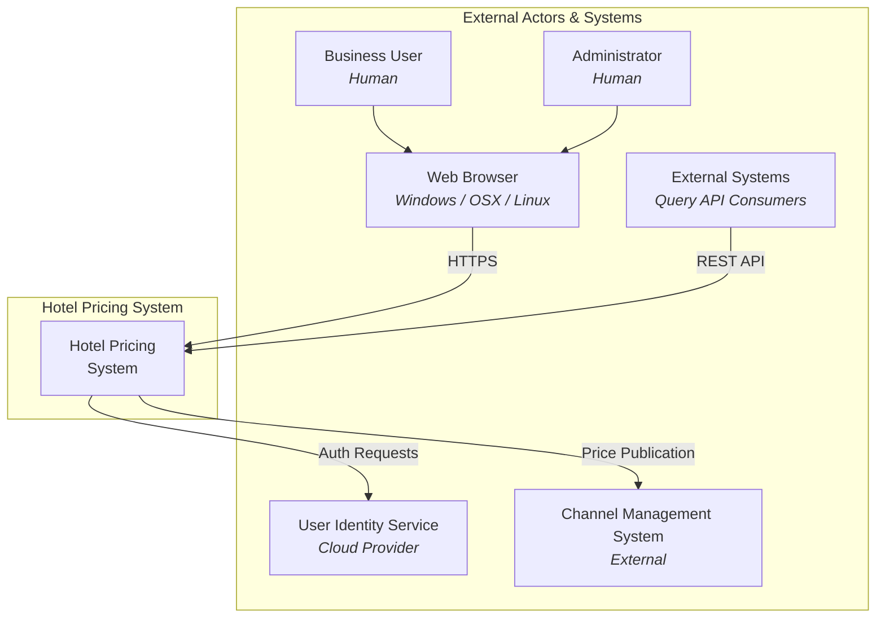
```mermaid
graph TB
    subgraph "External Actors & Systems"
        BU[Business User<br/><i>Human</i>]
        AD[Administrator<br/><i>Human</i>]
        WB[Web Browser<br/><i>Windows / OSX / Linux</i>]
        UIS[User Identity Service<br/><i>Cloud Provider</i>]
        CMS[Channel Management System<br/><i>External</i>]
        EXT[External Systems<br/><i>Query API Consumers</i>]
    end

    subgraph "Hotel Pricing System"
        HPS[Hotel Pricing<br/>System]
    end

    BU --> WB
    AD --> WB
    WB -->|HTTPS| HPS
    EXT -->|REST API| HPS
    HPS -->|Auth Requests| UIS
    HPS -->|Price Publication| CMS
```

---

## View 2: Primary Module/Decomposition View

This view shows the top-level decomposition of the Hotel Pricing System into its 5 constituent architectural elements, their data stores, internal communication paths, and external integrations.

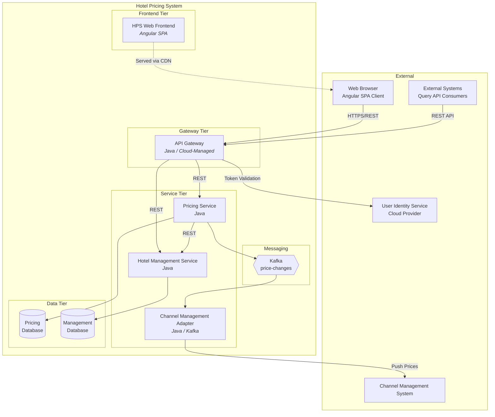
```mermaid
graph TB
    subgraph "External"
        WB[Web Browser<br/>Angular SPA Client]
        EXT[External Systems<br/>Query API Consumers]
        UIS[User Identity Service<br/>Cloud Provider]
        CMS[Channel Management System]
    end

    subgraph "Hotel Pricing System"
        subgraph "Frontend Tier"
            FE[HPS Web Frontend<br/><i>Angular SPA</i>]
        end

        subgraph "Gateway Tier"
            GW[API Gateway<br/><i>Java / Cloud-Managed</i>]
        end

        subgraph "Service Tier"
            PS[Pricing Service<br/><i>Java</i>]
            HMS[Hotel Management Service<br/><i>Java</i>]
            CMA[Channel Management Adapter<br/><i>Java / Kafka</i>]
        end

        subgraph "Data Tier"
            PDB[(Pricing<br/>Database)]
            MDB[(Management<br/>Database)]
        end

        subgraph "Messaging"
            KAFKA{{Kafka<br/>price-changes}}
        end
    end

    WB -->|HTTPS/REST| GW
    EXT -->|REST API| GW
    FE -.->|Served via CDN| WB

    GW -->|REST| PS
    GW -->|REST| HMS
    GW -->|Token Validation| UIS

    PS -->|REST| HMS
    PS --> KAFKA
    PS --> PDB

    HMS --> MDB

    KAFKA --> CMA
    CMA -->|Push Prices| CMS
```

---

## View 3: Use Case Allocation View

This view maps each use case to the architectural elements involved, showing the flow through the system.

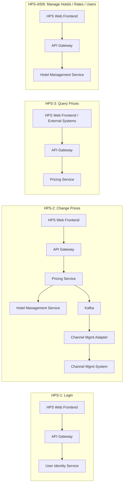
```mermaid
graph LR
    subgraph "HPS-1: Login"
        L1[HPS Web Frontend] --> L2[API Gateway] --> L3[User Identity Service]
    end

    subgraph "HPS-2: Change Prices"
        C1[HPS Web Frontend] --> C2[API Gateway] --> C3[Pricing Service]
        C3 --> C4[Hotel Management Service]
        C3 --> C5[Kafka] --> C6[Channel Mgmt Adapter] --> C7[Channel Mgmt System]
    end

    subgraph "HPS-3: Query Prices"
        Q1[HPS Web Frontend / External Systems] --> Q2[API Gateway] --> Q3[Pricing Service]
    end

    subgraph "HPS-4/5/6: Manage Hotels / Rates / Users"
        M1[HPS Web Frontend] --> M2[API Gateway] --> M3[Hotel Management Service]
    end
```

---

## View 4: Deployment View (Cloud-Native)

This deployment view illustrates the cloud-native deployment topology per CON-6. All services are containerized and deployed in the cloud, with the Angular SPA served via CDN.

```mermaid
graph TB
    subgraph "Cloud Environment"
        subgraph "CDN"
            CDN[Angular SPA<br/>Static Assets]
        end

        subgraph "Container Orchestration Cluster"
            subgraph "Gateway Pods"
                GW1[API Gateway<br/>Instance 1]
                GW2[API Gateway<br/>Instance 2]
            end

            subgraph "Pricing Pods"
                PS1[Pricing Service<br/>Instance 1]
                PS2[Pricing Service<br/>Instance 2]
            end

            subgraph "Management Pods"
                HMS1[Hotel Mgmt Service<br/>Instance 1]
            end

            subgraph "Adapter Pods"
                CMA1[Channel Mgmt Adapter<br/>Instance 1]
            end
        end

        subgraph "Managed Services"
            KAFKA_SVC[Managed Kafka<br/>Service]
            PDB_SVC[Managed Pricing<br/>Database]
            MDB_SVC[Managed Management<br/>Database]
            IDP[Cloud Identity<br/>Provider]
        end
    end

    subgraph "External"
        USERS[Users<br/>Browsers]
        EXT_API[External API<br/>Consumers]
        CMS_EXT[Channel Mgmt<br/>System]
    end

    USERS --> CDN
    USERS --> GW1
    USERS --> GW2
    EXT_API --> GW1
    EXT_API --> GW2

    GW1 --> PS1
    GW1 --> PS2
    GW2 --> PS1
    GW2 --> PS2
    GW1 --> HMS1
    GW2 --> HMS1

    PS1 --> PDB_SVC
    PS2 --> PDB_SVC
    HMS1 --> MDB_SVC

    PS1 --> KAFKA_SVC
    PS2 --> KAFKA_SVC
    KAFKA_SVC --> CMA1
    CMA1 --> CMS_EXT

    GW1 --> IDP
    GW2 --> IDP
```

---

## Summary of Views

| View | Type | Purpose |
|------|------|---------|
| System Context | Context Diagram | Define system boundary and external entities |
| Module/Decomposition | Component-and-Connector | Show top-level elements, their relationships, and data stores |
| Use Case Allocation | Allocation View | Trace use cases to architectural elements |
| Deployment | Deployment Diagram | Show cloud-native topology with containerization, scaling, and managed services |

### ADD Step 7: Analyze Design and Review Iteration Goal

# ADD Step 7: Analyze Design and Review Iteration Goal (Iteration 1)

## Analysis Against Iteration Success Criteria

The Iteration 1 success criteria (from Step 2):

### Criterion 1: System context is defined (all external actors and systems identified)
**✅ PASS** — All six external entities were identified in Step 3 and documented in the System Context diagram (Step 6, View 1): Business User, Administrator, Web Browser, User Identity Service, Channel Management System, and External Systems (Query API Consumers). Every external interaction mentioned in the use cases and constraints is captured.

### Criterion 2: High-level decomposition of the system into 3–7 top-level architectural elements is produced
**✅ PASS** — Five top-level elements were defined in Step 5:
1. HPS Web Frontend (Angular SPA)
2. API Gateway
3. Pricing Service
4. Hotel Management Service
5. Channel Management Adapter

Plus two data stores (Pricing Database, Management Database) and the Kafka messaging infrastructure. This falls within the 3–7 target range.

### Criterion 3: Primary architectural style/pattern is selected and justified
**✅ PASS** — Service-Based Architecture with Ports & Adapters was selected in Step 4 (Alternative D) after evaluating four alternatives against the key drivers (CON-6, CON-4, QA-6, QA-7, CRN-2). The rationale explicitly ties each driver to the selection.

### Criterion 4: Responsibilities of each top-level element are clearly stated
**✅ PASS** — Step 5 provides detailed responsibility tables for each element including technology, deployment model, provided interfaces, and required interfaces. Use case allocation is also traced.

### Criterion 5: Technology choices for major elements are aligned with team expertise (CRN-2) and cloud-native (CON-6)
**✅ PASS** — Angular SPA (frontend), Java services (backend), Kafka (messaging) all align with CRN-2. Containerized deployment, managed cloud services (Kafka, databases), CDN for static assets, and container orchestration align with CON-6.

## Driver Satisfaction Review

| Driver | Status | Evidence |
|--------|--------|----------|
| CRN-1 (Preliminary structure) | ✅ | Complete decomposition with 5 elements, views, and traceability |
| CON-6 (Cloud-native) | ✅ | Containerized services, managed cloud services, CDN, container orchestration in deployment view |
| CON-1 (Cross-platform browsers) | ✅ | Angular SPA served via CDN, no platform-specific dependencies |
| CON-2 (Cloud identity + hosting) | ✅ | API Gateway integrates with cloud identity service; all resources cloud-hosted |
| CRN-2 (Java, Angular, Kafka) | ✅ | All backend services in Java, frontend in Angular, Kafka for async messaging |
| QA-6 (Protocol flexibility) | ✅ | API Gateway as protocol boundary; core services expose technology-agnostic ports |
| QA-7 (Deployability) | ✅ | Independently deployable services; externalized configuration |
| CON-4 (2-month MVP) | ✅ | 5 services is achievable; team already knows the technology stack |

## Risks and Open Issues

| ID | Risk / Issue | Severity | Mitigation / Notes |
|----|-------------|----------|---------------------|
| R1 | **Data consistency between Pricing and Management DBs:** Pricing Service calls Hotel Management Service synchronously for configuration. If Management Service is unavailable, price changes may fail. | Medium | Address in Iteration 3 (Reliability). Consider caching strategies or eventual consistency. |
| R2 | **Channel Management Adapter scope:** Is it a standalone service or embedded in Pricing Service? Decision deferred. | Low | Standalone preferred for independent scaling and failure isolation. Clarify in Iteration 2. |
| R3 | **Kafka operational complexity:** Managed Kafka (cloud-native) mitigates this, but team must still design topics, partitioning, and consumer groups correctly. | Low | Address in Iteration 2 when refining the pricing flow. |
| R4 | **API Gateway technology choice:** Cloud-managed vs. self-managed (Java) gateway not yet decided. Cloud-managed aligns better with CON-6 but may limit customization. | Low | Evaluate in Iteration 4 (Development & Operations). |
| R5 | **QA-1 (100ms publication latency):** Not yet addressed — the current structure supports it but no latency budgets or caching strategies are defined. | High | Must be addressed in Iteration 2 (Primary Functionality). |
| R6 | **QA-2 (100% publication reliability):** Kafka provides at-least-once semantics, but the Channel Management Adapter's retry/acknowledgment mechanism is not yet designed. | High | Must be addressed in Iteration 3 (Reliability & Availability). |
| R7 | **Authentication/Authorization details:** Token flow between Angular SPA, API Gateway, and Identity Service is not yet specified beyond high-level integration. | Medium | Address in Iteration 2 when refining Login use case flow. |

## Iteration Goal: PASSED ✅

The iteration goal — "Establish the preliminary overall system structure" — has been achieved. The Hotel Pricing System now has a well-defined system context, a justified architectural style (Service-Based with Ports & Adapters), a clear decomposition into five top-level elements with assigned responsibilities, and four architectural views documenting the decisions. All selected drivers are satisfied. Identified risks are documented for resolution in subsequent iterations.

## Iteration 2: Identify structures supporting primary functionality

### ADD Step 2: Establish Iteration Goal by Selecting Drivers

# ADD Step 2: Establish Iteration Goal by Selecting Drivers (Iteration 2)

## Iteration Goal

**Refine the internal structures of the top-level elements to support primary functionality** — specifically, design the internal architecture of the Pricing Service, the price query path, the authentication/authorization flow, and the integration patterns between Pricing Service and Hotel Management Service. This iteration answers: _How does the system fulfill its core use cases (Login, Change Prices, Query Prices) while satisfying the most demanding quality attributes (performance, scalability, security)?_

## Selected Architectural Drivers

| Priority | Driver | Justification |
|----------|--------|---------------|
| **Primary** | HPS-2: Change Prices | Core domain operation. Must support base/fixed price changes, derived rate calculation, simulation, and publication — all within 100ms (QA-1). |
| **Primary** | QA-1 (Performance) | 100ms publication latency is the most demanding quality attribute. The internal structure of the Pricing Service must be designed around this constraint. |
| **Primary** | HPS-3: Query Prices | High-volume operation (100K→1M/day). Must scale horizontally with ≤20% latency increase (QA-4). Read path must be separated from write path. |
| **Primary** | QA-4 (Scalability) | The query architecture must support 10x traffic growth. Requires structural decisions about caching, read replicas, and stateless services. |
| **Secondary** | HPS-1: Login | Entry point for all users. The authentication token flow and authorization model must be concretely designed. |
| **Secondary** | QA-5 (Security) | Token validation, authorized-function visibility. Must be designed into frontend, gateway, and service layers. |
| **Secondary** | QA-6 (Modifiability) | Protocol isolation must be validated by defining concrete port interfaces within Pricing Service and Hotel Management Service. |
| **Secondary** | QA-9 (Testability) | Service ports must support stubbing/mocking for integration testing without external dependencies. |
| **Carried Risk** | R5 (100ms latency) | Must be resolved — latency budgets and computational strategy required. |
| **Carried Risk** | R7 (Auth details) | Token flow between SPA, Gateway, and Identity Service must be specified. |
| **Carried Risk** | R2 (CMA scope) | Decide standalone vs. embedded for Channel Management Adapter. |
| **Carried Risk** | R3 (Kafka design) | Topic structure, partitioning strategy, consumer groups. |

## Drivers Deferred to Later Iterations

| Driver | Reason for Deferral |
|--------|---------------------|
| QA-2 (Reliability: 100% publication) | Detailed retry/idempotency mechanisms → Iteration 3 |
| QA-3 (Availability: 99.9% SLA) | Redundancy, failover patterns → Iteration 3 |
| QA-7 (Deployability) | CI/CD pipeline design → Iteration 4 |
| QA-8 (Monitorability) | Metrics collection infrastructure → Iteration 4 |
| CRN-3, CRN-4, CRN-5 | Development process concerns → Iteration 4 |
| HPS-4/5/6 (Management use cases) | Supporting functionality; detailed in Iteration 2 only as needed for pricing integration |

## Success Criteria for This Iteration

1. **Pricing Service** internal structure is designed with clear separation of write path (price changes/simulation) and read path (price queries), satisfying QA-1 and QA-4.
2. **Derived rate calculation strategy** is defined — how base price changes cascade to derived rates within 100ms.
3. **Authentication and authorization flow** is specified end-to-end: Angular SPA → API Gateway → backend services, satisfying QA-5.
4. **Pricing Service ↔ Hotel Management Service integration** is designed — how pricing obtains hotel configuration and rate rules.
5. **Kafka topic and partitioning design** for price publication is defined.
6. **Channel Management Adapter scope** decision is finalized.
7. **Concrete port interfaces** for Pricing Service and Hotel Management Service are defined, supporting QA-6 and QA-9.

### ADD Step 3: Choose System Elements to Refine

# ADD Step 3: Choose One or More System Elements to Refine (Iteration 2)

## Elements Selected for Refinement

Based on the iteration goal (supporting primary functionality: Change Prices, Query Prices, Login), the following elements from Iteration 1 are selected for internal refinement:

### Element 1: Pricing Service (Primary Focus)

**Why:** This is the critical path for both HPS-2 (Change Prices) and HPS-3 (Query Prices). QA-1 (100ms latency) and QA-4 (scalability to 1M queries/day) both center on this element. Its internal structure — how it computes derived rates, separates reads from writes, and integrates with Hotel Management Service — determines whether the system's most demanding quality attributes are met.

**Current State from Iteration 1:** Defined as a Java service with Ports & Adapters pattern, owning the Pricing Database. High-level ports: `changePrices`, `simulatePrices`, `queryPrices`, `publishPrices`. No internal decomposition.

**Refinement Needed:**
- Internal module decomposition (domain logic, ports, adapters)
- Write path: price change processing, derived rate calculation, simulation
- Read path: query optimization, caching strategy for QA-4 scalability
- Database schema direction (read/write separation)
- Latency budget allocation for QA-1

### Element 2: API Gateway

**Why:** The API Gateway is the protocol boundary (QA-6) and the enforcement point for authentication (QA-5, HPS-1). Its routing rules, token validation flow, and protocol adapter design must be concretely specified.

**Current State from Iteration 1:** Routes `/api/prices/*`, `/api/hotels/*`, `/api/rates/*`, `/api/users/*`, `/api/auth/*`. Validates tokens against User Identity Service. No internal structure.

**Refinement Needed:**
- Authentication flow (token acquisition, validation, propagation to services)
- Authorization model (coarse-grained: which routes require which roles)
- Protocol adapter structure (REST today, gRPC-ready)
- Rate limiting and request routing rules

### Element 3: HPS Web Frontend (Angular SPA)

**Why:** HPS-1 (Login) starts here. QA-5 (Security) requires that only authorized functions are shown. The frontend must handle OAuth2/OIDC flows with the cloud identity service and manage tokens.

**Current State from Iteration 1:** Angular SPA served via CDN. Handles user authentication redirect, renders UI. No internal component structure.

**Refinement Needed:**
- Authentication flow (OAuth2/OIDC with cloud identity provider)
- Token management (storage, refresh, attachment to API calls)
- Authorization-driven UI (show/hide functions based on permissions)
- Component/module structure aligned with use cases

### Element 4: Channel Management Adapter

**Why:** Carried-forward risk R2 requires deciding its scope (standalone vs. embedded). R3 requires Kafka topic design. This element is the bridge between the Pricing Service and the external Channel Management System.

**Current State from Iteration 1:** Java/Kafka consumer. Subscribes to `price-changes` topic. Pushes prices to Channel Management System. Scope not finalized.

**Refinement Needed:**
- Scope decision: standalone service vs. module within Pricing Service
- Kafka topic design (partitioning key, retention, consumer groups)
- Failure handling strategy (preliminary — full reliability in Iteration 3)

### Element 5: Hotel Management Service (Partial)

**Why:** The Pricing Service depends on Hotel Management Service for hotel configuration (tax rates, room types) and rate business rules. The integration interface between these two services must be designed to avoid the Pricing Service being blocked.

**Current State from Iteration 1:** Java service. Ports: CRUD for hotels, rates, users. Exposes `getHotelConfiguration` and `getRateRules` for Pricing Service. No internal structure.

**Refinement Needed (for this iteration):**
- `getHotelConfiguration` and `getRateRules` interface contract details
- Caching strategy for reference data consumed by Pricing Service
- Authorization model (hotel-level access control)

### Elements NOT Refined in This Iteration

| Element | Reason |
|---------|--------|
| Hotel Management Service (full internals) | Supporting CRUD operations; detailed in Iteration 4 |
| Management Database (schema) | Schema design deferred to Iteration 4 |
| Pricing Database (full schema) | Logical structure defined; physical schema in Iteration 4 |

### ADD Step 4: Choose Design Concepts

# ADD Step 4: Choose One or More Design Concepts (Iteration 2)

This step selects design concepts for each element being refined. Each concept is evaluated against the primary drivers: QA-1 (100ms latency), QA-4 (scalability), QA-5 (security), QA-6 (modifiability), QA-9 (testability).

---

## 4A: Pricing Service — Internal Structure

### Design Decisions for Pricing Service

The Pricing Service must satisfy two conflicting demands:
- **Write path (HPS-2):** Compute derived rates and publish within 100ms (QA-1). Must be consistent and fast.
- **Read path (HPS-3):** Serve up to 1M queries/day with ≤20% latency increase (QA-4). Must be highly scalable and independently optimizable.

### Selected Concept: CQRS with In-Memory Computation

**CQRS (Command Query Responsibility Segregation)** separates the write model from the read model within the Pricing Service:

| Aspect | Write Side (Commands) | Read Side (Queries) |
|--------|----------------------|---------------------|
| **Purpose** | Process price changes, compute derived rates, publish events | Serve price queries at high throughput |
| **Data Model** | Domain model optimized for price calculation and consistency | Denormalized view optimized for query patterns |
| **Store** | Primary Pricing Database (write-optimized) | In-memory cache / read-optimized projection |
| **Scaling** | Vertical or limited horizontal (fewer writes) | Horizontal scaling (stateless, many instances) |

### Alternatives Evaluated

**Alternative A: Single unified service with shared data model**
- QA-1: ⚠ Reads and writes compete for resources; derived rate computation may be delayed by concurrent queries
- QA-4: ❌ Cannot scale reads independently of writes
- QA-6: ✅ Simple ports, but protocol changes affect both paths

**Alternative B: CQRS with in-memory computation (SELECTED)**
- QA-1: ✅ Derived rates are computed in-memory using pre-loaded rate rules; results projected to read cache synchronously; 100ms achievable
- QA-4: ✅ Read side uses in-memory cache; stateless query handlers scale horizontally; read replicas can be added
- QA-6: ✅ Separate command/query ports; new protocols can target either path independently

**Alternative C: Fully event-sourced with async projection**
- QA-1: ⚠ Event sourcing adds write latency; async projection means queries may see stale data for some window
- QA-4: ✅ Read projections can be highly optimized
- Complexity: ❌ Operational complexity (event store, projections) threatens 2-month MVP timeline (CON-4)

### Derived Rate Computation Strategy

Since QA-1 requires 100ms end-to-end for price publication, the computation must be near-instantaneous. The selected approach:

| Decision | Rationale |
|----------|-----------|
| **Pre-load rate rules into memory** | Rate business rules (from Hotel Management Service) change infrequently. Load at startup, refresh on change events. Eliminates cross-service call during price change. |
| **Compute derived rates in-memory** | Apply pre-loaded rules to base prices synchronously. No database round-trips during calculation. |
| **Synchronous projection to read model** | After write is committed, immediately update the read cache so queries see latest prices — critical for QA-1 "published within 100ms." |
| **Bulk computation** | When a base price changes, compute all affected derived rates in a single pass rather than per-rate queries. |

---

## 4B: API Gateway — Authentication and Routing

### Selected Concept: Token-Based Authentication with Backend-for-Frontend (BFF) Pattern

| Decision | Rationale |
|----------|-----------|
| **OAuth2 Authorization Code Flow with PKCE** | Standard for SPAs (CON-1 browser-based). Cloud identity service (CON-2) acts as the Authorization Server. |
| **API Gateway validates JWT access tokens** | Gateway validates token signature and expiry against the identity provider's public keys. No call to identity service per request — reduces latency. |
| **Token propagation to services** | Gateway forwards validated claims (user ID, roles, authorized hotels) to backend services via HTTP headers. Services do not re-validate tokens. |
| **Coarse-grained authorization at Gateway** | Gateway enforces route-level authorization (e.g., `/api/hotels/*` requires admin role). Fine-grained (hotel-level) authorization is enforced in the Hotel Management Service. |
| **Protocol adapter isolation** | REST adapter is one adapter; adding gRPC adds a parallel adapter at the gateway with the same routing logic — no changes to core services (QA-6). |

---

## 4C: HPS Web Frontend — Component Structure

### Selected Concept: Feature-Based Module Organization with Auth Guard

| Decision | Rationale |
|----------|-----------|
| **Feature modules** | Organize Angular code by feature: `LoginModule`, `PricingModule`, `HotelManagementModule`, `RateManagementModule`, `UserManagementModule`. Aligns with use cases and team work assignment (CRN-3). |
| **Auth Guard / Interceptor** | Angular route guards prevent navigation to unauthorized features. HTTP interceptor attaches JWT to all API calls. |
| **Role-based UI rendering** | Components query user roles from the decoded JWT; `*ngIf` directives show/hide functions per QA-5. |
| **Token storage in memory** | JWT stored in memory (not localStorage) to mitigate XSS risk. Refresh token stored in secure HTTP-only cookie. |

---

## 4D: Pricing Service ↔ Hotel Management Service Integration

### Selected Concept: Cached Reference Data with Change Notification

| Decision | Rationale |
|----------|-----------|
| **Pricing Service caches hotel config and rate rules locally** | Avoids synchronous cross-service call during price change processing, which would consume the 100ms budget (QA-1). |
| **Startup load + Kafka change events** | On startup, Pricing Service loads all rate rules and hotel tax configurations from Hotel Management Service. Subsequent changes are pushed via a Kafka topic (`hotel-config-changes`). |
| **Staleness tolerance** | Hotel configuration changes are infrequent. A brief propagation delay (seconds) is acceptable. Price changes always use the latest cached config — if a config change is in-flight, the price change either uses old or new config, both of which are valid states. |

---

## 4E: Channel Management Adapter — Scope Decision

### Selected Concept: Standalone Service (resolves R2)

| Decision | Rationale |
|----------|-----------|
| **Standalone service (not embedded in Pricing Service)** | Independent scaling: price publication to external systems may have different throughput characteristics than internal price computation. Failure isolation: if the Channel Management System is slow or unavailable, the Pricing Service remains operational. |
| **Kafka as buffer** | The Pricing Service publishes to Kafka and returns success to the user. The Channel Management Adapter consumes from Kafka and handles delivery to the external system. This decoupling is essential for QA-1 (100ms) — the user does not wait for external system acknowledgment. |
| **Partitioning by hotel ID** | Ensures ordering of price changes per hotel. Consumer groups allow parallel processing across hotels. |

---

## Summary of Design Concept Selections

| Element | Selected Concept | Primary Drivers Satisfied |
|---------|-----------------|--------------------------|
| Pricing Service (internals) | CQRS + In-Memory Computation | QA-1, QA-4, QA-6 |
| API Gateway (auth/routing) | Token-Based Auth + BFF Pattern | QA-5, QA-6 |
| HPS Web Frontend | Feature Modules + Auth Guard | QA-5, CRN-3 |
| PS ↔ HMS Integration | Cached Reference Data + Change Events | QA-1 |
| Channel Management Adapter | Standalone Service + Kafka Buffer | QA-1, R2, R3 |

### ADD Step 5: Instantiate Elements, Assign Responsibilities, and Define Interfaces

# ADD Step 5: Instantiate Architectural Elements, Assign Responsibilities, and Define Interfaces (Iteration 2)

---

## 5A: Pricing Service — Internal Decomposition (CQRS + In-Memory Computation)

The Pricing Service is decomposed into internal modules following CQRS and Ports & Adapters patterns:

### Pricing Service Internal Elements

| Internal Element | Type | Responsibilities |
|------------------|------|------------------|
| **PriceCommandHandler** | Command Processor | Receives `changePrices` and `simulatePrices` requests. Validates input. Orchestrates the write flow. |
| **DerivedRateCalculator** | Domain Service | Applies business rules (rate rules) to base prices to compute derived rates. Operates entirely in-memory using pre-loaded rules. |
| **RateRuleCache** | In-Memory Store | Holds pre-loaded rate business rules and hotel tax configurations. Loaded at startup; refreshed via Kafka events from Hotel Management Service. |
| **PriceRepository** | Domain Repository (Port) | Persists price changes to the Pricing Database. Abstract interface — implemented by a DB adapter. |
| **PriceQueryHandler** | Query Processor | Handles `queryPrices` requests. Serves from the read-optimized cache. Stateless for horizontal scaling. |
| **PriceReadCache** | In-Memory Cache | Denormalized view of current prices, indexed by hotel + date + room type + rate. Updated synchronously after each write. Query responses served from cache without DB access. |
| **PriceEventPublisher** | Event Publisher (Port) | Publishes price change events to Kafka `price-changes` topic. Abstract interface — implemented by Kafka adapter. |
| **PricingDBAdapter** | Adapter (Outbound) | Implements `PriceRepository`. Executes SQL/NoSQL operations against the Pricing Database. |
| **KafkaPriceAdapter** | Adapter (Outbound) | Implements `PriceEventPublisher`. Produces messages to Kafka. |
| **RESTPricingAdapter** | Adapter (Inbound) | Exposes REST endpoints for price commands and queries. Translates HTTP requests to port method calls. |

### Pricing Service Internal Communication Flow

**Write Flow (HPS-2: Change Prices):**
```
RESTPricingAdapter → PriceCommandHandler → RateRuleCache (get rules)
    → DerivedRateCalculator (compute derived rates)
    → PriceRepository (persist)
    → PriceReadCache (update read model)
    → PriceEventPublisher → Kafka
```

**Query Flow (HPS-3: Query Prices):**
```
RESTPricingAdapter → PriceQueryHandler → PriceReadCache → Response
```

**Simulation Flow (HPS-2: Simulate):**
```
RESTPricingAdapter → PriceCommandHandler → RateRuleCache (get rules)
    → DerivedRateCalculator (compute hypothetical derived rates)
    → Response (no persistence, no cache update, no event)
```

### Port Interfaces (Technology-Agnostic)

```
// === Command Port ===
interface PriceCommandPort {
    ChangePricesResult changePrices(ChangePricesCommand command);
    SimulatedPricesResult simulatePrices(SimulatePricesCommand command);
}

// === Query Port ===
interface PriceQueryPort {
    PriceQueryResult queryPrices(PriceQuery query);
}

// === Repository Port (outbound) ===
interface PriceRepository {
    void savePriceChange(HotelId hotelId, DateRange dates, Map<RateType, Money> prices);
    PriceSnapshot loadCurrentPrices(HotelId hotelId);
}

// === Event Publisher Port (outbound) ===
interface PriceEventPublisher {
    void publishPriceChanged(PriceChangedEvent event);
}
```

### Data Types (Key Commands/Queries)

```
ChangePricesCommand {
    hotelId: HotelId
    userId: UserId
    changes: List<PriceChange>  // base price or fixed price changes
    // Each PriceChange: date, roomType, amount, changeType (BASE|FIXED)
}

SimulatePricesCommand {
    hotelId: HotelId
    changes: List<PriceChange>
}

PriceQuery {
    hotelId: HotelId
    dateRange: DateRange
    rateTypes: List<RateType>  // optional filter
}

PriceChangedEvent {
    hotelId: HotelId
    timestamp: Instant
    prices: List<PublishedPrice>
    // Each PublishedPrice: date, roomType, rateType, amount
}
```

### Latency Budget for QA-1 (100ms)

| Step | Budget | Notes |
|------|--------|-------|
| HTTP ingress + deserialization | 5ms | Gateway → REST Adapter |
| Rate rule lookup (in-memory) | 2ms | Pre-loaded; O(1) hash lookup |
| Derived rate computation | 15ms | Arithmetic operations; bulk computation |
| Database write | 20ms | Single transaction, indexed by hotel+date |
| Read cache update | 5ms | In-memory put |
| Kafka produce (async) | 3ms | Fire-and-forget; no wait for ack |
| HTTP response serialization | 5ms | — |
| **Subtotal core** | **55ms** | — |
| Network + Gateway overhead | 20ms | — |
| **Safety margin** | **25ms** | — |
| **Total budget** | **100ms** | — |

---

## 5B: API Gateway — Internal Decomposition

### API Gateway Internal Elements

| Internal Element | Type | Responsibilities |
|------------------|------|------------------|
| **AuthFilter** | Inbound Interceptor | Intercepts all requests. Extracts JWT from Authorization header. Validates signature and expiry against identity provider JWKS. Rejects unauthenticated requests. |
| **RoleEnforcer** | Inbound Interceptor | Checks JWT claims for required roles per route. Rejects unauthorized requests. |
| **ClaimPropagator** | Outbound Enricher | Extracts user ID, roles, authorized hotels from JWT claims. Attaches as HTTP headers (`X-User-Id`, `X-User-Roles`, `X-Authorized-Hotels`) to downstream service calls. |
| **RequestRouter** | Core Router | Routes requests to backend services based on URL path patterns. Maintains route table. |
| **RESTIngressAdapter** | Inbound Adapter | Accepts REST/HTTP requests. Today the only protocol. |
| **RESTEgressAdapter** | Outbound Adapter | Forwards requests to backend services via REST. |
| **RateLimiter** | Cross-Cutting | Per-user / per-IP rate limiting to protect backend services. |

### API Gateway Route Table

| Path Pattern | Target Service | Required Role | Rate Limit |
|-------------|---------------|---------------|------------|
| `POST /api/auth/login` | Identity Service (redirect) | None | 10/min per IP |
| `POST /api/auth/refresh` | Identity Service | Authenticated | 10/min per user |
| `GET  /api/prices` | Pricing Service (query) | Authenticated | 1000/min per user |
| `POST /api/prices/change` | Pricing Service (command) | Authenticated | 100/min per user |
| `POST /api/prices/simulate` | Pricing Service (command) | Authenticated | 100/min per user |
| `GET/POST/PUT/DELETE /api/hotels/**` | Hotel Management Service | Admin | 500/min per user |
| `GET/POST/PUT/DELETE /api/rates/**` | Hotel Management Service | Admin | 500/min per user |
| `GET/POST/PUT/DELETE /api/users/**` | Hotel Management Service | Admin | 200/min per user |

### Authentication Flow (End-to-End)

```
1. User → Angular SPA: Clicks "Login"
2. Angular SPA → Cloud Identity Service: Redirect to OAuth2 /authorize (PKCE)
3. User → Identity Service: Enters credentials
4. Identity Service → Angular SPA: Redirect with authorization code
5. Angular SPA → API Gateway (/api/auth/token): Exchange code for tokens
6. API Gateway → Identity Service: POST /token (code + code_verifier)
7. Identity Service → API Gateway: { access_token (JWT), refresh_token }
8. API Gateway → Angular SPA: { access_token, refresh_token (HTTP-only cookie) }
9. Angular SPA: Stores access_token in memory, includes in Authorization header
10. API Gateway (per request): Validates JWT, propagates claims to services
```

---

## 5C: HPS Web Frontend — Internal Decomposition

### Angular Module Structure (Feature-Based)

| Module | Components | Routes | Guards |
|--------|-----------|--------|--------|
| **AppModule** | Shell, NavBar, Layout | `/` | — |
| **LoginModule** | LoginComponent, CallbackComponent | `/login`, `/auth/callback` | None |
| **PricingModule** | PriceChangeComponent, PriceSimulationComponent, PriceQueryComponent, HotelSelectorComponent | `/pricing/change`, `/pricing/simulate`, `/pricing/query` | AuthGuard |
| **HotelManagementModule** | HotelListComponent, HotelEditComponent, TaxRateComponent, RoomTypeComponent | `/admin/hotels/**` | AuthGuard, AdminGuard |
| **RateManagementModule** | RateListComponent, RateEditComponent, RateRuleBuilder | `/admin/rates/**` | AuthGuard, AdminGuard |
| **UserManagementModule** | UserListComponent, PermissionEditorComponent | `/admin/users/**` | AuthGuard, AdminGuard |
| **CoreModule** | AuthService, ApiService, TokenInterceptor, AuthGuard, AdminGuard | — | — |

### Key Frontend Services (Angular Injectable)

| Service | Responsibility |
|---------|---------------|
| **AuthService** | OAuth2 flow orchestration, token storage/refresh, user session management |
| **TokenInterceptor** | Attaches `Authorization: Bearer <token>` to all outbound HTTP requests |
| **ApiService** | Typed HTTP client wrapping REST calls to API Gateway |
| **AuthGuard** | Route guard: checks if user is authenticated before activating route |
| **AdminGuard** | Route guard: checks if user has admin role from JWT claims |
| **HotelAuthorizationService** | From decoded JWT, provides list of authorized hotels for UI filtering |

### Authorization-Driven UI (QA-5)

- NavBar reads roles from AuthService; renders navigation links only for authorized modules.
- HotelSelectorComponent queries `authorizedHotels` claim from JWT; shows only permitted hotels.
- Admin-only routes (`/admin/**`) are protected by AdminGuard.
- Business users never see admin navigation or can access admin routes.

---

## 5D: Pricing Service ↔ Hotel Management Service Integration

### Integration Design

The Pricing Service depends on Hotel Management Service for two data sets:
1. **Hotel configuration:** tax rates, room types per hotel
2. **Rate business rules:** how derived rates are computed from base prices

### Caching Strategy

| Aspect | Design |
|--------|--------|
| **Initial Load** | On Pricing Service startup, `RateRuleCache` calls `GET /api/hotels/config/all` and `GET /api/rates/rules/all` from HMS to populate its in-memory cache. |
| **Change Notification** | When an administrator modifies hotel config or rate rules (HPS-4, HPS-5), HMS publishes events to Kafka topic `hotel-config-changes`. Pricing Service's `RateRuleCache` consumes these events and updates its in-memory store. |
| **Staleness Window** | Config changes propagate within seconds. During the propagation window, price changes may use slightly stale config. This is acceptable because: (a) config changes are infrequent; (b) the window is short; (c) both old and new configs are valid states. |
| **Cache Miss** | If cache is empty (e.g., after restart before initial load completes), pricing operations are rejected with a 503 until cache is warm. |

### New Kafka Topic: `hotel-config-changes`

| Attribute | Value |
|-----------|-------|
| **Topic Name** | `hotel-config-changes` |
| **Producers** | Hotel Management Service |
| **Consumers** | Pricing Service (RateRuleCache) |
| **Partition Key** | hotelId |
| **Message Format** | `{ eventType: "RATE_UPDATED" | "HOTEL_CONFIG_UPDATED", entityId: string, timestamp: ISO8601 }` |
| **Retention** | 7 days (for replay on restart) |

### Hotel Management Service — New/Refined Ports for Pricing Integration

```
// === Config Provisioning Port (for Pricing Service consumption) ===
interface HotelConfigProvisioningPort {
    HotelConfigSnapshot getAllHotelConfigurations();
    RateRulesSnapshot getAllRateRules();
    List<ConfigChangeEvent> getConfigChangesSince(Timestamp since);  // for catch-up
}

// === Config Change Publisher Port ===
interface ConfigChangePublisher {
    void publishConfigChanged(ConfigChangeEvent event);
}
```

---

## 5E: Channel Management Adapter — Standalone Service Design

### Decision: Standalone Service (R2 Resolved)

The Channel Management Adapter is a standalone Java service, not embedded in the Pricing Service.

### Channel Management Adapter Internal Elements

| Internal Element | Type | Responsibilities |
|------------------|------|------------------|
| **PriceChangeConsumer** | Kafka Consumer | Consumes messages from `price-changes` topic. Partitions by hotelId for ordering. |
| **MessageTransformer** | Data Mapper | Transforms internal `PriceChangedEvent` format to the Channel Management System's expected format. |
| **CMSClient** | Outbound Adapter (Port) | Sends price data to the external Channel Management System. Abstract interface for testability (QA-9). |
| **CMSRestAdapter** | Adapter | Implements `CMSClient` using REST/HTTP to the Channel Management System. |
| **RetryHandler** | Resilience | Handles transient failures when publishing to CMS. Preliminary: retry with backoff. Full reliability design in Iteration 3. |
| **DeadLetterQueue** | Failure Sink | Stores messages that fail after all retries, for operator inspection. |

### Kafka Topic: `price-changes` (R3 Resolved)

| Attribute | Value |
|-----------|-------|
| **Topic Name** | `price-changes` |
| **Partition Key** | hotelId |
| **Partitions** | 6 (supports parallel processing by hotel) |
| **Replication Factor** | 3 (cloud-native, CON-6) |
| **Retention** | 7 days |
| **Consumer Group** | `channel-management-adapter` |
| **Delivery Semantics** | At-least-once (idempotency handled by CMS-side dedup or message ID) |

### CMSClient Port Interface (Technology-Agnostic)

```
interface CMSClient {
    PublicationResult publishPrices(HotelId hotelId, List<PublishedPrice> prices);
}

enum PublicationResult {
    SUCCESS, TRANSIENT_FAILURE, PERMANENT_FAILURE
}
```

---

## 5F: Summary — All New Elements and Interfaces

### New Internal Elements Across All Refined Components

| Parent Element | New Internal Element | Type |
|---------------|---------------------|------|
| Pricing Service | PriceCommandHandler | Command Processor |
| Pricing Service | DerivedRateCalculator | Domain Service |
| Pricing Service | RateRuleCache | In-Memory Store |
| Pricing Service | PriceRepository | Outbound Port |
| Pricing Service | PriceQueryHandler | Query Processor |
| Pricing Service | PriceReadCache | In-Memory Cache |
| Pricing Service | PriceEventPublisher | Outbound Port |
| Pricing Service | PricingDBAdapter | Outbound Adapter |
| Pricing Service | KafkaPriceAdapter | Outbound Adapter |
| Pricing Service | RESTPricingAdapter | Inbound Adapter |
| API Gateway | AuthFilter | Inbound Interceptor |
| API Gateway | RoleEnforcer | Inbound Interceptor |
| API Gateway | ClaimPropagator | Outbound Enricher |
| API Gateway | RequestRouter | Core Router |
| API Gateway | RESTIngressAdapter | Inbound Adapter |
| API Gateway | RESTEgressAdapter | Outbound Adapter |
| API Gateway | RateLimiter | Cross-Cutting |
| HPS Web Frontend | AppModule, LoginModule, PricingModule, HotelManagementModule, RateManagementModule, UserManagementModule, CoreModule | Angular Modules |
| HPS Web Frontend | AuthService, TokenInterceptor, ApiService, AuthGuard, AdminGuard, HotelAuthorizationService | Angular Services |
| HMS (partial) | HotelConfigProvisioningPort | Inbound Port |
| HMS (partial) | ConfigChangePublisher | Outbound Port |
| Channel Mgmt Adapter | PriceChangeConsumer | Kafka Consumer |
| Channel Mgmt Adapter | MessageTransformer | Data Mapper |
| Channel Mgmt Adapter | CMSClient | Outbound Port |
| Channel Mgmt Adapter | CMSRestAdapter | Outbound Adapter |
| Channel Mgmt Adapter | RetryHandler | Resilience |
| Channel Mgmt Adapter | DeadLetterQueue | Failure Sink |

### Carried-Forward Risks Resolution

| Risk ID | Status | Resolution |
|---------|--------|------------|
| R5 (100ms latency) | ✅ RESOLVED | CQRS + in-memory computation + latency budget defined (55ms core, 100ms total) |
| R7 (Auth details) | ✅ RESOLVED | OAuth2 PKCE flow, JWT validation at Gateway, claim propagation to services specified |
| R2 (CMA scope) | ✅ RESOLVED | Standalone service with Kafka buffer |
| R3 (Kafka design) | ✅ RESOLVED | `price-changes` topic: 6 partitions, hotelId key, replication factor 3; `hotel-config-changes` topic for HMS→PS config sync |

### ADD Step 6: Sketch Views and Perspectives

# ADD Step 6: Sketch Views and Perspectives (Iteration 2)

---

## View 1: Pricing Service Internal Structure (CQRS)

This view shows the internal decomposition of the Pricing Service using the CQRS pattern, with clear separation of write (command) and read (query) paths, and in-memory computation of derived rates.

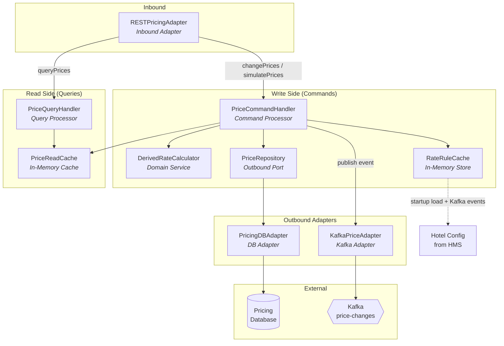
```mermaid
graph TB
    subgraph "Inbound"
        REST[RESTPricingAdapter<br/><i>Inbound Adapter</i>]
    end

    subgraph "Write Side (Commands)"
        CMD[PriceCommandHandler<br/><i>Command Processor</i>]
        CALC[DerivedRateCalculator<br/><i>Domain Service</i>]
        CACHE[RateRuleCache<br/><i>In-Memory Store</i>]
        REPO[PriceRepository<br/><i>Outbound Port</i>]
    end

    subgraph "Read Side (Queries)"
        QRY[PriceQueryHandler<br/><i>Query Processor</i>]
        RDCACHE[PriceReadCache<br/><i>In-Memory Cache</i>]
    end

    subgraph "Outbound Adapters"
        DB_ADPT[PricingDBAdapter<br/><i>DB Adapter</i>]
        KAFKA_ADPT[KafkaPriceAdapter<br/><i>Kafka Adapter</i>]
    end

    subgraph "External"
        PDB[(Pricing<br/>Database)]
        KAFKA{{Kafka<br/>price-changes}}
    end

    REST -->|changePrices / simulatePrices| CMD
    REST -->|queryPrices| QRY

    CMD --> CACHE
    CMD --> CALC
    CMD --> REPO
    CMD --> RDCACHE
    CMD -->|publish event| KAFKA_ADPT

    QRY --> RDCACHE

    CACHE -.->|startup load + Kafka events| HMS_CONFIG[Hotel Config<br/>from HMS]

    REPO --> DB_ADPT --> PDB
    KAFKA_ADPT --> KAFKA
```

---

## View 2: Authentication Flow (Sequence)

This sequence diagram shows the end-to-end OAuth2 Authorization Code flow with PKCE, from the user's browser through the Angular SPA, API Gateway, and Cloud Identity Service.

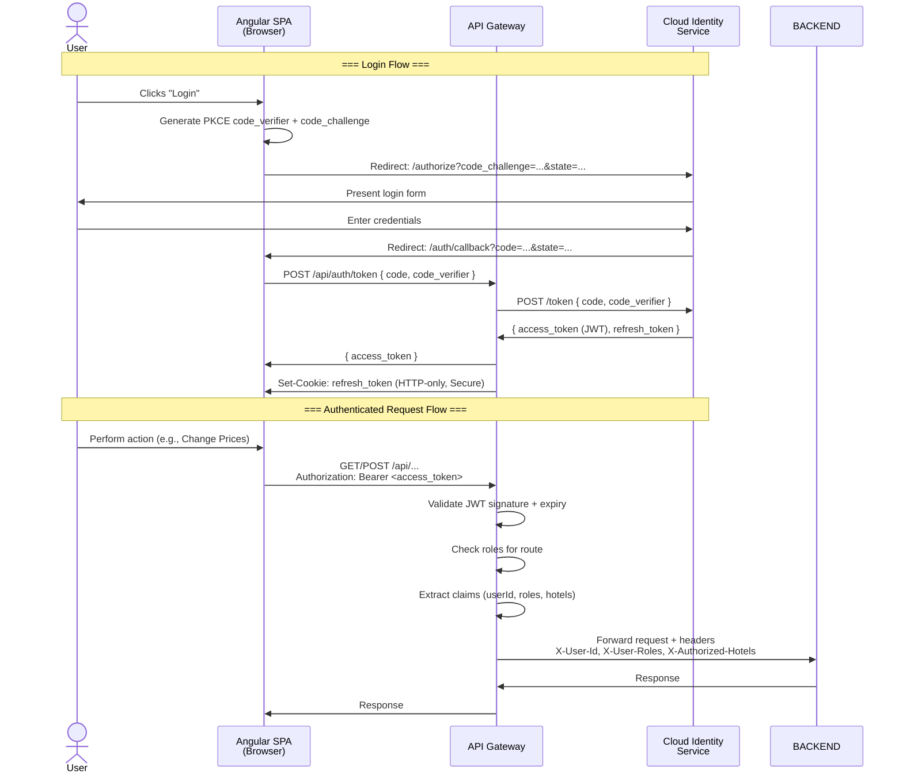
```mermaid
sequenceDiagram
    actor User
    participant SPA as Angular SPA<br/>(Browser)
    participant GW as API Gateway
    participant IDP as Cloud Identity<br/>Service

    Note over User,IDP: === Login Flow ===

    User->>SPA: Clicks "Login"
    SPA->>SPA: Generate PKCE code_verifier + code_challenge
    SPA->>IDP: Redirect: /authorize?code_challenge=...&state=...

    IDP->>User: Present login form
    User->>IDP: Enter credentials

    IDP->>SPA: Redirect: /auth/callback?code=...&state=...
    SPA->>GW: POST /api/auth/token { code, code_verifier }
    GW->>IDP: POST /token { code, code_verifier }
    IDP->>GW: { access_token (JWT), refresh_token }
    GW->>SPA: { access_token }
    GW->>SPA: Set-Cookie: refresh_token (HTTP-only, Secure)

    Note over User,IDP: === Authenticated Request Flow ===

    User->>SPA: Perform action (e.g., Change Prices)
    SPA->>GW: GET/POST /api/...<br/>Authorization: Bearer <access_token>
    GW->>GW: Validate JWT signature + expiry
    GW->>GW: Check roles for route
    GW->>GW: Extract claims (userId, roles, hotels)
    GW->>BACKEND: Forward request + headers<br/>X-User-Id, X-User-Roles, X-Authorized-Hotels
    BACKEND->>GW: Response
    GW->>SPA: Response
```

---

## View 3: Price Change Flow — Component Interaction (HPS-2)

This component interaction diagram shows the end-to-end flow for the Change Prices use case, tracing through all refined elements.

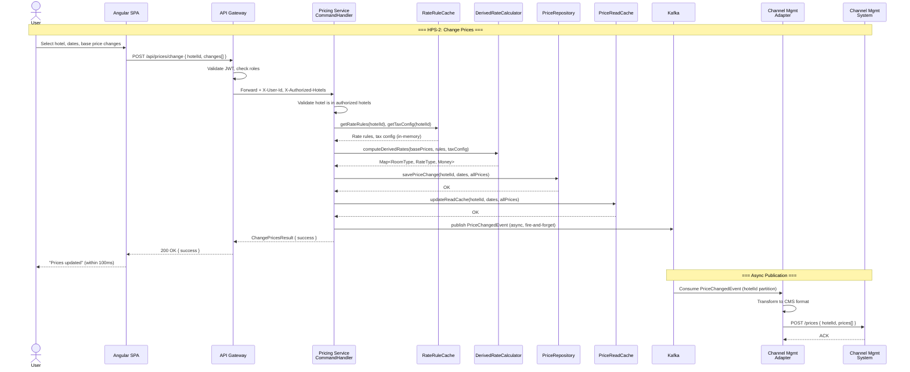
```mermaid
sequenceDiagram
    actor User
    participant SPA as Angular SPA
    participant GW as API Gateway
    participant PS_CMD as Pricing Service<br/>CommandHandler
    participant PS_CACHE as RateRuleCache
    participant PS_CALC as DerivedRateCalculator
    participant PS_REPO as PriceRepository
    participant PS_RCACHE as PriceReadCache
    participant KAFKA as Kafka
    participant CMA as Channel Mgmt<br/>Adapter
    participant CMS_EXT as Channel Mgmt<br/>System

    Note over User,CMS_EXT: === HPS-2: Change Prices ===

    User->>SPA: Select hotel, dates, base price changes
    SPA->>GW: POST /api/prices/change { hotelId, changes[] }
    GW->>GW: Validate JWT, check roles
    GW->>PS_CMD: Forward + X-User-Id, X-Authorized-Hotels

    PS_CMD->>PS_CMD: Validate hotel is in authorized hotels
    PS_CMD->>PS_CACHE: getRateRules(hotelId), getTaxConfig(hotelId)
    PS_CACHE-->>PS_CMD: Rate rules, tax config (in-memory)

    PS_CMD->>PS_CALC: computeDerivedRates(basePrices, rules, taxConfig)
    PS_CALC-->>PS_CMD: Map<RoomType, RateType, Money>

    PS_CMD->>PS_REPO: savePriceChange(hotelId, dates, allPrices)
    PS_REPO-->>PS_CMD: OK

    PS_CMD->>PS_RCACHE: updateReadCache(hotelId, dates, allPrices)
    PS_RCACHE-->>PS_CMD: OK

    PS_CMD->>KAFKA: publish PriceChangedEvent (async, fire-and-forget)
    PS_CMD-->>GW: ChangePricesResult { success }
    GW-->>SPA: 200 OK { success }
    SPA-->>User: "Prices updated" (within 100ms)

    Note over KAFKA,CMS_EXT: === Async Publication ===

    KAFKA->>CMA: Consume PriceChangedEvent (hotelId partition)
    CMA->>CMA: Transform to CMS format
    CMA->>CMS_EXT: POST /prices { hotelId, prices[] }
    CMS_EXT-->>CMA: ACK
```

---

## View 4: Query Path Scalability (HPS-3)

This deployment view focuses on the query path, showing how stateless query handling and in-memory caches enable horizontal scaling for QA-4.

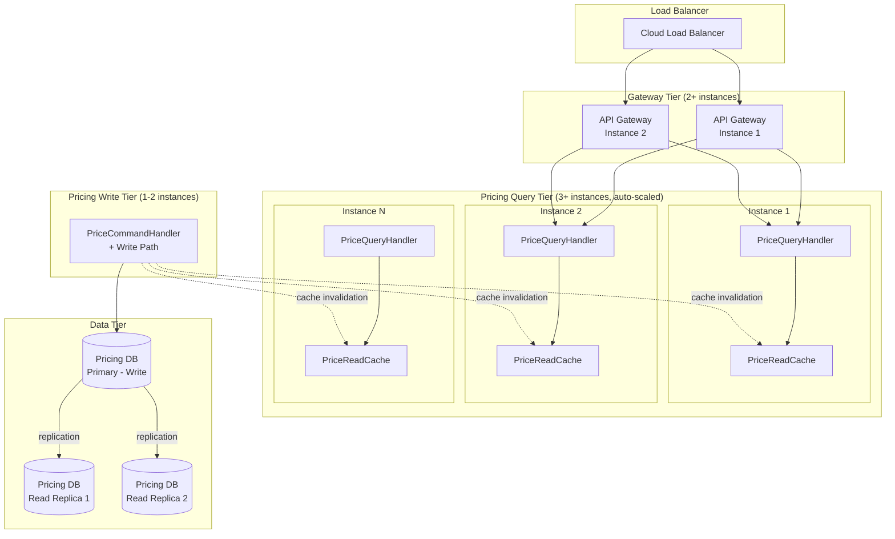
```mermaid
graph TB
    subgraph "Load Balancer"
        LB[Cloud Load Balancer]
    end

    subgraph "Gateway Tier (2+ instances)"
        GW1[API Gateway<br/>Instance 1]
        GW2[API Gateway<br/>Instance 2]
    end

    subgraph "Pricing Query Tier (3+ instances, auto-scaled)"
        subgraph "Instance 1"
            QH1[PriceQueryHandler]
            RC1[PriceReadCache]
        end
        subgraph "Instance 2"
            QH2[PriceQueryHandler]
            RC2[PriceReadCache]
        end
        subgraph "Instance N"
            QHN[PriceQueryHandler]
            RCN[PriceReadCache]
        end
    end

    subgraph "Pricing Write Tier (1-2 instances)"
        PS_WRITE[PriceCommandHandler<br/>+ Write Path]
    end

    subgraph "Data Tier"
        PDB_WRITE[(Pricing DB<br/>Primary - Write)]
        PDB_READ1[(Pricing DB<br/>Read Replica 1)]
        PDB_READ2[(Pricing DB<br/>Read Replica 2)]
    end

    LB --> GW1
    LB --> GW2

    GW1 --> QH1
    GW1 --> QH2
    GW2 --> QH1
    GW2 --> QH2

    QH1 --> RC1
    QH2 --> RC2
    QHN --> RCN

    PS_WRITE --> PDB_WRITE
    PS_WRITE -.->|cache invalidation| RC1
    PS_WRITE -.->|cache invalidation| RC2
    PS_WRITE -.->|cache invalidation| RCN

    PDB_WRITE -->|replication| PDB_READ1
    PDB_WRITE -->|replication| PDB_READ2
```

---

## View 5: Integration — Pricing Service ↔ Hotel Management Service

This view shows how the Pricing Service obtains hotel configuration and rate rules from the Hotel Management Service, including the caching and change notification mechanism.

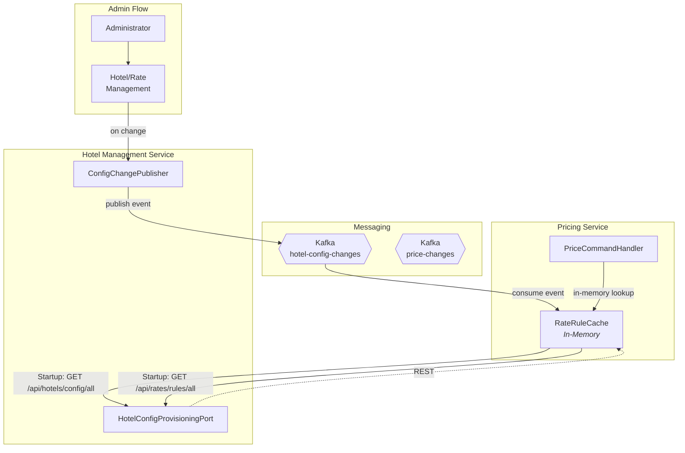
```mermaid
graph TB
    subgraph "Pricing Service"
        RRC[RateRuleCache<br/><i>In-Memory</i>]
        PS_CMD[PriceCommandHandler]
    end

    subgraph "Hotel Management Service"
        HMS_API[HotelConfigProvisioningPort]
        HMS_PUB[ConfigChangePublisher]
    end

    subgraph "Messaging"
        CONFIG_KAFKA{{Kafka<br/>hotel-config-changes}}
        PRICE_KAFKA{{Kafka<br/>price-changes}}
    end

    subgraph "Admin Flow"
        ADMIN[Administrator]
        HMS_MGMT[Hotel/Rate<br/>Management]
    end

    RRC -->|Startup: GET /api/hotels/config/all| HMS_API
    RRC -->|Startup: GET /api/rates/rules/all| HMS_API

    ADMIN --> HMS_MGMT
    HMS_MGMT -->|on change| HMS_PUB
    HMS_PUB -->|publish event| CONFIG_KAFKA
    CONFIG_KAFKA -->|consume event| RRC

    PS_CMD -->|in-memory lookup| RRC

    HMS_API -.->|REST| RRC
```

---

## View 6: Kafka Topic and Consumer Topology

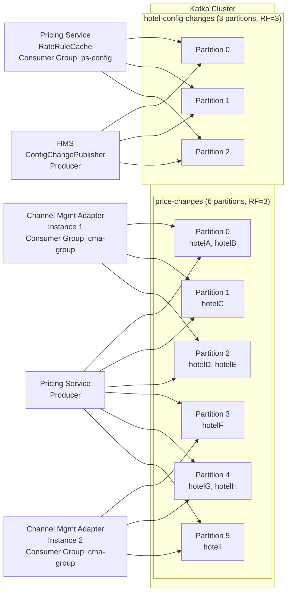
```mermaid
graph LR
    subgraph "Kafka Cluster"
        subgraph "price-changes (6 partitions, RF=3)"
            P0[Partition 0<br/>hotelA, hotelB]
            P1[Partition 1<br/>hotelC]
            P2[Partition 2<br/>hotelD, hotelE]
            P3[Partition 3<br/>hotelF]
            P4[Partition 4<br/>hotelG, hotelH]
            P5[Partition 5<br/>hotelI]
        end
        subgraph "hotel-config-changes (3 partitions, RF=3)"
            C0[Partition 0]
            C1[Partition 1]
            C2[Partition 2]
        end
    end

    PS[Pricing Service<br/>Producer] --> P0
    PS --> P1
    PS --> P2
    PS --> P3
    PS --> P4
    PS --> P5

    CMA1[Channel Mgmt Adapter<br/>Instance 1<br/>Consumer Group: cma-group] --> P0
    CMA1 --> P1
    CMA1 --> P2
    CMA2[Channel Mgmt Adapter<br/>Instance 2<br/>Consumer Group: cma-group] --> P3
    CMA2 --> P4
    CMA2 --> P5

    PS_CACHE[Pricing Service<br/>RateRuleCache<br/>Consumer Group: ps-config] --> C0
    PS_CACHE --> C1
    PS_CACHE --> C2

    HMS[HMS<br/>ConfigChangePublisher<br/>Producer] --> C0
    HMS --> C1
    HMS --> C2
```

---

## Summary of Views

| View | Type | Primary Purpose |
|------|------|----------------|
| View 1: Pricing Service CQRS | Component Diagram | Internal structure of the critical Pricing Service |
| View 2: Authentication Flow | Sequence Diagram | End-to-end OAuth2/PKCE flow for QA-5 |
| View 3: Price Change Flow | Sequence Diagram | End-to-end HPS-2 flow through all refined elements |
| View 4: Query Path Scalability | Deployment Diagram | Horizontal scaling of read path for QA-4 |
| View 5: PS↔HMS Integration | Component Diagram | Cached reference data with change notification |
| View 6: Kafka Topology | Component Diagram | Topic partitioning, consumer groups |

### ADD Step 7: Analyze Design and Review Iteration Goal

# ADD Step 7: Analyze Design and Review Iteration Goal (Iteration 2)

## Analysis Against Iteration Success Criteria

### Criterion 1: Pricing Service internal structure with separation of write path and read path ✅

**PASS** — The Pricing Service is decomposed into 10 internal elements following CQRS. The write path (PriceCommandHandler → DerivedRateCalculator → PriceRepository → PriceReadCache → PriceEventPublisher) is cleanly separated from the read path (PriceQueryHandler → PriceReadCache). Technology-agnostic ports (PriceCommandPort, PriceQueryPort, PriceRepository, PriceEventPublisher) enable protocol isolation and testability.

### Criterion 2: Derived rate calculation strategy defined ✅

**PASS** — Derived rates are computed in-memory by the DerivedRateCalculator using pre-loaded rate rules from the RateRuleCache. The computation strategy avoids cross-service calls and database round-trips during calculation. A latency budget allocates 15ms for computation within the 100ms total budget (QA-1).

### Criterion 3: Authentication and authorization flow specified end-to-end ✅

**PASS** — The OAuth2 Authorization Code flow with PKCE is specified from Angular SPA through API Gateway to the Cloud Identity Service. The API Gateway validates JWT tokens, enforces route-level authorization, and propagates claims (`X-User-Id`, `X-User-Roles`, `X-Authorized-Hotels`) to backend services. The Angular SPA uses AuthGuard, AdminGuard, and role-based UI rendering to satisfy QA-5.

### Criterion 4: Pricing Service ↔ Hotel Management Service integration designed ✅

**PASS** — The integration uses cached reference data with change notification. Rate rules and hotel configurations are loaded at Pricing Service startup and kept fresh via the `hotel-config-changes` Kafka topic. This avoids synchronous cross-service calls on the critical price-change path, preserving the 100ms latency budget. The staleness tolerance window is explicitly accepted.

### Criterion 5: Kafka topic and partitioning design defined ✅

**PASS** — Two Kafka topics are designed:
- `price-changes`: 6 partitions, hotelId key, replication factor 3, consumer group `channel-management-adapter`
- `hotel-config-changes`: 3 partitions, hotelId key, replication factor 3, consumer group `ps-config`

Partitioning by hotelId ensures message ordering per hotel.

### Criterion 6: Channel Management Adapter scope decision finalized ✅

**PASS** — R2 is resolved: the Channel Management Adapter is a standalone service, not embedded in the Pricing Service. This supports independent scaling, failure isolation, and clean separation of concerns. Kafka acts as the decoupling buffer so that price change responses do not wait for external system acknowledgment.

### Criterion 7: Concrete port interfaces defined ✅

**PASS** — Technology-agnostic port interfaces are defined for:
- Pricing Service: `PriceCommandPort`, `PriceQueryPort`, `PriceRepository`, `PriceEventPublisher`
- Hotel Management Service: `HotelConfigProvisioningPort`, `ConfigChangePublisher`
- Channel Management Adapter: `CMSClient`

All ports support mock/stub implementations for integration testing (QA-9) and protocol-independent core logic (QA-6).

---

## Driver Satisfaction Review

| Driver | Status | Evidence |
|--------|--------|----------|
| **HPS-2: Change Prices** | ✅ | Full end-to-end flow designed (View 3). All steps from UI through computation to Kafka publication are assigned to specific internal elements. |
| **QA-1 (100ms Performance)** | ✅ | Latency budget: 55ms core processing + 20ms network + 25ms margin = 100ms. In-memory computation, async Kafka produce, pre-loaded rules all contribute. |
| **HPS-3: Query Prices** | ✅ | Stateless PriceQueryHandler with in-memory PriceReadCache enables horizontal scaling (View 4). Read replicas for DB. |
| **QA-4 (Scalability)** | ✅ | Query tier can auto-scale to N instances. In-memory caches updated synchronously after writes. Read path is fully stateless. |
| **HPS-1: Login** | ✅ | OAuth2 PKCE flow specified (View 2). Token management in Angular SPA via memory + HTTP-only cookie. |
| **QA-5 (Security)** | ✅ | JWT validation at Gateway, role-based route enforcement, claim propagation to services, AuthGuard/AdminGuard in SPA, authorized-hotel filtering in UI. |
| **QA-6 (Modifiability)** | ✅ | All core logic behind technology-agnostic ports. Adding gRPC = new adapter at Gateway + new inbound adapter in Pricing Service — no core changes. |
| **QA-9 (Testability)** | ✅ | All outbound ports (PriceRepository, PriceEventPublisher, CMSClient) are interfaces — mockable. In-memory caches can be pre-populated in tests. |
| **R5 (100ms latency)** | ✅ RESOLVED | CQRS + in-memory computation + latency budget. See criterion 2. |
| **R7 (Auth details)** | ✅ RESOLVED | Complete OAuth2 PKCE flow. See criterion 3. |
| **R2 (CMA scope)** | ✅ RESOLVED | Standalone service. See criterion 6. |
| **R3 (Kafka design)** | ✅ RESOLVED | Two topics, partitioning by hotelId, consumer groups. See criterion 5. |

---

## Risks and Open Issues

| ID | Risk / Issue | Severity | Mitigation / Notes |
|----|-------------|----------|---------------------|
| **R8** | **Read cache consistency across instances:** When the Pricing Service has multiple query instances, a write must invalidate/update all read caches. The current design shows cache invalidation arrows but does not specify the mechanism (pub-sub, distributed cache, or write-through). | Medium | Address in Iteration 3 (Reliability/Availability). Options: Redis pub-sub, direct broadcast, or shared distributed cache (e.g., Redis). |
| **R9** | **RateRuleCache startup race condition:** If pricing requests arrive before the RateRuleCache has finished its initial load from HMS, the Pricing Service rejects them (503). This may violate QA-3 (99.9% availability) during deployment/restart. | Medium | Address in Iteration 3. Consider: graceful startup with readiness probes, or fallback to direct HMS call during warm-up. |
| **R10** | **QA-2 (100% publication reliability):** Kafka provides at-least-once delivery, but the Channel Management Adapter's RetryHandler and DeadLetterQueue are only preliminarily designed. Full idempotency and guaranteed delivery are not yet addressed. | High | Must be addressed in Iteration 3. |
| **R11** | **Price simulation not isolated from production data:** The simulation flow shares the RateRuleCache but skips persistence. However, the simulation command executes in the same service instance as production changes. No resource isolation. | Low | Acceptable for MVP. Could be addressed with separate simulation endpoints or rate limiting. |
| **R12** | **API Gateway as single point of failure:** Both frontend and external API consumers route through the Gateway. A Gateway outage blocks all access. | High | Address in Iteration 3. Need redundancy, health checks, and potentially separate gateways for internal vs. external traffic. |
| **R13** | **Hotel Management Service internal design:** Only the ports needed by Pricing Service are defined. Full internal structure (domain logic, adapters, database schema) is deferred. | Low | Addressed in Iteration 4 (Development & Operations). |

---

## Iteration Goal: PASSED ✅

The iteration goal — "Refine the internal structures of the top-level elements to support primary functionality" — has been achieved:

- **Pricing Service** is fully decomposed with CQRS, in-memory computation, and defined latency budgets supporting QA-1 (100ms) and QA-4 (scalability).
- **Authentication/authorization** is designed end-to-end (OAuth2 PKCE, JWT validation, role enforcement, claim propagation) satisfying QA-5.
- **PS↔HMS integration** uses cached reference data with Kafka change notifications, avoiding cross-service calls on the critical path.
- **Kafka topology** is defined with two topics, hotelId-based partitioning, and consumer groups.
- **Channel Management Adapter** is confirmed as a standalone service with Kafka as buffer.
- **All carried-forward risks from Iteration 1** (R2, R3, R5, R7) are resolved.
- **Six architectural views** document the refined structures.
- **New risks** (R8–R13) are identified for Iteration 3 (Reliability/Availability) and Iteration 4 (Development/Operations).

## Iteration 3: Address reliability and availability quality attributes

### ADD Step 2: Establish Iteration Goal by Selecting Drivers

# ADD Step 2: Establish Iteration Goal by Selecting Drivers (Iteration 3)

## Iteration Goal

**Design reliability and availability mechanisms across the system** — specifically, ensure that 100% of price changes are successfully published and received (QA-2), that the system achieves 99.9% uptime for price queries (QA-3), and that failure modes are handled gracefully. This iteration answers: _How does the system guarantee reliable publication and remain available even when components fail?_

## Selected Architectural Drivers

| Priority | Driver | Justification |
|----------|--------|---------------|
| **Primary** | QA-2 (Reliability) | 100% of price changes successfully published (queryable) AND received by Channel Management System. This is the most demanding quality requirement. Requires end-to-end reliability design: idempotency, guaranteed delivery, acknowledgment tracking, and reconciliation. |
| **Primary** | QA-3 (Availability) | Price query uptime SLA of 99.9%. Requires redundancy at every tier, health checking, graceful degradation, and failure isolation. Directly shapes deployment topology and resilience patterns. |
| **Primary** | R10 (100% publication) | Carried-forward risk from Iteration 2. CMA retry/idempotency/guaranteed-delivery mechanisms must be fully designed. |
| **Primary** | R12 (Gateway SPOF) | Carried-forward risk from Iteration 2. API Gateway redundancy and failover must be designed. |
| **Secondary** | R8 (Cache consistency) | Carried-forward risk from Iteration 2. Multi-instance read cache update mechanism must be specified. |
| **Secondary** | R9 (Startup race) | Carried-forward risk from Iteration 2. RateRuleCache warm-up / readiness gating must be designed to avoid 503 during restart. |
| **Secondary** | R1 (Cross-service consistency) | Carried-forward risk from Iteration 1. HMS unavailability impact on Pricing Service must be mitigated. |
| **Secondary** | QA-8 (Monitorability) | To verify QA-2 and QA-3, metrics collection points must be identified and preliminary metric definitions provided. Full infrastructure in Iteration 4. |
| **Tertiary** | QA-1 (Performance) | Reliability mechanisms must not compromise the 100ms latency budget. Every reliability addition is checked against the latency budget. |
| **Tertiary** | CON-6 (Cloud-Native) | Cloud-native patterns (multi-AZ, managed services, health probes, auto-scaling) are the primary enablers for availability. |

## Drivers NOT Addressed (Deferred)

| Driver | Reason |
|--------|--------|
| QA-4 (Scalability detail) | Already structurally addressed in Iteration 2; scaling policies deferred to Iteration 4 |
| QA-5 (Security detail) | Auth flow already designed in Iteration 2 |
| QA-6 (Modifiability) | Port/adapter structure already defined in Iterations 1-2 |
| QA-7 (Deployability) | CI/CD pipeline design → Iteration 4 |
| QA-9 (Testability) | Test patterns → Iteration 4 |
| CRN-3, CRN-4, CRN-5 | Development process → Iteration 4 |
| HPS-4/5/6 (Management internals) | Supporting CRUD → Iteration 4 |

## Success Criteria for This Iteration

1. **End-to-end reliable publication** is designed: idempotent price change processing in Pricing Service, guaranteed Kafka delivery, and assured CMS delivery with acknowledgment tracking. All failure modes (transient, permanent) are handled. QA-2 satisfied.
2. **API Gateway redundancy** is designed: multi-instance Gateway with load balancing, health checks, and session-independent token validation (R12 resolved).
3. **99.9% availability deployment topology** is designed: redundancy at Gateway, Pricing Service (query and write), Hotel Management Service, and CMA tiers. Multi-AZ deployment per CON-6.
4. **Read cache consistency** mechanism is specified across Pricing Service query instances (R8 resolved).
5. **Graceful startup and dependency failure** handling is designed: readiness probes, RateRuleCache warm-up gating (R9), degraded operation when HMS is unavailable (R1).
6. **Channel Management Adapter reliability** is fully specified: retry with exponential backoff, circuit breaker, dead letter queue, idempotent CMS delivery, and reconciliation (R10 resolved).
7. **Preliminary metrics** for reliability and availability are identified (foundation for QA-8 / Iteration 4).
8. **QA-1 latency budget** remains intact: all reliability additions are verified against the 100ms budget.

### ADD Step 3: Choose System Elements to Refine

# ADD Step 3: Choose One or More System Elements to Refine (Iteration 3)

## Elements Selected for Refinement

The iteration goal targets reliability and availability, which are cross-cutting concerns affecting multiple elements. The following elements are selected for refinement, prioritized by their role in the critical paths for QA-2 and QA-3.

---

### Element 1: Pricing Service — Write Path (Reliability Hardening)

**Why:** QA-2 requires that 100% of price changes are "successfully published (queryable)." The Pricing Service write path is where price changes are persisted and published to Kafka. We must ensure that once a user receives a success response, the price change is durable, queryable, and reliably enqueued for CMS delivery.

**Current State (Iteration 2):** PriceCommandHandler orchestrates the write: validate → compute derived rates → persist to DB → update read cache → fire-and-forget to Kafka. No idempotency. No acknowledgment tracking.

**Refinement Needed:**
- Idempotent change processing (duplicate requests must not create duplicate effects)
- Transactional outbox pattern or equivalent to ensure DB write and Kafka publish are atomic
- Price change acknowledgment tracking (is the price queryable?)
- Retry handling for transient DB failures

---

### Element 2: Channel Management Adapter (Full Reliability Design)

**Why:** QA-2 specifically requires that price changes are "received by the channel management system." The CMA is the sole bridge to the CMS. Its reliability directly determines whether QA-2 is satisfied. R10 (High severity) demands this be fully designed.

**Current State (Iteration 2):** Standalone service. PriceChangeConsumer reads from Kafka. MessageTransformer formats data. CMSClient (port) and CMSRestAdapter (adapter) communicate with CMS. Basic RetryHandler and DeadLetterQueue exist but are preliminary.

**Refinement Needed:**
- Full retry strategy with exponential backoff and jitter
- Circuit breaker for CMS to avoid cascading failures
- Idempotent CMS delivery (duplicate messages must not create duplicate prices at CMS)
- Dead letter handling with operator alerting
- Reconciliation mechanism for messages that fail permanently
- Consumer offset management (commit only after CMS confirms)

---

### Element 3: API Gateway (High Availability Hardening)

**Why:** R12 (High severity) identifies the Gateway as a single point of failure. Both browser frontend and external API consumers depend on it. QA-3 (99.9% availability) cannot be met if the Gateway is a SPOF.

**Current State (Iteration 2):** Single-tier gateway. AuthFilter, RoleEnforcer, ClaimPropagator, RequestRouter, RateLimiter. Single instance in Iteration 2 deployment views.

**Refinement Needed:**
- Multi-instance deployment with cloud load balancer
- Stateless design validation (no server-side sessions — JWT is self-contained)
- Health probe endpoints for load balancer
- Graceful shutdown (drain in-flight requests)
- Circuit breakers for downstream service calls

---

### Element 4: Pricing Service — Read Cache Consistency

**Why:** R8 (Medium severity) — when multiple Pricing Service query instances exist, a write on one instance must update caches on all instances. Stale reads violate the "published (ready for query)" aspect of QA-1 and QA-2.

**Current State (Iteration 2):** PriceReadCache is local (in-memory per instance). Write path updates local cache. Cache invalidation arrows were drawn in Iteration 2 View 4 but mechanism unspecified.

**Refinement Needed:**
- Distributed cache invalidation / update mechanism
- Options: Redis pub-sub, centralized cache (Redis), or write-through to shared cache
- Evaluation against QA-1 latency budget (cache update step is currently budgeted at 5ms)

---

### Element 5: Pricing Service — Startup and Dependency Resilience

**Why:** R9 (startup race) and R1 (HMS dependency) both affect the Pricing Service's ability to become and remain available. QA-3 requires the service to handle these gracefully.

**Current State (Iteration 2):** RateRuleCache loads all config from HMS at startup. No readiness gating. No fallback if HMS is unavailable.

**Refinement Needed:**
- Readiness probe: Pricing Service reports "ready" only after RateRuleCache is warm
- Fallback strategy for HMS unavailability during operation (retry with backoff, serve from stale cache)
- Startup resilience: if HMS is down, Pricing Service retries with backoff; does not crash-loop
- Cache staleness monitoring and alerting

---

### Element 6: Hotel Management Service (Availability Hardening)

**Why:** R1 originated from HMS being a dependency of Pricing Service. If HMS is unavailable, Pricing Service cannot refresh its RateRuleCache. Also, administrative functions (HPS-4/5/6) must remain available for the 99.9% SLA.

**Current State (Iteration 2):** Single instance in deployment views. Exposes HotelConfigProvisioningPort and ConfigChangePublisher. Full internals not designed.

**Refinement Needed (for this iteration):**
- Multi-instance deployment with load balancing
- Database-level redundancy (managed DB with read replicas)
- Graceful handling of Pricing Service config requests
- Health probe endpoints

---

### Element 7: Kafka (Infrastructure Resilience)

**Why:** Kafka is the backbone of async communication (price publication, config change notification). Its reliability directly impacts QA-2. While it's a cloud-managed service (CON-6), we must design consumer-side resilience patterns.

**Current State (Iteration 2):** Two topics defined (`price-changes`, `hotel-config-changes`). Cloud-managed Kafka assumed. Consumer groups defined.

**Refinement Needed:**
- Consumer-side resilience: retry, idempotent processing, offset commit strategy
- Monitoring: consumer lag, topic throughput (preliminary for QA-8)
- Multi-AZ deployment validation (managed service should handle this)

---

### Elements NOT Refined in This Iteration

| Element | Reason |
|---------|--------|
| HPS Web Frontend | Browser-side reliability is inherently limited; SPA is served via CDN (already highly available) |
| HPS Web Frontend internals | Already organized in Iteration 2; no reliability changes needed at component level |
| Hotel Management Service internals (domain logic) | Full internal structure deferred to Iteration 4 |
| Management Database schema | Iteration 4 |
| CI/CD pipeline | Iteration 4 |

### ADD Step 4: Choose Design Concepts

# ADD Step 4: Choose One or More Design Concepts (Iteration 3)

---

## 4A: Pricing Service Write Path — Transactional Outbox for Reliable Publication

### Problem
The Iteration 2 design uses fire-and-forget Kafka publish after DB commit. If the Kafka publish fails (or the process crashes between DB commit and Kafka publish), the price change is durable but not published. This violates QA-2: "100% of price changes are successfully published."

### Alternatives Evaluated

**Alternative A: Two-Phase Commit (XA) across DB and Kafka**
- QA-2: ⚠ Theoretically atomic, but Kafka doesn't natively support XA. Complex and fragile.
- QA-1: ❌ Two-phase commit adds significant latency. Would violate 100ms budget.
- CON-4 (MVP): ❌ Operational complexity too high.

**Alternative B: Transactional Outbox Pattern (SELECTED)**
- Write price change AND an outbox message in a single DB transaction. A separate process (OutboxPoller) reads the outbox table and publishes to Kafka. After successful Kafka publish, marks outbox record as published.
- QA-2: ✅ Guarantees at-least-once delivery. No published message can be lost once the DB transaction commits.
- QA-1: ✅ Outbox write is a single additional row in the same transaction — negligible latency impact (~2ms). Kafka publish is asynchronous from the user's perspective.
- CON-4: ✅ Well-known pattern, straightforward to implement.

**Alternative C: Event Sourcing**
- QA-2: ✅ Events are the source of truth.
- QA-1: ⚠ Event replay for read model adds latency.
- CON-4: ❌ High operational complexity for 2-month MVP.

### Selected: Transactional Outbox Pattern

| Aspect | Design |
|--------|--------|
| **Outbox Table** | `price_change_outbox` in Pricing Database. Columns: `id` (UUID), `aggregate_id` (hotelId), `event_type`, `payload` (JSON), `created_at`, `published_at` (nullable), `retry_count`. |
| **Atomic Write** | `PriceRepository.savePriceChange()` writes both the price data AND the outbox record in a single DB transaction. |
| **OutboxPoller** | Background thread/process in Pricing Service. Polls `price_change_outbox WHERE published_at IS NULL` every 100ms. Publishes to Kafka. On success, sets `published_at`. |
| **At-Least-Once** | If Kafka publish succeeds but the DB update to set `published_at` fails, the message will be re-published on next poll. Kafka consumer (CMA) must be idempotent (see 4B). |
| **Latency Impact** | ~2ms for additional row insert in same transaction. Well within the 100ms budget (Step 5 will recalculate). |

---

## 4B: Channel Management Adapter — Full Reliability Design

### Design Decisions

#### 4B-1: Idempotent CMS Delivery

Since the Pricing Service Transactional Outbox may re-publish duplicate messages to Kafka, the CMA must deliver idempotently to the CMS.

| Decision | Rationale |
|----------|-----------|
| **Message deduplication key** | Each `PriceChangedEvent` includes a unique `eventId` (UUID from outbox). CMA uses `eventId` as idempotency key when calling CMS. |
| **CMS-side idempotency** | If CMS supports idempotency keys natively, use them. If not, CMA maintains a local dedup cache (TTL = 24 hours) of recently published `eventId`s. |
| **Idempotency storage** | In-memory LRU cache for recent events + periodic flush to a DB table for persistence across CMA restarts. |

#### 4B-2: Retry Strategy

| Aspect | Design |
|--------|--------|
| **Retry policy** | Exponential backoff with jitter: 1s → 2s → 4s → 8s → 16s → 32s (max 5 retries). |
| **Transient vs. Permanent** | HTTP 5xx, network errors, timeouts → transient (retry). HTTP 4xx (except 429) → permanent (no retry, move to DLQ). HTTP 429 (rate limit) → retry with longer backoff, respecting Retry-After header. |
| **Consumer offset commit** | Commit Kafka offset ONLY after CMS confirms receipt (200 OK). If retries exhausted → move to DLQ → commit offset. |

#### 4B-3: Circuit Breaker

| Aspect | Design |
|--------|--------|
| **Pattern** | Circuit Breaker on CMSClient calls. States: CLOSED → OPEN (after 5 consecutive failures in 60s window) → HALF_OPEN (after 30s cooldown) → CLOSED (on first success). |
| **Behavior when OPEN** | CMA pauses consumption (pauses Kafka consumer). Messages accumulate in Kafka (retention = 7 days). Prevents resource exhaustion from repeated failed calls. |
| **Recovery** | After cooldown, one probe request. If success → close circuit, resume consumption. If failure → remain open, reset cooldown timer. |

#### 4B-4: Dead Letter Queue and Reconciliation

| Aspect | Design |
|--------|--------|
| **DLQ Topic** | Kafka topic `price-changes-dlq`. Messages that exhaust retries or encounter permanent failures are published here. |
| **DLQ Consumer** | A lightweight process reads DLQ and stores messages in a database/object store for operator inspection. |
| **Operator Alert** | When a message lands in DLQ, emit a metric that triggers an alert (QA-8 foundation). |
| **Reconciliation API** | CMA exposes `POST /admin/reconciliation/replay?eventId=X` endpoint for operators to manually replay a failed message after root cause is resolved. |

---

## 4C: API Gateway — High Availability

### Selected: Stateless Multi-Instance Gateway with Cloud Load Balancer

| Aspect | Design |
|--------|--------|
| **Statelessness** | Gateway stores no session state. JWT tokens are self-contained — any instance can validate any token. No session affinity required. |
| **Multi-Instance** | Minimum 2 instances, deployed across availability zones (CON-6). Cloud load balancer distributes traffic (round-robin or least-connections). |
| **Health Probe** | `GET /health` endpoint. Returns 200 if Gateway is healthy. Load balancer removes unhealthy instances. Health check includes: connectivity to downstream services, token signing key availability. |
| **Graceful Shutdown** | On SIGTERM: stop accepting new connections, drain in-flight requests (30s timeout), then exit. Kubernetes/container orchestrator handles this natively (CON-6). |
| **Circuit Breakers (Downstream)** | Gateway adds circuit breakers for calls to Pricing Service and Hotel Management Service. If Pricing Service is slow, Gateway returns 503 with Retry-After rather than blocking threads. |
| **Rate Limiting (Distributed)** | Rate limiter uses a shared Redis instance (cloud-managed) for distributed counters. Falls back to per-instance limits if Redis is unavailable — slightly less accurate but still protective. |

---

## 4D: Pricing Service — Read Cache Consistency

### Alternatives Evaluated

**Alternative A: Local cache with pub-sub invalidation**
- Each write instance publishes an invalidation event. All query instances subscribe.
- QA-1: ✅ Fast — pub-sub message adds ~5ms.
- QA-3: ⚠ If a query instance misses an invalidation message (network blip), its cache is stale until next write.
- Complexity: Medium.

**Alternative B: Shared distributed cache (Redis) — SELECTED**
- All query instances read from a shared Redis cache. Write instances update Redis directly.
- QA-1: ✅ Redis write is ~2-3ms within same AZ. Slightly higher cross-AZ but still within budget.
- QA-3: ✅ No cache consistency issues — single source of truth. Query instances can come and go freely.
- Complexity: Low — cloud-managed Redis service (CON-6).

**Alternative C: No cache — always read from DB read replicas**
- QA-1: ⚠ DB read latency (5-15ms per query) may accumulate under load. Less predictable.
- QA-4: ⚠ Can scale read replicas, but cache is more cost-effective for hot data.
- Complexity: Lowest, but performs worse.

### Selected: Shared Distributed Cache (Redis)

| Aspect | Design |
|--------|--------|
| **Cache Store** | Cloud-managed Redis (CON-6). Single cluster with read replicas across AZs. |
| **Write Path** | After DB commit + outbox write, `PriceCommandHandler` writes computed prices to Redis: `SET price:{hotelId}:{date}:{roomType}:{rateType} = {amount}` with TTL = 24 hours. |
| **Read Path** | `PriceQueryHandler` calls `MGET` (batch read) from Redis for the requested date range. No DB access on the query path. |
| **Fallback** | If Redis is unavailable, query handler falls back to Pricing DB read replica. Slower but available — supports QA-3. |
| **Latency Budget** | Redis write: 2-3ms (was 5ms for local cache update in Iteration 2 budget). Saves 2ms. |

---

## 4E: Pricing Service — Startup and Dependency Resilience

### Selected: Readiness Gating + Graceful Degradation

| Aspect | Design |
|--------|--------|
| **Readiness Probe** | `GET /health/ready`. Returns 200 only when: (a) RateRuleCache is fully loaded, (b) DB connection is healthy, (c) Redis connection is healthy, (d) Kafka connection is healthy. Kubernetes uses this to control traffic routing (CON-6). |
| **Startup Sequence** | 1. Connect to DB, Redis, Kafka. 2. Load RateRuleCache from HMS (with retry: 5 attempts, 2s backoff). 3. Begin polling outbox. 4. Signal readiness. |
| **HMS Unavailable at Startup** | Retry loading config for up to 2 minutes. If still unavailable, signal readiness anyway but with `degraded=true`. In degraded mode, Pricing Service uses a local fallback config file (last known good configuration, updated on each successful HMS sync). |
| **HMS Unavailable During Operation** | RateRuleCache continues serving from last-known-good cache. Logs a warning. Emits a metric for alerting (QA-8 foundation). Retries in background every 30s. |
| **Cache Staleness Monitoring** | If HMS has been unreachable for > 5 minutes, emit an alert. Cache staleness beyond 30 minutes triggers a critical alert. |

---

## 4F: Hotel Management Service — Multi-Instance Availability

### Design Decisions

| Aspect | Design |
|--------|--------|
| **Multi-Instance** | Minimum 2 instances across AZs. Stateless design (no sticky sessions). Cloud load balancer distributes requests. |
| **Database Redundancy** | Managed database with primary + read replica across AZs (CON-6). Automatic failover. |
| **Health Probe** | `GET /health`. Checks DB connectivity. |
| **Config Provisioning for Pricing Service** | Remains REST-based. Multiple HMS instances behind load balancer — Pricing Service calls the load-balanced endpoint. |
| **Kafka Producer Resilience** | `ConfigChangePublisher` uses Kafka's built-in retries (`retries=3`, `acks=all`). If Kafka is unavailable, config changes are still persisted to DB; a background process reconciles unpublished events. |

---

## 4G: Kafka Resilience Patterns

| Aspect | Design |
|--------|--------|
| **Producer Settings (Pricing Service)** | `acks=all` (wait for all in-sync replicas), `retries=3`, `enable.idempotence=true` (Kafka-level dedup). |
| **Consumer Offset Commit (CMA)** | Manual commit after CMS confirms receipt. This ensures at-least-once delivery even if CMA crashes mid-processing. |
| **Consumer Lag Monitoring** | Expose consumer lag metrics. If lag > 1000 messages or > 60s, trigger alert (QA-8 foundation). |
| **Multi-AZ** | Managed Kafka deployed across 3 AZs (CON-6). Replication factor = 3. Min in-sync replicas = 2. |

---

## Summary of Design Concept Selections

| Element | Selected Concept | Primary Driver |
|---------|-----------------|----------------|
| Pricing Service (Write) | Transactional Outbox Pattern | QA-2 (reliable publication) |
| Channel Management Adapter | Idempotent delivery + Exponential Backoff + Circuit Breaker + DLQ | QA-2 (guaranteed CMS receipt) |
| API Gateway | Stateless multi-instance + Cloud LB + Health probes + Circuit breakers | QA-3 (99.9% availability), R12 |
| Pricing Service (Cache) | Shared Redis cache with DB fallback | R8 (cache consistency), QA-3 |
| Pricing Service (Startup) | Readiness gating + degraded mode + fallback config | R9, R1, QA-3 |
| Hotel Management Service | Multi-instance + DB redundancy + Kafka producer retries | QA-3, R1 |
| Kafka | Producer idempotence + manual offset commit + lag monitoring | QA-2, QA-3 |

### ADD Step 5: Instantiate Elements, Assign Responsibilities, and Define Interfaces

# ADD Step 5: Instantiate Architectural Elements, Assign Responsibilities, and Define Interfaces (Iteration 3)

---

## 5A: Pricing Service — Transactional Outbox Implementation

### New/Modified Internal Elements

| Element | Status | Changes |
|---------|--------|---------|
| **PriceCommandHandler** | MODIFIED | Now coordinates transactional outbox: DB write now includes outbox record insertion. No longer calls KafkaPriceAdapter directly. |
| **PriceRepository** | MODIFIED | `savePriceChange()` now writes both price data AND an outbox record in a single transaction. New method: `markOutboxPublished(eventId)`. |
| **OutboxPoller** | NEW | Background process. Polls unpublished outbox records every 100ms. Publishes to Kafka via KafkaPriceAdapter. On success, marks record as published. Runs in the same Pricing Service process. |
| **KafkaPriceAdapter** | MODIFIED | Called by OutboxPoller (not PriceCommandHandler). Producer config updated: `acks=all`, `retries=3`, `enable.idempotence=true`. |
| **RedisCacheAdapter** | NEW | Writes computed prices to Redis after DB commit. Reads prices from Redis for query path. Falls back to DB read replica if Redis unavailable. |
| **PricingServiceHealthProbe** | NEW | Exposes `/health/ready` (readiness) and `/health/live` (liveness). Readiness checks: RateRuleCache loaded, DB, Redis, Kafka connectivity. |
| **FallbackConfigStore** | NEW | Stores last-known-good hotel config and rate rules on local disk. Used in degraded mode when HMS is unreachable. |

### Modified Write Flow (with Transactional Outbox)

```
RESTPricingAdapter → PriceCommandHandler
  → RateRuleCache (get rules, in-memory)
  → DerivedRateCalculator (compute derived rates)
  → PriceRepository.savePriceChange()  ← SINGLE TRANSACTION:
      1. INSERT/UPDATE price records
      2. INSERT into price_change_outbox (eventId, hotelId, payload)
  → RedisCacheAdapter.writeToCache()    ← After transaction commit
  → Return success to caller

[Async, background]
OutboxPoller:
  → SELECT * FROM price_change_outbox WHERE published_at IS NULL
  → FOR EACH: KafkaPriceAdapter.publish(event)
  → ON SUCCESS: PriceRepository.markOutboxPublished(eventId)
```

### New/Updated Port Interfaces

```
// === Modified PriceCommandPort (unchanged signature, changed implementation) ===
interface PriceCommandPort {
    ChangePricesResult changePrices(ChangePricesCommand command);
    // Implementation now uses transactional outbox instead of direct Kafka publish
}

// === New: Outbox Repository Port ===
interface OutboxRepository {
    List<OutboxRecord> pollUnpublished(int batchSize);
    void markPublished(EventId eventId);
    void incrementRetry(EventId eventId);
}

// === New: Cache Port ===
interface PriceCachePort {
    void writePrices(HotelId hotelId, DateRange dates, Map<RateType, Map<RoomType, Money>> prices);
    Optional<PriceSnapshot> readPrices(HotelId hotelId, DateRange dates, List<RateType> rateTypes);
    void invalidate(HotelId hotelId);
}
```

### Updated Latency Budget (QA-1, 100ms)

| Step | Previous Budget | New Budget | Change |
|------|----------------|------------|--------|
| HTTP ingress + deserialization | 5ms | 5ms | — |
| Rate rule lookup | 2ms | 2ms | — |
| Derived rate computation | 15ms | 15ms | — |
| DB write (price + outbox) | 20ms | 22ms | +2ms (outbox row) |
| Redis cache write | 5ms | 3ms | -2ms (Redis faster than local) |
| Kafka produce (async) | 3ms | 0ms | -3ms (moved to background) |
| HTTP response | 5ms | 5ms | — |
| **Subtotal core** | **55ms** | **52ms** | **-3ms net improvement** |
| Network + Gateway | 20ms | 20ms | — |
| Safety margin | 25ms | 28ms | +3ms |
| **Total budget** | **100ms** | **100ms** | — |

---

## 5B: Channel Management Adapter — Full Reliability Internals

### New/Modified Internal Elements

| Element | Status | Details |
|---------|--------|---------|
| **PriceChangeConsumer** | MODIFIED | Consumes from `price-changes`. Manual offset commit only after CMS confirms. Batches messages for efficiency. |
| **MessageTransformer** | UNCHANGED | Transforms PriceChangedEvent to CMS format. |
| **IdempotencyGuard** | NEW | Checks if `eventId` was already published to CMS. Maintains in-memory LRU cache (24h TTL) + periodic DB persistence. |
| **CMSClient (Port)** | MODIFIED | Now accepts `idempotencyKey` parameter. |
| **CMSRestAdapter** | MODIFIED | Sends `Idempotency-Key: {eventId}` header to CMS. |
| **RetryHandler** | REPLACED (WAS PRELIMINARY) | Full exponential backoff: 1s→2s→4s→8s→16s→32s (max 5 retries). Jitter: ±25%. Classifies errors as transient/permanent. |
| **CircuitBreaker** | NEW | Monitors CMS call outcomes. CLOSED→OPEN after 5 consecutive failures in 60s. HALF_OPEN after 30s cooldown. OPEN state pauses Kafka consumer. |
| **DeadLetterPublisher** | MODIFIED | Publishes permanently failed messages to `price-changes-dlq` Kafka topic. |
| **ReconciliationAPI** | NEW | REST endpoint for operators: `POST /admin/reconciliation/replay?eventId=X`, `GET /admin/reconciliation/dlq?hotelId=X&from=Y&to=Z`. |
| **CMAHealthProbe** | NEW | `/health/ready` checks: Kafka connectivity, CMS reachability (non-blocking), DB connectivity (for idempotency store). |

### CMA Processing Flow

```
PriceChangeConsumer.poll()
  → FOR EACH message:
      IdempotencyGuard.check(eventId)
        → IF already published: skip, commit offset
        → ELSE: continue
      CircuitBreaker.allowRequest()
        → IF OPEN: pause consumer, wait for cooldown
        → ELSE: continue
      MessageTransformer.transform(event) → CMS-formatted payload
      CMSClient.publishPrices(hotelId, prices, idempotencyKey=eventId)
        → SUCCESS:
            IdempotencyGuard.record(eventId)
            Consumer.commitOffset()
        → TRANSIENT_FAILURE:
            RetryHandler.retry(message)  ← up to 5 times
        → ALL_RETRIES_EXHAUSTED:
            DeadLetterPublisher.send(message)
            Consumer.commitOffset()  ← don't block the queue
        → PERMANENT_FAILURE (4xx):
            DeadLetterPublisher.send(message)
            Consumer.commitOffset()
```

### Port Interfaces

```
// === Modified CMSClient Port ===
interface CMSClient {
    PublicationResult publishPrices(
        HotelId hotelId,
        List<PublishedPrice> prices,
        IdempotencyKey idempotencyKey
    );
}

// === New: IdempotencyStore Port ===
interface IdempotencyStore {
    boolean hasBeenProcessed(EventId eventId);
    void markProcessed(EventId eventId);
    void expireOlderThan(Duration ttl);
}

// === New: DeadLetterPort ===
interface DeadLetterPort {
    void send(PriceChangedEvent event, FailureReason reason);
    List<DeadLetteredEvent> query(HotelId hotelId, TimeRange range);
    Optional<DeadLetteredEvent> get(EventId eventId);
}

// === New: Reconciliation Port ===
interface ReconciliationPort {
    ReconciliationResult replay(EventId eventId);
    List<DeadLetteredEvent> listDeadLetters(HotelId hotelId, TimeRange range);
}
```

---

## 5C: API Gateway — High Availability Internals

### New/Modified Internal Elements

| Element | Status | Details |
|---------|--------|---------|
| **RequestRouter** | UNCHANGED | Routes to downstream services per route table. |
| **AuthFilter** | UNCHANGED | JWT validation is stateless — works across instances. |
| **RoleEnforcer** | UNCHANGED | Role check from JWT claims — stateless. |
| **CircuitBreaker (Downstream)** | NEW | Per-downstream-service circuit breaker. If Pricing Service is degraded, Gateway returns 503 rather than blocking threads. |
| **GatewayHealthProbe** | NEW | `GET /health` returns 200 if: (a) Gateway process is alive, (b) at least one downstream service is reachable. Used by cloud load balancer. |
| **DistributedRateLimiter** | NEW | Token bucket algorithm backed by Redis. Per-user and per-IP counters. Falls back to per-instance limits if Redis unavailable. |
| **GracefulShutdownHandler** | NEW | On SIGTERM: stop accepting new connections, complete in-flight requests (30s max), then exit. |

### Gateway Redundancy Configuration

| Aspect | Value |
|--------|-------|
| **Min instances** | 2 |
| **Max instances** | 6 (auto-scaled on CPU > 70%) |
| **AZ distribution** | Spread across 2+ availability zones |
| **Load balancer** | Cloud-managed, round-robin |
| **Health check path** | `GET /health` |
| **Health check interval** | 10s |
| **Unhealthy threshold** | 3 consecutive failures |
| **Graceful shutdown timeout** | 30s |

---

## 5D: Pricing Service — Read Cache Architecture (Redis)

### Redis Cache Design

| Aspect | Design |
|--------|--------|
| **Cache Type** | Cloud-managed Redis cluster (CON-6) |
| **Key Pattern** | `price:{hotelId}:{date}:{roomType}:{rateType}` |
| **Value** | JSON: `{ "amount": 199.00, "currency": "USD", "computedAt": "2025-01-15T10:30:00Z" }` |
| **TTL** | 24 hours (prices typically change daily; stale data auto-expires) |
| **Write Strategy** | Write-through: Pricing Service writes to Redis after every price change |
| **Read Strategy** | Cache-aside: QueryHandler reads Redis first; on miss, reads DB read replica and populates cache |
| **Fallback** | If Redis unavailable, QueryHandler reads directly from Pricing DB read replica |
| **Cluster** | 1 primary + 2 replicas across AZs |

### RedisCacheAdapter Implementation

```
class RedisCacheAdapter implements PriceCachePort {
    writePrices(hotelId, dates, prices):
        pipeline = redis.pipeline()
        FOR EACH (date, roomType, rateType) → amount:
            key = "price:{hotelId}:{date}:{roomType}:{rateType}"
            pipeline.setex(key, 86400, toJson(amount))  // 24h TTL
        pipeline.execute()

    readPrices(hotelId, dates, rateTypes):
        keys = buildKeys(hotelId, dates, rateTypes)
        values = redis.mget(keys)
        IF all found: return PriceSnapshot.from(values)
        ELSE: fallback to DB read replica → populate cache → return
}
```

---

## 5E: Pricing Service — Startup and Dependency Resilience

### Startup Sequence with Readiness Gating

| Phase | Action | Readiness Signal |
|-------|--------|-----------------|
| 1 | Connect to DB | Not ready |
| 2 | Connect to Redis | Not ready |
| 3 | Connect to Kafka | Not ready |
| 4 | Load RateRuleCache from HMS (retry up to 2 min) | Not ready |
| 4a | If HMS unreachable after 2 min → load FallbackConfigStore | Ready (degraded=true) |
| 5 | Start OutboxPoller | Ready (if step 4 succeeded) |
| 6 | Signal readiness | Ready (or Ready+degraded) |

### Degraded Mode Behavior

| Scenario | Behavior |
|----------|----------|
| HMS unreachable during operation | RateRuleCache serves last-known-good config. Retry HMS every 30s. Metric emitted: `pricing_service_config_staleness_seconds`. |
| Redis unreachable during operation | Query path falls back to DB read replica. Write path continues to update Redis (buffered). Metric: `pricing_service_redis_available = 0`. |
| DB primary unreachable | Price changes fail immediately with 503. Read path serves from Redis cache (stale but available). |
| Kafka unreachable | OutboxPoller backs off. Messages accumulate in outbox table. Alert at 1000 pending messages. |

### Health Probe Endpoints

| Endpoint | Purpose | Success Conditions |
|----------|---------|-------------------|
| `GET /health/live` | Liveness (should restart if fail) | Process is alive. Minimal check. |
| `GET /health/ready` | Readiness (should receive traffic if pass) | RateRuleCache loaded OR degraded mode. DB connected. Redis connected. Kafka connected. |

---

## 5F: Hotel Management Service — Availability Configuration

### Multi-Instance Configuration

| Aspect | Value |
|--------|-------|
| **Min instances** | 2 |
| **AZ distribution** | 2+ AZs |
| **Load balancer** | Cloud-managed, round-robin |
| **Health probe** | `GET /health` (checks DB) |
| **Database** | Managed DB: 1 primary + 1 read replica, multi-AZ, auto-failover |
| **Kafka producer** | `acks=all`, `retries=3`, `enable.idempotence=true` |

### New Elements

| Element | Status | Details |
|---------|--------|---------|
| **HMSHealthProbe** | NEW | `GET /health` checks DB connectivity |
| **ConfigProvisioningController** | NEW (Refinement of existing port) | Handles Pricing Service requests for config. Stateless — any HMS instance can serve. Response includes `Last-Modified` timestamp for caching. |

---

## 5G: Preliminary Metrics for QA-8

These metric definitions provide the foundation for the full monitoring infrastructure to be designed in Iteration 4.

| Metric Name | Type | Source | Description |
|-------------|------|--------|-------------|
| `price_change_publication_success_total` | Counter | Pricing Service (OutboxPoller) | Count of successfully published outbox messages |
| `price_change_publication_failure_total` | Counter | Pricing Service (OutboxPoller) | Count of failed outbox publish attempts |
| `price_change_outbox_pending` | Gauge | Pricing Service | Number of unpublished outbox records |
| `cms_delivery_success_total` | Counter | CMA | Count of successful CMS deliveries |
| `cms_delivery_failure_total` | Counter | CMA | Count of failed CMS deliveries |
| `cms_delivery_retry_total` | Counter | CMA | Count of CMS delivery retries |
| `cms_circuit_breaker_state` | Gauge | CMA | 0=CLOSED, 1=OPEN, 2=HALF_OPEN |
| `dead_letter_queue_size` | Gauge | CMA | Number of messages in DLQ |
| `kafka_consumer_lag` | Gauge | CMA, Pricing Service | Consumer lag in message count |
| `pricing_service_config_staleness_seconds` | Gauge | Pricing Service | Time since last successful HMS config refresh |
| `pricing_service_degraded_mode` | Gauge | Pricing Service | 0=normal, 1=degraded |
| `gateway_upstream_availability` | Gauge | API Gateway | 1=available, 0=unavailable (per downstream service) |
| `price_query_latency_p99` | Histogram | Pricing Service (QueryHandler) | P99 query latency in ms |
| `price_change_latency_p99` | Histogram | Pricing Service (CommandHandler) | P99 change latency in ms |

---

## Summary: Risk Resolution Status

| Risk ID | Status | Resolution |
|---------|--------|------------|
| **R10** (100% publication) | ✅ RESOLVED | Transactional Outbox ensures DB→Kafka atomicity. CMA with idempotent delivery, retry, circuit breaker, DLQ, and reconciliation API ensures CMS receipt. |
| **R12** (Gateway SPOF) | ✅ RESOLVED | Multi-instance Gateway with cloud load balancer, health probes, graceful shutdown, and downstream circuit breakers. |
| **R8** (Cache consistency) | ✅ RESOLVED | Shared Redis cache replaces local caches. Write-through from Pricing Service. Fallback to DB read replica. |
| **R9** (Startup race) | ✅ RESOLVED | Readiness probe with gating on RateRuleCache load. Degraded mode with fallback config file. |
| **R1** (PS↔HMS dependency) | ✅ RESOLVED | Degraded mode with fallback config. Background retry. HMS multi-instance for availability. |

### ADD Step 6: Sketch Views and Perspectives

# ADD Step 6: Sketch Views and Perspectives (Iteration 3)

---

## View 1: Transactional Outbox — Reliable Price Publication

This sequence diagram shows how the Transactional Outbox pattern guarantees that every price change is published to Kafka, even in the face of failures.

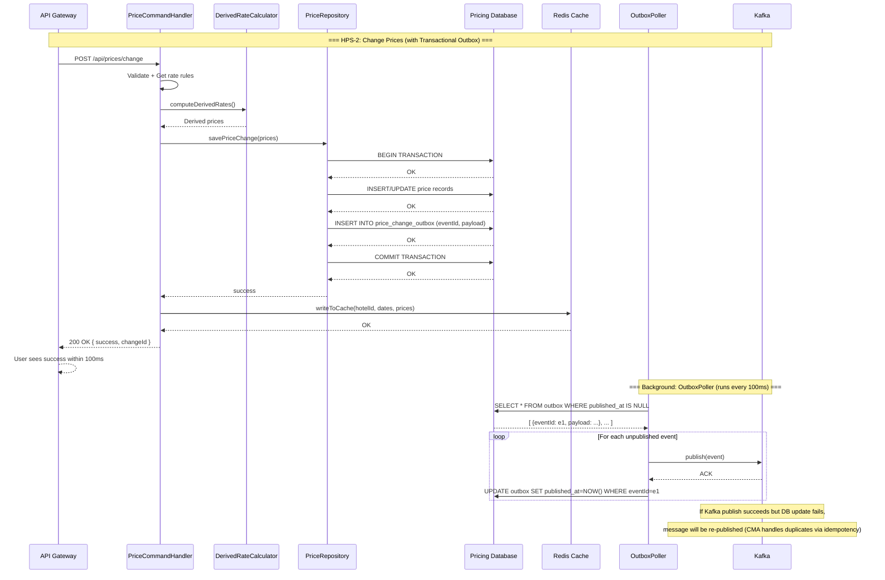
```mermaid
sequenceDiagram
    participant GW as API Gateway
    participant CMD as PriceCommandHandler
    participant CALC as DerivedRateCalculator
    participant REPO as PriceRepository
    participant DB as Pricing Database
    participant REDIS as Redis Cache
    participant POLLER as OutboxPoller
    participant KAFKA as Kafka

    Note over GW,KAFKA: === HPS-2: Change Prices (with Transactional Outbox) ===

    GW->>CMD: POST /api/prices/change

    CMD->>CMD: Validate + Get rate rules
    CMD->>CALC: computeDerivedRates()
    CALC-->>CMD: Derived prices

    CMD->>REPO: savePriceChange(prices)
    REPO->>DB: BEGIN TRANSACTION
    DB-->>REPO: OK
    REPO->>DB: INSERT/UPDATE price records
    DB-->>REPO: OK
    REPO->>DB: INSERT INTO price_change_outbox (eventId, payload)
    DB-->>REPO: OK
    REPO->>DB: COMMIT TRANSACTION
    DB-->>REPO: OK
    REPO-->>CMD: success

    CMD->>REDIS: writeToCache(hotelId, dates, prices)
    REDIS-->>CMD: OK

    CMD-->>GW: 200 OK { success, changeId }
    GW-->>GW: User sees success within 100ms

    Note over POLLER,KAFKA: === Background: OutboxPoller (runs every 100ms) ===

    POLLER->>DB: SELECT * FROM outbox WHERE published_at IS NULL
    DB-->>POLLER: [ {eventId: e1, payload: ...}, ... ]

    loop For each unpublished event
        POLLER->>KAFKA: publish(event)
        KAFKA-->>POLLER: ACK
        POLLER->>DB: UPDATE outbox SET published_at=NOW() WHERE eventId=e1
    end

    Note over KAFKA: If Kafka publish succeeds but DB update fails,
    Note over KAFKA: message will be re-published (CMA handles duplicates via idempotency)
```

---

## View 2: Channel Management Adapter — Reliable CMS Delivery

This sequence diagram shows how the CMA ensures guaranteed delivery to the Channel Management System with idempotency, retry, circuit breaker, and dead letter handling.

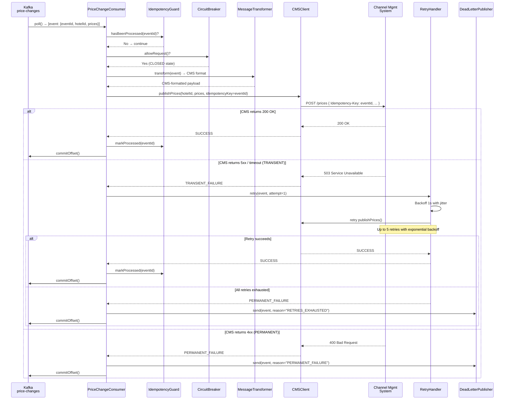
```mermaid
sequenceDiagram
    participant KAFKA as Kafka<br/>price-changes
    participant CONSUMER as PriceChangeConsumer
    participant IDEM as IdempotencyGuard
    participant CB as CircuitBreaker
    participant TRANSFORM as MessageTransformer
    participant CMS as CMSClient
    participant CMS_EXT as Channel Mgmt<br/>System
    participant RETRY as RetryHandler
    participant DLQ as DeadLetterPublisher

    KAFKA->>CONSUMER: poll() → [event: {eventId, hotelId, prices}]

    CONSUMER->>IDEM: hasBeenProcessed(eventId)?
    IDEM-->>CONSUMER: No → continue

    CONSUMER->>CB: allowRequest()?
    CB-->>CONSUMER: Yes (CLOSED state)

    CONSUMER->>TRANSFORM: transform(event) → CMS format
    TRANSFORM-->>CONSUMER: CMS-formatted payload

    CONSUMER->>CMS: publishPrices(hotelId, prices, idempotencyKey=eventId)
    CMS->>CMS_EXT: POST /prices { Idempotency-Key: eventId, ... }

    alt CMS returns 200 OK
        CMS_EXT-->>CMS: 200 OK
        CMS-->>CONSUMER: SUCCESS
        CONSUMER->>IDEM: markProcessed(eventId)
        CONSUMER->>KAFKA: commitOffset()
    else CMS returns 5xx / timeout (TRANSIENT)
        CMS_EXT-->>CMS: 503 Service Unavailable
        CMS-->>CONSUMER: TRANSIENT_FAILURE
        CONSUMER->>RETRY: retry(event, attempt=1)
        RETRY->>RETRY: Backoff 1s with jitter
        RETRY->>CMS: retry publishPrices()
        Note over RETRY,CMS_EXT: Up to 5 retries with exponential backoff
        alt Retry succeeds
            CMS-->>RETRY: SUCCESS
            RETRY-->>CONSUMER: SUCCESS
            CONSUMER->>IDEM: markProcessed(eventId)
            CONSUMER->>KAFKA: commitOffset()
        else All retries exhausted
            RETRY-->>CONSUMER: PERMANENT_FAILURE
            CONSUMER->>DLQ: send(event, reason="RETRIES_EXHAUSTED")
            CONSUMER->>KAFKA: commitOffset()
        end
    else CMS returns 4xx (PERMANENT)
        CMS_EXT-->>CMS: 400 Bad Request
        CMS-->>CONSUMER: PERMANENT_FAILURE
        CONSUMER->>DLQ: send(event, reason="PERMANENT_FAILURE")
        CONSUMER->>KAFKA: commitOffset()
    end
```

---

## View 3: High Availability Deployment Topology

This deployment view shows the multi-instance, multi-AZ deployment topology that achieves 99.9% availability (QA-3). All tiers are redundant.

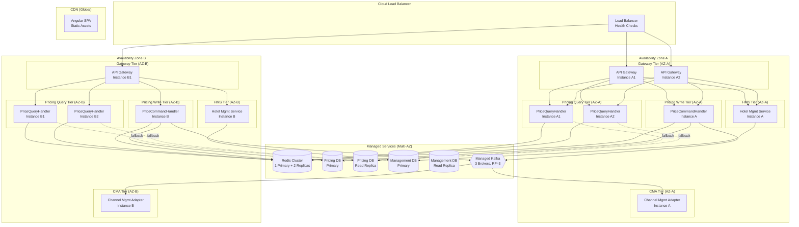
```mermaid
graph TB
    subgraph "Cloud Load Balancer"
        LB[Load Balancer<br/>Health Checks]
    end

    subgraph "Availability Zone A"
        subgraph "Gateway Tier (AZ-A)"
            GW_A1[API Gateway<br/>Instance A1]
            GW_A2[API Gateway<br/>Instance A2]
        end
        subgraph "Pricing Query Tier (AZ-A)"
            PSQ_A1[PriceQueryHandler<br/>Instance A1]
            PSQ_A2[PriceQueryHandler<br/>Instance A2]
        end
        subgraph "Pricing Write Tier (AZ-A)"
            PSW_A[PriceCommandHandler<br/>Instance A]
        end
        subgraph "HMS Tier (AZ-A)"
            HMS_A[Hotel Mgmt Service<br/>Instance A]
        end
        subgraph "CMA Tier (AZ-A)"
            CMA_A[Channel Mgmt Adapter<br/>Instance A]
        end
    end

    subgraph "Availability Zone B"
        subgraph "Gateway Tier (AZ-B)"
            GW_B1[API Gateway<br/>Instance B1]
        end
        subgraph "Pricing Query Tier (AZ-B)"
            PSQ_B1[PriceQueryHandler<br/>Instance B1]
            PSQ_B2[PriceQueryHandler<br/>Instance B2]
        end
        subgraph "Pricing Write Tier (AZ-B)"
            PSW_B[PriceCommandHandler<br/>Instance B]
        end
        subgraph "HMS Tier (AZ-B)"
            HMS_B[Hotel Mgmt Service<br/>Instance B]
        end
        subgraph "CMA Tier (AZ-B)"
            CMA_B[Channel Mgmt Adapter<br/>Instance B]
        end
    end

    subgraph "Managed Services (Multi-AZ)"
        REDIS[(Redis Cluster<br/>1 Primary + 2 Replicas)]
        PDB_PRIMARY[(Pricing DB<br/>Primary)]
        PDB_REPLICA[(Pricing DB<br/>Read Replica)]
        MDB_PRIMARY[(Management DB<br/>Primary)]
        MDB_REPLICA[(Management DB<br/>Read Replica)]
        KAFKA_SVC{{Managed Kafka<br/>3 Brokers, RF=3}}
    end

    subgraph "CDN (Global)"
        CDN[Angular SPA<br/>Static Assets]
    end

    LB --> GW_A1
    LB --> GW_A2
    LB --> GW_B1

    GW_A1 --> PSQ_A1
    GW_A1 --> PSQ_A2
    GW_A2 --> PSQ_A1
    GW_A2 --> PSQ_A2
    GW_B1 --> PSQ_B1
    GW_B1 --> PSQ_B2

    GW_A1 --> PSW_A
    GW_A2 --> PSW_A
    GW_B1 --> PSW_B

    GW_A1 --> HMS_A
    GW_A2 --> HMS_A
    GW_B1 --> HMS_B

    PSQ_A1 --> REDIS
    PSQ_A1 -.->|fallback| PDB_REPLICA
    PSQ_A2 --> REDIS
    PSQ_A2 -.->|fallback| PDB_REPLICA
    PSQ_B1 --> REDIS
    PSQ_B1 -.->|fallback| PDB_REPLICA
    PSQ_B2 --> REDIS
    PSQ_B2 -.->|fallback| PDB_REPLICA

    PSW_A --> PDB_PRIMARY
    PSW_A --> REDIS
    PSW_B --> PDB_PRIMARY
    PSW_B --> REDIS

    HMS_A --> MDB_PRIMARY
    HMS_B --> MDB_PRIMARY

    PSW_A --> KAFKA_SVC
    PSW_B --> KAFKA_SVC
    KAFKA_SVC --> CMA_A
    KAFKA_SVC --> CMA_B
```

---

## View 4: Pricing Service Startup and Degraded Mode

This state diagram shows the Pricing Service startup sequence and transitions between normal and degraded modes.

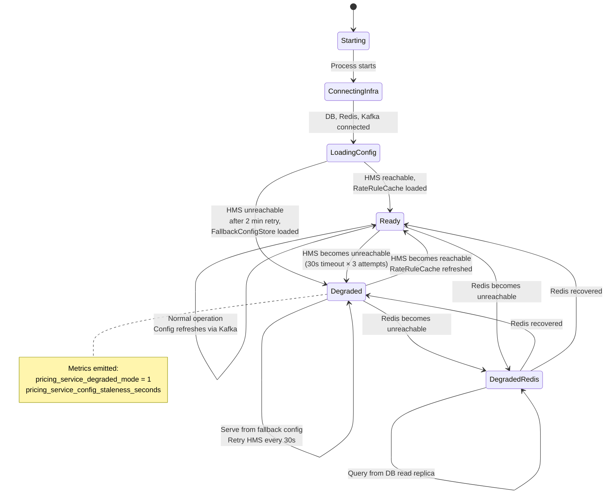
```mermaid
stateDiagram-v2
    [*] --> Starting

    Starting --> ConnectingInfra: Process starts
    ConnectingInfra --> LoadingConfig: DB, Redis, Kafka connected

    LoadingConfig --> Ready: HMS reachable,<br/>RateRuleCache loaded
    LoadingConfig --> Degraded: HMS unreachable<br/>after 2 min retry,<br/>FallbackConfigStore loaded

    Ready --> Ready: Normal operation<br/>Config refreshes via Kafka
    Ready --> Degraded: HMS becomes unreachable<br/>(30s timeout × 3 attempts)

    Degraded --> Degraded: Serve from fallback config<br/>Retry HMS every 30s
    Degraded --> Ready: HMS becomes reachable<br/>RateRuleCache refreshed

    Degraded --> DegradedRedis: Redis becomes unreachable
    DegradedRedis --> DegradedRedis: Query from DB read replica
    DegradedRedis --> Degraded: Redis recovered

    Ready --> DegradedRedis: Redis becomes unreachable
    DegradedRedis --> Ready: Redis recovered

    note right of Degraded
        Metrics emitted:
        pricing_service_degraded_mode = 1
        pricing_service_config_staleness_seconds
    end note
```

---

## View 5: Circuit Breaker State Machine (CMA)

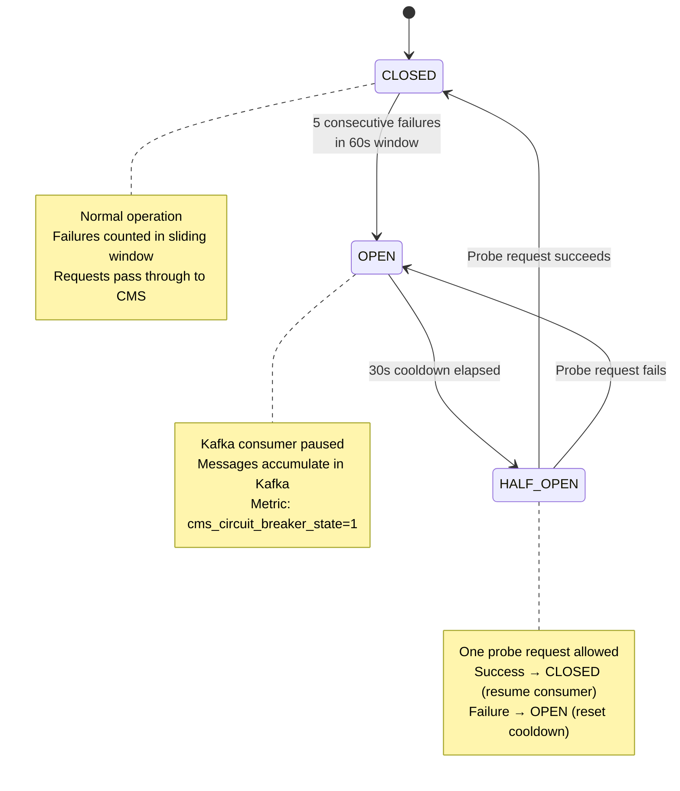
```mermaid
stateDiagram-v2
    [*] --> CLOSED

    CLOSED --> OPEN: 5 consecutive failures<br/>in 60s window
    OPEN --> HALF_OPEN: 30s cooldown elapsed

    HALF_OPEN --> CLOSED: Probe request succeeds
    HALF_OPEN --> OPEN: Probe request fails

    note right of CLOSED
        Normal operation
        Failures counted in sliding window
        Requests pass through to CMS
    end note

    note right of OPEN
        Kafka consumer paused
        Messages accumulate in Kafka
        Metric: cms_circuit_breaker_state=1
    end note

    note right of HALF_OPEN
        One probe request allowed
        Success → CLOSED (resume consumer)
        Failure → OPEN (reset cooldown)
    end note
```

---

## View 6: End-to-End Reliability — Component Overview

This diagram consolidates all reliability mechanisms across the system into a single view.

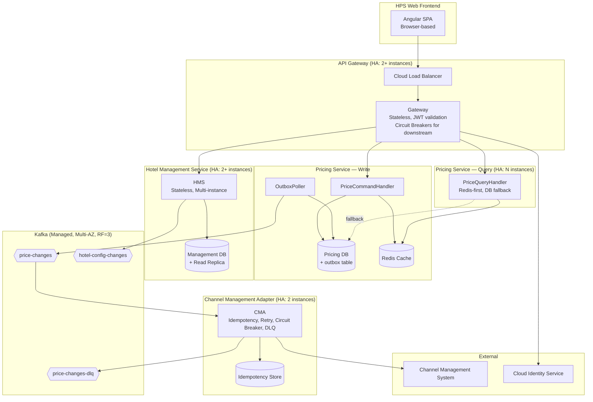
```mermaid
graph TB
    subgraph "HPS Web Frontend"
        SPA[Angular SPA<br/>Browser-based]
    end

    subgraph "API Gateway (HA: 2+ instances)"
        GW_LB[Cloud Load Balancer]
        GW[Gateway<br/>Stateless, JWT validation<br/>Circuit Breakers for downstream]
    end

    subgraph "Pricing Service — Write"
        PSW_CMD[PriceCommandHandler]
        PSW_OUTBOX[OutboxPoller]
        PSW_DB[(Pricing DB<br/>+ outbox table)]
        PSW_REDIS[(Redis Cache)]
    end

    subgraph "Pricing Service — Query (HA: N instances)"
        PSQ[PriceQueryHandler<br/>Redis-first, DB fallback]
    end

    subgraph "Hotel Management Service (HA: 2+ instances)"
        HMS[HMS<br/>Stateless, Multi-instance]
        HMS_DB[(Management DB<br/>+ Read Replica)]
    end

    subgraph "Kafka (Managed, Multi-AZ, RF=3)"
        KAFKA_PC{{price-changes}}
        KAFKA_DLQ{{price-changes-dlq}}
        KAFKA_CFG{{hotel-config-changes}}
    end

    subgraph "Channel Management Adapter (HA: 2 instances)"
        CMA[CMA<br/>Idempotency, Retry, Circuit Breaker, DLQ]
        CMA_IDEM[(Idempotency Store)]
    end

    subgraph "External"
        CMS[Channel Management System]
        IDP[Cloud Identity Service]
    end

    SPA --> GW_LB --> GW
    GW --> PSW_CMD
    GW --> PSQ
    GW --> HMS
    GW --> IDP

    PSW_CMD --> PSW_DB
    PSW_CMD --> PSW_REDIS
    PSW_OUTBOX --> PSW_DB
    PSW_OUTBOX --> KAFKA_PC

    PSQ --> PSW_REDIS
    PSQ -.->|fallback| PSW_DB

    HMS --> HMS_DB
    HMS --> KAFKA_CFG

    KAFKA_PC --> CMA
    CMA --> CMS
    CMA --> KAFKA_DLQ
    CMA --> CMA_IDEM
```

---

## Summary of Views

| View | Type | Primary Focus |
|------|------|---------------|
| View 1: Transactional Outbox | Sequence Diagram | Atomic DB+Kafka publication (QA-2) |
| View 2: CMA Reliable Delivery | Sequence Diagram | Idempotency, retry, circuit breaker, DLQ flow (QA-2) |
| View 3: HA Deployment Topology | Deployment Diagram | Multi-AZ redundancy for 99.9% uptime (QA-3) |
| View 4: Startup & Degraded Mode | State Diagram | Graceful startup and dependency failure handling (R1, R9) |
| View 5: Circuit Breaker | State Diagram | CMA circuit breaker states and transitions |
| View 6: End-to-End Reliability | Component Diagram | Consolidated view of all reliability mechanisms |

### ADD Step 7: Analyze Design and Review Iteration Goal

# ADD Step 7: Analyze Design and Review Iteration Goal (Iteration 3)

## Analysis Against Iteration Success Criteria

### Criterion 1: End-to-end reliable publication designed ✅

**PASS** — The Transactional Outbox pattern (Section 5A) ensures atomicity between DB write and Kafka publication. The OutboxPoller runs as a background process, guaranteeing at-least-once delivery to Kafka. Combined with the CMA's idempotent delivery (Section 5B), the system achieves end-to-end exactly-once semantics from the user's perspective: every price change is published and received. All failure modes are classified and handled:
- Transient failures: retry with exponential backoff (CMA)
- Permanent failures: move to DLQ with operator alerting
- CMS circuit breaker: pause consumption, accumulate in Kafka
- Reconciliation API for manual replay of DLQ messages

QA-2 is satisfied: "100% of price changes are successfully published (queryable) and received by the channel management system."

### Criterion 2: API Gateway redundancy designed ✅

**PASS** — R12 is resolved. The Gateway is deployed as a stateless, multi-instance tier (minimum 2, auto-scale to 6) behind a cloud load balancer with health checks. Statelessness is validated: JWT tokens are self-contained, no server-side sessions exist. Circuit breakers protect downstream services. Graceful shutdown drains in-flight requests. Distributed rate limiting falls back gracefully if Redis is unavailable. The Gateway is no longer a single point of failure.

### Criterion 3: 99.9% availability deployment topology designed ✅

**PASS** — View 3 shows the complete multi-AZ deployment topology:
- **Gateway Tier:** 2+ instances across AZs, cloud load balancer
- **Pricing Query Tier:** N instances (auto-scaled), stateless
- **Pricing Write Tier:** 2 instances across AZs (active-active via shared DB)
- **HMS Tier:** 2+ instances across AZs
- **CMA Tier:** 2 instances across AZs (same consumer group, partitions distributed)
- **Data Tier:** All managed services (DB, Redis, Kafka) in multi-AZ configurations with replication

99.9% availability (~8.76 hours downtime/year) is achievable with this topology. Each tier can tolerate the loss of an entire AZ without complete outage.

### Criterion 4: Read cache consistency mechanism specified ✅

**PASS** — R8 is resolved. The shared Redis cluster (Section 5D) replaces local per-instance caches. Write-through from Pricing Service ensures all query instances see consistent data. Key design: `price:{hotelId}:{date}:{roomType}:{rateType}` with 24h TTL. Query fallback to DB read replica ensures availability if Redis is unavailable.

### Criterion 5: Graceful startup and dependency failure handling designed ✅

**PASS** — R9 and R1 are resolved:
- **R9:** Readiness probe gates traffic until RateRuleCache is loaded. If HMS is unreachable at startup, the service enters degraded mode with FallbackConfigStore after 2 minutes of retries — it serves traffic rather than staying offline indefinitely.
- **R1:** During operation, if HMS becomes unreachable, Pricing Service continues serving from the last-known-good config cache. Background retry every 30s. Alerts are emitted after 5 minutes of staleness, critical after 30 minutes. HMS itself is deployed multi-instance for availability.

### Criterion 6: Channel Management Adapter reliability fully specified ✅

**PASS** — R10 is resolved. The CMA now has a complete reliability design (Section 5B):
- **IdempotencyGuard:** EventId-based deduplication with in-memory LRU + DB persistence
- **RetryHandler:** Exponential backoff (1s→2s→4s→8s→16s→32s, max 5 retries) with jitter
- **CircuitBreaker:** CLOSED→OPEN→HALF_OPEN state machine, 5 failures in 60s, 30s cooldown
- **DeadLetterQueue:** Kafka topic `price-changes-dlq` for permanently failed messages
- **ReconciliationAPI:** REST endpoints for operator replay of DLQ messages
- **Offset commit:** Manual commit only after CMS confirms receipt

### Criterion 7: Preliminary metrics for reliability and availability identified ✅

**PASS** — 14 metrics are defined (Section 5G) covering: publication success/failure, outbox pending, CMS delivery outcomes, retry counts, circuit breaker state, DLQ size, consumer lag, config staleness, degraded mode, upstream availability, and latency percentiles. These provide the foundation for the full QA-8 (Monitorability) design in Iteration 4.

### Criterion 8: QA-1 latency budget remains intact ✅

**PASS** — The updated latency budget shows a **net improvement** from 55ms to 52ms for core processing:
- Outbox row insert: +2ms (same transaction)
- Redis write instead of local cache: -2ms
- Kafka produce moved to background: -3ms
- Safety margin increases from 25ms to 28ms

The 100ms total budget is preserved with more headroom.

---

## Driver Satisfaction Review

| Driver | Status | Evidence |
|--------|--------|----------|
| **QA-2 (100% Reliability)** | ✅ | Transactional Outbox + idempotent CMA delivery + retry + circuit breaker + DLQ + reconciliation. Every failure mode handled. |
| **QA-3 (99.9% Availability)** | ✅ | Multi-AZ deployment with redundancy at every tier. Degraded mode for graceful dependency failure. Redis fallback to DB. Gateway stateless + multi-instance. |
| **R10 (Publication reliability)** | ✅ RESOLVED | Full CMA reliability design: idempotency, retry, circuit breaker, DLQ, reconciliation. |
| **R12 (Gateway SPOF)** | ✅ RESOLVED | Multi-instance Gateway with cloud LB, health probes, graceful shutdown. |
| **R8 (Cache consistency)** | ✅ RESOLVED | Shared Redis cache with write-through. Fallback to DB read replica. |
| **R9 (Startup race)** | ✅ RESOLVED | Readiness gating + degraded mode with FallbackConfigStore. |
| **R1 (PS↔HMS dependency)** | ✅ RESOLVED | Degraded mode serves from fallback config. HMS multi-instance. Background retry with alerting. |
| **QA-8 (Preliminary metrics)** | ✅ | 14 metrics defined. Full infrastructure in Iteration 4. |
| **QA-1 (Performance)** | ✅ | Latency budget improved: 52ms core (was 55ms), 28ms margin (was 25ms). |
| **CON-6 (Cloud-Native)** | ✅ | Multi-AZ, managed services (DB, Redis, Kafka), container orchestration, health probes, auto-scaling. |

---

## Risks and Open Issues

| ID | Risk / Issue | Severity | Mitigation / Notes |
|----|-------------|----------|---------------------|
| **R14** | **OutboxPoller single process:** If the Pricing Service write instance's OutboxPoller fails, outbox messages accumulate. The outbox table is in the DB but only polled by one instance. | Medium | Accept for MVP. Mitigations: (a) Leader election across write instances for OutboxPoller, or (b) dedicated outbox processor service. Evaluate in Iteration 4. |
| **R15** | **Redis cluster split-brain:** In the unlikely event of a network partition, two Redis primaries could exist. Stale writes could be served. | Low | Cloud-managed Redis typically handles this. Acceptable risk given hotel pricing domain (non-critical consistency). |
| **R16** | **CMA idempotency store consistency:** The idempotency LRU cache is in-memory per CMA instance. If CMA instance A processes event X and CMA instance B processes the same event (rebalance), duplicate delivery could occur if the in-memory cache hasn't been replicated. | Medium | Kafka partitioning by hotelId ensures all events for a hotel go to the same partition → same CMA instance (within a consumer group). Rebalance is infrequent. DB persistence of idempotency records adds durability. Acceptable risk. |
| **R17** | **FallbackConfigStore staleness:** If HMS is unavailable for an extended period, the Pricing Service operates on a potentially very stale fallback config. New rate rules or hotel configurations won't be reflected. | Low | Acceptable because: (a) HMS is multi-instance for high availability, (b) extended HMS outage is itself a critical incident, (c) stale config is better than no pricing service. |
| **R18** | **Full monitoring implementation:** Only metric definitions exist. The collection, aggregation, dashboard, and alerting infrastructure is not designed. | Medium | Deferred to Iteration 4 (Development & Operations) as part of QA-8 and CRN-5. |
| **R19** | **Database failover latency:** Managed DB auto-failover can take 30-60 seconds. During failover, write operations fail. | Low | Acceptable for 99.9% SLA. Write operations failing briefly (not lost — outbox provides durability) is acceptable. Query path continues serving from Redis during failover. |

---

## Iteration Goal: PASSED ✅

The iteration goal — "Design reliability and availability mechanisms across the system" — has been achieved:

- **QA-2 (100% reliability):** End-to-end reliability designed with Transactional Outbox (DB→Kafka atomicity), idempotent CMA delivery, exponential retry, circuit breaker, dead letter queue, and reconciliation API. Every failure mode is classified and handled.

- **QA-3 (99.9% availability):** Multi-AZ deployment topology with redundancy at every tier. All services are multi-instance (min 2). All data stores are managed, replicated, and multi-AZ. Graceful degradation (Redis→DB fallback, HMS→fallback config) ensures partial functionality during dependency failures.

- **All 5 carried-forward risks resolved:** R10 (publication reliability), R12 (Gateway SPOF), R8 (cache consistency), R9 (startup race), and R1 (PS↔HMS dependency) are all fully resolved with concrete design decisions.

- **QA-1 latency budget preserved:** The 100ms budget is not only maintained but improved (52ms core + 28ms margin).

- **Six architectural views** document the reliability and availability mechanisms.

- **14 preliminary metrics** defined for QA-8 foundation.

**Remaining risks (R14–R19) are medium/low severity and primarily concern edge cases or deferred infrastructure (full monitoring to Iteration 4).** The system architecture now supports the demanding reliability and availability requirements of the Hotel Pricing System.

## Iteration 4: Address development and operations

### ADD Step 2: Establish Iteration Goal by Selecting Drivers

# ADD Step 2: Establish Iteration Goal by Selecting Drivers (Iteration 4)

## Iteration Goal

**Complete all remaining architectural design and establish the development and operational foundation** — specifically: finish internal designs for supporting services (HMS, databases), design the CI/CD pipeline and monitoring infrastructure, define the test strategy, resolve remaining technology choices, establish team structure, and ensure the architecture is construction-ready. This iteration answers: _How is the system built, tested, deployed, monitored, and maintained by the development team?_

## Selected Architectural Drivers

### Primary Drivers

| Priority | Driver | Justification |
|----------|--------|---------------|
| **Primary** | CRN-5 (Continuous Deployment) | Set up continuous deployment infrastructure. This is an explicit architectural concern that has not been addressed. The CI/CD pipeline design must cover all 5 services plus the Angular SPA. |
| **Primary** | QA-8 (Monitorability) | Operators must measure price publication performance and reliability. 100% of metrics must be collectable. The 14 metrics defined in Iteration 3 need a collection, aggregation, dashboard, and alerting infrastructure. |
| **Primary** | QA-9 (Testability) | 100% of system elements must support integration testing independent of external systems. The port/adapter pattern enables this structurally; now we must design test harnesses, stub definitions, contract tests, and testing environments. |
| **Primary** | QA-7 (Deployability) | Applications move between non-production environments without code changes. Externalized configuration, environment profiles, and deployment manifests must be concretely designed. |
| **Primary** | CRN-3 (Work Assignment) | Assign work to development team members. The architecture-to-team mapping is a core organizational design decision that affects delivery velocity and code ownership. |

### Secondary Drivers

| Priority | Driver | Justification |
|----------|--------|---------------|
| **Secondary** | CRN-4 (Technical Debt) | Avoid introducing technical debt. Establish architectural fitness functions, code standards, and review processes. |
| **Secondary** | HPS-4/5/6 (Supporting Use Cases) | Manage Hotels, Rates, Users — these are CRUD operations that the Hotel Management Service must support. Internal design must be completed. |
| **Secondary** | CON-3 (Git Platform) | Code hosted on proprietary Git-based platform. Repository structure and branching strategy must be defined. |
| **Secondary** | CON-4 (Timeline) | 6-month delivery, 2-month MVP. The CI/CD pipeline and team assignment must support phased delivery. |
| **Secondary** | R4 (Gateway choice) | Resolve API Gateway technology: cloud-managed vs. self-managed Java gateway. |
| **Secondary** | R14 (OutboxPoller) | Design resilient outbox processing across multiple Pricing Service instances. |
| **Secondary** | R16 (CMA idempotency) | Harden idempotency across CMA instances during Kafka rebalances. |
| **Secondary** | R18 (Full monitoring) | Complete monitoring infrastructure design per QA-8. |

### Validation Driver

| Driver | Justification |
|--------|---------------|
| **QA-6 (Modifiability validation)** | Verify that adding gRPC support would indeed require no core changes. Walk through the gRPC addition scenario against the current architecture to validate the port/adapter isolation. |

## Drivers NOT Addressed (Already Satisfied)

| Driver | Status |
|--------|--------|
| QA-1 (100ms performance) | ✅ Designed in Iteration 2, preserved in Iteration 3 |
| QA-2 (100% reliability) | ✅ Designed in Iteration 3 |
| QA-3 (99.9% availability) | ✅ Designed in Iteration 3 |
| QA-4 (Scalability) | ✅ Designed in Iteration 2 |
| QA-5 (Security) | ✅ Designed in Iteration 2 |
| CON-1 (Cross-platform browsers) | ✅ Angular SPA, Iteration 1 |
| CON-2 (Cloud identity + hosting) | ✅ Iterations 1-2 |
| CON-5 (REST initially) | ✅ Iteration 1, validated in this iteration |
| CON-6 (Cloud-native) | ✅ All iterations |
| CRN-1 (Overall structure) | ✅ Iteration 1 |
| CRN-2 (Java, Angular, Kafka) | ✅ All iterations |

## Success Criteria for This Iteration

1. **CI/CD pipeline** is designed: build, test, and deployment stages for all 6 deployables (5 services + 1 SPA), per CRN-5.
2. **Monitoring infrastructure** is fully designed: metrics collection (agents/exporters), aggregation (time-series DB), dashboards, and alerting rules. The 14 metrics from Iteration 3 are operationalized. QA-8 satisfied.
3. **Test strategy** is defined: unit test scope, integration test isolation using port stubs, contract tests between services, end-to-end test boundaries. QA-9 satisfied.
4. **Externalized configuration** is concretely designed: per-environment configuration structure, secret management, feature flags. QA-7 satisfied.
5. **Team structure** is defined: mapping of architectural elements to development teams/sub-teams, aligned with team expertise (Java, Angular, Kafka — CRN-2). CRN-3 satisfied.
6. **Hotel Management Service** internal design is completed: domain logic for HPS-4/5/6, adapters, and the Management Database logical schema.
7. **Pricing Database** logical schema is completed.
8. **Remaining risks** (R4, R14, R16, R18) are resolved.
9. **QA-6 (Modifiability)** is validated by walking through a gRPC addition scenario.
10. **Architectural fitness functions** are defined to prevent technical debt (CRN-4).

### ADD Step 3: Choose System Elements to Refine

# ADD Step 3: Choose One or More System Elements to Refine (Iteration 4)

## Elements Selected for Refinement

Iteration 4 addresses development and operations — it spans infrastructure concerns (CI/CD, monitoring, configuration, testing), team organization, and the completion of internal designs for supporting services. The following elements are selected:

---

### Element 1: CI/CD Pipeline (New Infrastructure Element)

**Why:** CRN-5 explicitly requires setting up continuous deployment infrastructure. No pipeline design exists. This is a cross-cutting infrastructure element that spans all deployables.

**Current State:** Not designed. The system has 6 deployables (HPS Web Frontend, API Gateway, Pricing Service, Hotel Management Service, Channel Management Adapter, and potentially a shared library). Each has its own build, test, and deployment needs.

**Refinement Needed:**
- Pipeline stages: Build → Unit Test → Integration Test → Static Analysis → Container Build → Deploy to Dev → Deploy to Staging → Deploy to Production
- Repository structure (CON-3: proprietary Git platform)
- Branching strategy and environment promotion flow
- Artifact management (container registry)
- Rollback strategy

---

### Element 2: Monitoring Infrastructure (New Infrastructure Element)

**Why:** QA-8 requires collecting 100% of price publication performance and reliability metrics. Iteration 3 defined 14 metrics but no collection/infrastructure design. R18 must be resolved.

**Current State:** 14 metrics defined (gauges, counters, histograms). No collectors, aggregators, dashboards, or alerting rules designed.

**Refinement Needed:**
- Metrics collection layer (agent per service)
- Time-series database for aggregation
- Dashboard definitions (operational and business)
- Alerting rules with severity levels and notification channels
- Log aggregation strategy (complementary to metrics)
- Health check endpoint standardization

---

### Element 3: Test Architecture (Cross-Cutting)

**Why:** QA-9 requires 100% of system elements support integration testing independent of external systems. The port/adapter pattern structurally enables this, but the test strategy and harnesses must be explicitly designed.

**Current State:** All outbound ports are interfaces (PriceRepository, PriceEventPublisher, CMSClient, etc.). Inbound adapters (REST) are separate from domain logic. Test isolation is structurally possible but not operationalized.

**Refinement Needed:**
- Test pyramid definition (unit / integration / contract / E2E)
- Stub/mock strategy per external dependency
- Contract test design between services
- Test data management
- Test environment design (what runs where)

---

### Element 4: Configuration Management (Cross-Cutting)

**Why:** QA-7 requires applications to move between non-production environments without code changes. Externalized configuration must be concretely designed — what is externalized, how it's injected, how secrets are managed.

**Current State:** "Externalized configuration" stated as a principle. No concrete mechanism.

**Refinement Needed:**
- Configuration categories: environment-specific, feature flags, secrets
- Configuration injection mechanism (environment variables, config server, cloud-native config maps/secrets)
- Secret management (cloud provider secret store)
- Per-environment configuration structure

---

### Element 5: Hotel Management Service — Internal Completion

**Why:** HPS-4 (Manage Hotels), HPS-5 (Manage Rates), HPS-6 (Manage Users) are three of six use cases. The HMS internal design beyond the PS integration ports has not been done. This is the last major service requiring internal design.

**Current State (from Iterations 1-2):** 
- Defined as a Java service with Ports & Adapters
- Exposes: HotelConfigProvisioningPort (for PS), ConfigChangePublisher (Kafka)
- Manages: hotels, rates, users
- No domain logic decomposition, no adapter design, no DB schema

**Refinement Needed:**
- Internal domain model: Hotel, Rate, RateRule, RoomType, User, Permission aggregates
- Inbound adapters: REST endpoints for CRUD operations
- Outbound adapters: DB adapter, Kafka adapter
- Authorization logic: hotel-level access enforcement
- Management Database logical schema

---

### Element 6: Database Logical Schemas

**Why:** Both Pricing Database and Management Database need logical schema definitions. The Pricing DB's outbox table is already partially defined; the price data itself and the management schema are not.

**Current State:**
- Pricing DB: `price_change_outbox` table designed in Iteration 3
- Management DB: referenced but no schema

**Refinement Needed:**
- Pricing DB: price tables, indexing strategy for query patterns
- Management DB: hotels, rates, rate_rules, room_types, users, permissions tables

---

### Element 7: Team Structure and Work Assignment

**Why:** CRN-3 requires assigning work to development team members. The architecture-to-team mapping is a key organizational design decision.

**Current State:** Not addressed. CRN-2 tells us team knows Java, Angular, Kafka.

**Refinement Needed:**
- Team decomposition aligned with architectural elements
- Ownership boundaries matching service boundaries
- Skill alignment (Angular → frontend team, Java → backend teams, Kafka → shared infrastructure)
- Coordination points between teams

---

### Element 8: API Gateway Technology Decision (R4 Resolution)

**Why:** R4 from Iteration 1 remains outstanding. The choice between cloud-managed and self-managed gateway affects deployment, operations, and modifiability.

**Current State:** API Gateway internal design is refined (AuthFilter, RoleEnforcer, ClaimPropagator, RequestRouter, RateLimiter, CircuitBreakers). Technology choice between cloud-managed and Java self-managed is pending.

**Refinement Needed:** Decision with rationale aligned with CON-6 (cloud-native), CRN-2 (Java expertise), QA-6 (modifiability), and operational complexity.

---

### Elements NOT Further Refined

| Element | Reason |
|---------|--------|
| Pricing Service (core) | Fully designed in Iterations 2-3 |
| HPS Web Frontend (modules) | Fully designed in Iteration 2 |
| Channel Management Adapter (reliability) | Fully designed in Iteration 3 |
| Kafka topology | Fully designed in Iteration 2 |

### ADD Step 4: Choose Design Concepts

# ADD Step 4: Choose One or More Design Concepts (Iteration 4)

---

## 4A: CI/CD Pipeline Design

### Selected Concept: Container-Native Pipeline with Environment Promotion

| Aspect | Design |
|--------|--------|
| **Repository Structure** | Monorepo with 6 modules (per CON-3, proprietary Git platform): `frontend/`, `api-gateway/`, `pricing-service/`, `hotel-management-service/`, `channel-management-adapter/`, `shared-lib/` |
| **Branching Strategy** | Trunk-based development. Short-lived feature branches. `main` branch is always deployable. Release tags for production. |
| **Build Tool** | Maven/Gradle for Java services (per CRN-2). npm/Angular CLI for frontend. |
| **Containerization** | Each deployable produces a Docker/OCI container image. Images are immutable and tagged with Git commit SHA. |
| **Container Registry** | Cloud-managed container registry (CON-6). |
| **Pipeline Orchestrator** | Cloud-native CI/CD platform integrated with Git platform (CON-3). |

### Pipeline Stages

| Stage | Trigger | Actions | Gates |
|-------|---------|---------|-------|
| **1. Build & Unit Test** | Push to feature branch / main | Compile, run unit tests for changed modules | All unit tests pass |
| **2. Static Analysis** | Stage 1 passes | Linting, code style, dependency vulnerability scan, architectural fitness functions | No critical/high issues |
| **3. Integration Test** | Stage 2 passes | Spin up service with stubbed dependencies (per QA-9). Run integration tests against stubs. | All integration tests pass |
| **4. Contract Test** | Stage 2 passes | Publish contract; verify against consumer contracts | No contract violations |
| **5. Container Build** | Stage 3 passes (on main) | Build container image, tag with SHA + `latest` | Image builds successfully |
| **6. Deploy to Dev** | Stage 5 passes (main) | Deploy to development environment. Smoke tests. | Smoke tests pass |
| **7. Deploy to Staging** | Manual trigger (or auto on main) | Deploy to staging. Run full regression suite. | Regression passes |
| **8. Deploy to Production** | Manual approval | Blue-green or rolling deployment. Canary for Pricing Service changes. | Canary metrics healthy for 10 min |

### Environment Promotion Strategy

| Environment | Purpose | Configuration Source | Deployment Trigger |
|-------------|---------|---------------------|-------------------|
| **Dev** | Developer integration testing | `config/dev/` | Auto on merge to main |
| **Staging** | Pre-production validation, demo (CON-4: MVP demo) | `config/staging/` | Manual / daily auto |
| **Production** | Live system | `config/prod/` | Manual approval |
| **Per-Developer** (optional) | Local development | `config/local/` | Docker Compose |

### Rollback Strategy
- Container images are immutable — rollback = deploy previous image tag.
- Database migrations are backward-compatible (expand-contract pattern).
- Blue-green deployment: keep previous version running until new version is healthy for 10 minutes.

---

## 4B: Monitoring Infrastructure Design

### Selected Concept: Cloud-Native Observability Stack

| Layer | Technology | Rationale |
|-------|-----------|-----------|
| **Metrics Export** | Micrometer (Java) + Prometheus endpoint | Standard JVM ecosystem, aligns with CRN-2 (Java team knowledge). Each service exposes `GET /actuator/prometheus`. |
| **Metrics Collection** | Prometheus (cloud-managed or self-managed) | Pull-based scraping. Scrapes `/actuator/prometheus` on each service instance. |
| **Time-Series DB** | Prometheus TSDB (or cloud-managed equivalent per CON-6) | Purpose-built for metrics. Retention: 15 days raw, 1 year aggregated. |
| **Dashboards** | Grafana (or cloud-managed equivalent) | Pre-built dashboards. Operational and business views. |
| **Alerting** | Alertmanager + Notification Channels | Alert rules → PagerDuty/email/Slack based on severity. |
| **Log Aggregation** | Structured JSON logging → Cloud log aggregation service (CON-6) | Each service logs in JSON to stdout. Cloud agent collects and indexes. |
| **Distributed Tracing** | Optional future addition | Not in MVP scope but instrument with trace IDs in headers from day one. |
| **Health Checks** | Standardized `/health/live` and `/health/ready` on all services | Already defined for Pricing Service in Iteration 3. Standardize across all services. |

### Metric Operationalization (from Iteration 3's 14 metrics)

| Metric Name | Alert Rule | Severity | Channel |
|-------------|------------|----------|---------|
| `price_change_outbox_pending` | > 500 for 5 min | Warning | Slack |
| `price_change_outbox_pending` | > 2000 for 10 min | Critical | PagerDuty |
| `cms_delivery_failure_total` | Rate > 5/min for 5 min | Warning | Slack |
| `cms_delivery_failure_total` | Rate > 20/min for 10 min | Critical | PagerDuty |
| `cms_circuit_breaker_state` | = 1 (OPEN) for > 2 min | Critical | PagerDuty |
| `dead_letter_queue_size` | > 0 | Warning | Slack |
| `dead_letter_queue_size` | > 10 | Critical | PagerDuty |
| `kafka_consumer_lag` | > 5000 for 5 min | Warning | Slack |
| `kafka_consumer_lag` | > 20000 for 10 min | Critical | PagerDuty |
| `pricing_service_config_staleness_seconds` | > 300 (5 min) | Warning | Slack |
| `pricing_service_config_staleness_seconds` | > 1800 (30 min) | Critical | PagerDuty |
| `pricing_service_degraded_mode` | = 1 | Warning | Slack |
| `gateway_upstream_availability` | = 0 for any service > 1 min | Critical | PagerDuty |
| `price_change_latency_p99` | > 200ms for 5 min | Warning | Slack |
| `price_query_latency_p99` | > 100ms for 5 min | Warning | Slack |

### Dashboard Definitions

| Dashboard | Audience | Key Panels |
|-----------|----------|------------|
| **Operational Overview** | Ops / SRE | Service health (green/red), request rates, error rates, P99 latency per service, circuit breaker states |
| **Publication Reliability** | Ops / Business | Price publication success rate (target: 100%), outbox pending count, CMS delivery success rate, DLQ size over time, consumer lag |
| **System Capacity** | Ops / Architects | Query throughput vs. SLA, scaling events, DB connection pools, Redis hit ratio, JVM heap/memory |
| **Business Metrics** | Product / Business | Daily price changes per hotel, simulation vs. actual change ratio, active user count |

---

## 4C: Test Architecture Design

### Selected Concept: Layered Test Pyramid with Contract Tests

| Layer | Scope | Technology | Environment | Mocking |
|-------|-------|-----------|-------------|---------|
| **Unit Tests** | Single class/method | JUnit 5 (Java), Jasmine/Karma (Angular) | In-process | All dependencies mocked |
| **Integration Tests** | Single service with stubbed externals | Spring Boot Test (Java), Angular TestBed | In-process or containerized | DB stubbed (H2 in-memory), Kafka stubbed, external APIs stubbed via port interfaces (QA-9) |
| **Contract Tests** | Service boundary (provider-consumer) | Spring Cloud Contract or Pact | CI pipeline | Consumer-side: stub provider. Provider-side: verify against contract. |
| **End-to-End Tests** | Critical user journeys only | Cypress (frontend) or REST Assured | Staging environment | All real services, external systems stubbed (CMS, Identity Service) |

### Test Isolation Strategy (QA-9)

QA-9 requires "100% of system elements support integration testing independent of external systems." This is achieved through:

| System Element | External Dependency | Isolation Mechanism |
|---------------|---------------------|---------------------|
| Pricing Service | Pricing DB | H2 in-memory database or Testcontainers |
| Pricing Service | Redis | Embedded Redis or Testcontainers |
| Pricing Service | Kafka | Embedded Kafka or Testcontainers |
| Pricing Service | Hotel Management Service | Mock/stub of HotelConfigProvisioningPort |
| Channel Mgmt Adapter | Kafka | Embedded Kafka |
| Channel Mgmt Adapter | CMS | Mock/stub of CMSClient port |
| Hotel Management Service | Management DB | H2 in-memory or Testcontainers |
| Hotel Management Service | Kafka | Embedded Kafka |
| API Gateway | Pricing Service, HMS | WireMock stubs |
| API Gateway | Identity Service | WireMock stub of JWKS endpoint |
| HPS Web Frontend | API Gateway | Angular HttpClientTestingModule or MSW |

### Architectural Fitness Functions (CRN-4)

To avoid technical debt, the following architectural fitness functions are integrated into the CI pipeline (Stage 2: Static Analysis):

| Fitness Function | Check | Tool |
|-----------------|-------|------|
| **Layer Dependency** | Domain layer has no dependency on adapters | ArchUnit (Java) |
| **Port Isolation** | Core logic only references port interfaces, not adapter implementations | ArchUnit |
| **No Cross-Service DB Access** | Services only access their own database | ArchUnit |
| **Kafka Topic Ownership** | Only Pricing Service produces to `price-changes` | Code review + ArchUnit |
| **API Gateway Route Pattern** | All routes follow defined pattern | Custom lint rule |
| **Angular Module Boundaries** | Feature modules don't import internals of other feature modules | ESLint plugin |

---

## 4D: Configuration Management Design

### Selected Concept: Cloud-Native Externalized Configuration

| Configuration Category | Mechanism | Example |
|------------------------|-----------|---------|
| **Environment-specific** | Environment variables injected via container orchestrator ConfigMaps (CON-6) | `DB_HOST`, `REDIS_HOST`, `KAFKA_BOOTSTRAP_SERVERS` |
| **Secrets** | Cloud secret manager (CON-6). Injected as environment variables or mounted files. Never in code or config files. | `DB_PASSWORD`, `JWT_SIGNING_KEY`, `CMS_API_KEY` |
| **Feature Flags** | Configuration service or environment variables with sensible defaults | `FEATURE_SIMULATION_ENABLED=true`, `FEATURE_GRPC_ENABLED=false` |
| **Service Discovery** | Kubernetes DNS (CON-6). Services reference each other by service name. | `pricing-service:8080`, `hotel-management-service:8080` |

### Per-Environment Configuration Structure (QA-7)

```
config/
├── dev/
│   ├── pricing-service.yaml       # Dev DB, low-cost Redis tier
│   ├── hotel-management-service.yaml
│   ├── api-gateway.yaml
│   └── channel-management-adapter.yaml
├── staging/
│   ├── pricing-service.yaml       # Staging DB, mirrors prod topology
│   ├── ...
└── prod/
    ├── pricing-service.yaml       # Prod DB, multi-AZ Redis, full replicas
    ├── ...
```

**Key principle (QA-7):** The same container image is deployed to dev, staging, and prod. Only the injected configuration differs. No code changes between environments.

---

## 4E: Hotel Management Service — Internal Design

### Selected Concept: Standard Layered Architecture within Ports & Adapters

Since HPS-4/5/6 are CRUD-heavy (manage hotels, rates, users), a full CQRS separation (like Pricing Service) is unnecessary. A standard layered architecture within the Ports & Adapters pattern is appropriate.

| Layer | Responsibility |
|-------|---------------|
| **Domain Model** | Hotel, Rate, RateRule, RoomType, User, Permission aggregates. Business invariants (e.g., a hotel must have at least one room type). |
| **Application Services** | Orchestrate use cases: HotelManagementService, RateManagementService, UserManagementService. Transaction management. Authorization enforcement. |
| **Ports (Interfaces)** | HotelRepository, RateRepository, UserRepository, ConfigChangePublisher (already defined). |
| **Inbound Adapters** | REST controllers for CRUD operations. |
| **Outbound Adapters** | DB adapter (JPA/JDBC), Kafka adapter (already partially defined). |

### Key Design Decisions

| Decision | Rationale |
|----------|-----------|
| **Single DB transaction per use case** | CRUD operations are simple — no need for complex sagas or event sourcing. |
| **Hotel-level authorization** | Each user has a list of authorized hotel IDs. Application services filter queries and validate mutations against this list. The `X-Authorized-Hotels` header from API Gateway is the source of truth. |
| **Rate rule immutability** | When a rate rule is updated, create a new version rather than mutating in place. Old versions retained for audit (and because Pricing Service may briefly use a stale cached version). |
| **Config change events on every mutation** | Any change to hotel config or rate rules publishes to `hotel-config-changes` Kafka topic for Pricing Service cache refresh. |

---

## 4F: Database Logical Schemas

### Pricing Database Schema

```sql
-- Core price data
CREATE TABLE prices (
    hotel_id        VARCHAR(36) NOT NULL,
    date            DATE NOT NULL,
    room_type_id    VARCHAR(36) NOT NULL,
    rate_id         VARCHAR(36) NOT NULL,
    amount          DECIMAL(10,2) NOT NULL,
    currency        CHAR(3) NOT NULL DEFAULT 'USD',
    price_type      ENUM('BASE', 'DERIVED', 'FIXED') NOT NULL,
    base_price_id   VARCHAR(36),  -- FK to self for derived rates
    changed_by      VARCHAR(36) NOT NULL,
    changed_at      TIMESTAMP NOT NULL DEFAULT CURRENT_TIMESTAMP,
    PRIMARY KEY (hotel_id, date, room_type_id, rate_id)
);

CREATE INDEX idx_prices_query ON prices(hotel_id, date, room_type_id);

-- Transactional outbox (from Iteration 3)
CREATE TABLE price_change_outbox (
    id              UUID PRIMARY KEY,
    aggregate_id    VARCHAR(36) NOT NULL,  -- hotelId
    event_type      VARCHAR(100) NOT NULL,
    payload         JSONB NOT NULL,
    created_at      TIMESTAMP NOT NULL DEFAULT CURRENT_TIMESTAMP,
    published_at    TIMESTAMP,
    retry_count     INT NOT NULL DEFAULT 0
);

CREATE INDEX idx_outbox_pending ON price_change_outbox(published_at)
    WHERE published_at IS NULL;
```

### Management Database Schema

```sql
CREATE TABLE hotels (
    id              UUID PRIMARY KEY,
    name            VARCHAR(200) NOT NULL,
    address         TEXT,
    currency        CHAR(3) NOT NULL DEFAULT 'USD',
    tax_rate        DECIMAL(5,4) NOT NULL,  -- e.g., 0.1000 = 10%
    created_at      TIMESTAMP NOT NULL DEFAULT CURRENT_TIMESTAMP,
    updated_at      TIMESTAMP NOT NULL DEFAULT CURRENT_TIMESTAMP
);

CREATE TABLE room_types (
    id              UUID PRIMARY KEY,
    hotel_id        UUID NOT NULL REFERENCES hotels(id),
    name            VARCHAR(100) NOT NULL,  -- e.g., "Standard", "Deluxe", "Suite"
    base_capacity   INT NOT NULL DEFAULT 2,
    is_active       BOOLEAN NOT NULL DEFAULT TRUE,
    created_at      TIMESTAMP NOT NULL DEFAULT CURRENT_TIMESTAMP,
    UNIQUE (hotel_id, name)
);

CREATE TABLE rates (
    id              UUID PRIMARY KEY,
    hotel_id        UUID NOT NULL REFERENCES hotels(id),
    name            VARCHAR(100) NOT NULL,  -- e.g., "Flexible", "Non-Refundable", "Breakfast Included"
    description     TEXT,
    is_active       BOOLEAN NOT NULL DEFAULT TRUE,
    created_at      TIMESTAMP NOT NULL DEFAULT CURRENT_TIMESTAMP,
    updated_at      TIMESTAMP NOT NULL DEFAULT CURRENT_TIMESTAMP
);

CREATE TABLE rate_rules (
    id              UUID PRIMARY KEY,
    rate_id         UUID NOT NULL REFERENCES rates(id),
    version         INT NOT NULL,
    rule_type       ENUM('PERCENTAGE_ADJUSTMENT', 'FIXED_ADJUSTMENT', 'CONDITIONAL') NOT NULL,
    adjustment      DECIMAL(10,4) NOT NULL,  -- percentage (0.10) or fixed amount
    condition       JSONB,  -- e.g., {"minStay": 3, "advanceBookingDays": 14}
    effective_from  TIMESTAMP NOT NULL,
    created_at      TIMESTAMP NOT NULL DEFAULT CURRENT_TIMESTAMP,
    UNIQUE (rate_id, version)
);

CREATE TABLE users (
    id              UUID PRIMARY KEY,
    external_id     VARCHAR(100) NOT NULL UNIQUE,  -- ID from Cloud Identity Service
    username        VARCHAR(100) NOT NULL,
    role            ENUM('ADMIN', 'BUSINESS_USER') NOT NULL,
    is_active       BOOLEAN NOT NULL DEFAULT TRUE,
    created_at      TIMESTAMP NOT NULL DEFAULT CURRENT_TIMESTAMP
);

CREATE TABLE user_hotel_permissions (
    user_id         UUID NOT NULL REFERENCES users(id),
    hotel_id        UUID NOT NULL REFERENCES hotels(id),
    permission      ENUM('READ', 'WRITE') NOT NULL,
    granted_at      TIMESTAMP NOT NULL DEFAULT CURRENT_TIMESTAMP,
    PRIMARY KEY (user_id, hotel_id, permission)
);

CREATE INDEX idx_user_permissions ON user_hotel_permissions(user_id);
CREATE INDEX idx_room_types_hotel ON room_types(hotel_id);
CREATE INDEX idx_rates_hotel ON rates(hotel_id);
```

---

## 4G: API Gateway Technology Decision (R4 Resolution)

### Alternatives Revisited

**Option A: Cloud-Managed API Gateway (AWS API Gateway / Azure API Management / GCP API Gateway)**

| Criterion | Assessment |
|-----------|------------|
| CON-6 (Cloud-Native) | ✅ Fully managed, auto-scaling, integrated with cloud ecosystem |
| CRN-2 (Java expertise) | ⚠ Team has less control; configuration via cloud-specific DSL, not Java |
| QA-6 (Modifiability) | ⚠ Adding gRPC depends on cloud provider's feature set. Some support it, others don't. |
| Operational Complexity | ✅ Low — managed service handles scaling, TLS, DDoS protection |
| Custom Auth Logic | ⚠ Cloud gateway supports JWT validation but custom claim propagation (X-User-Id, X-Authorized-Hotels) may require Lambda/Function integration — adds complexity |

**Option B: Self-Managed Java Gateway (Spring Cloud Gateway)**

| Criterion | Assessment |
|-----------|------------|
| CON-6 (Cloud-Native) | ✅ Runs in containers, can be deployed like any microservice. Still cloud-native. |
| CRN-2 (Java expertise) | ✅ Full Java control. Team already knows Spring ecosystem. Custom filters are straightforward Java code. |
| QA-6 (Modifiability) | ✅ Adding gRPC: add Spring Cloud Gateway gRPC route. Same codebase, no external dependency. |
| Operational Complexity | ⚠ Moderate — team manages scaling, TLS, updates. But containerized, so similar to other services. |
| Custom Auth Logic | ✅ Trivial — AuthFilter, RoleEnforcer, ClaimPropagator are Spring filters. Already designed in Iteration 2. |
| CON-4 (2-Month MVP) | ✅ Team already knows Java/Spring — no learning curve for gateway technology. |

### Decision: Self-Managed Java Gateway (Spring Cloud Gateway)

**Rationale:** The gateway's custom logic (JWT claim extraction, role enforcement, claim propagation, distributed rate limiting with Redis) is non-trivial and directly leverages the team's Java expertise (CRN-2). A cloud-managed gateway would require expressing this logic in the cloud provider's specific extension mechanism (Lambda, custom authorizer), adding complexity and potential vendor lock-in. Spring Cloud Gateway runs in containers, fully aligned with CON-6 (cloud-native). Adding gRPC support (QA-6 validation) is straightforward with Spring's gRPC integration.

---

## 4H: OutboxPoller Resilience (R14 Resolution)

**Problem:** If the Pricing Service write instance's OutboxPoller fails or the instance crashes, outbox messages accumulate with no other instance polling.

### Selected Solution: Cooperative Polling with Distributed Lock

| Aspect | Design |
|--------|--------|
| **All Pricing Service instances run OutboxPoller** | Both write instances (and even query instances) can run the poller. Eliminates single-process risk. |
| **Distributed lock per outbox record** | Use `SELECT ... FOR UPDATE SKIP LOCKED` (PostgreSQL) or Redis distributed lock to ensure only one instance processes each outbox record. |
| **Lock granularity** | Per-row locking. Each poller selects a batch of unlocked records, locks them, publishes to Kafka, and marks as published. |
| **Failure recovery** | If an instance crashes holding locks, the DB transaction rolls back (locks released). Next poll cycle picks up the records. |
| **No leader election needed** | Cooperative polling is simpler and more robust than leader election. |

---

## 4I: CMA Idempotency Hardening (R16 Resolution)

**Problem:** CMA instances maintain in-memory LRU caches for idempotency. During Kafka consumer group rebalance, a different CMA instance may receive the same event, and its cache won't have the idempotency record.

### Selected Solution: Shared Idempotency Store

| Aspect | Design |
|--------|--------|
| **Shared store** | Replace per-instance in-memory LRU with a shared Redis cache (already available per Iteration 3). |
| **Key pattern** | `idempotency:cma:{eventId}` with TTL = 48 hours (twice the Kafka retention). |
| **Check-and-set** | `SET idempotency:cma:{eventId} "processed" NX EX 172800`. Returns OK if new, nil if already exists. Atomic. |
| **Fallback** | If Redis is unavailable, CMA falls back to a local in-memory LRU (less reliable but prevents total failure). The circuit breaker on CMS already prevents duplicate delivery to CMS from different instances. |
| **Reconciliation** | Periodic sweep: query CMS for recently published price IDs and reconcile with idempotency store. |

---

## Summary of Design Concept Selections

| Element | Selected Concept | Primary Driver |
|---------|-----------------|----------------|
| CI/CD Pipeline | Container-native, trunk-based, environment promotion | CRN-5, CON-3, CON-4 |
| Monitoring | Micrometer + Prometheus + Grafana + Alertmanager | QA-8, R18 |
| Testing | Layered pyramid with contract tests, port stubs, fitness functions | QA-9, CRN-4 |
| Configuration | Environment variables + cloud secret manager + feature flags | QA-7 |
| HMS Internals | Standard layered architecture with hotel-level authorization | HPS-4/5/6 |
| Database Schemas | Normalized relational with outbox table | All use cases |
| API Gateway Tech | Self-managed Spring Cloud Gateway (Java) | R4, CRN-2, QA-6 |
| OutboxPoller | Cooperative polling with DB row locking | R14 |
| CMA Idempotency | Shared Redis with local fallback | R16 |

### ADD Step 5: Instantiate Elements, Assign Responsibilities, and Define Interfaces

# ADD Step 5: Instantiate Architectural Elements, Assign Responsibilities, and Define Interfaces (Iteration 4)

---

## 5A: CI/CD Pipeline — Element Instantiation

### New Infrastructure Element: CI/CD Pipeline

| Attribute | Detail |
|-----------|--------|
| **Type** | Infrastructure / Process Element |
| **Technology** | Cloud-native CI/CD platform integrated with proprietary Git platform (CON-3) |
| **Repository** | Monorepo: `frontend/`, `api-gateway/`, `pricing-service/`, `hotel-management-service/`, `channel-management-adapter/`, `shared-lib/` |

### Pipeline Configuration (per deployable)

```
pipeline/
├── Jenkinsfile (or .github/workflows/ or equivalent)
├── scripts/
│   ├── build.sh
│   ├── test.sh
│   ├── container-build.sh
│   └── deploy.sh
├── docker/
│   ├── Dockerfile.pricing-service
│   ├── Dockerfile.hotel-management-service
│   ├── Dockerfile.api-gateway
│   ├── Dockerfile.channel-management-adapter
│   └── Dockerfile.frontend          # Multi-stage: build Angular → nginx
└── kubernetes/
    ├── pricing-service/
    │   ├── deployment.yaml
    │   ├── service.yaml
    │   └── configmap.yaml
    ├── hotel-management-service/
    ├── api-gateway/
    ├── channel-management-adapter/
    └── frontend/
        ├── deployment.yaml
        └── service.yaml
```

### Stage Definitions — Pricing Service Example

| Stage | Command/Action | Timeout | On Failure |
|-------|---------------|---------|------------|
| Checkout | `git clone` | 1 min | Fail build |
| Build | `mvn clean compile` | 3 min | Fail build |
| Unit Test | `mvn test` | 5 min | Fail build |
| Static Analysis | `mvn verify -Pstatic-analysis` (ArchUnit, Checkstyle, SpotBugs, OWASP dependency check) | 3 min | Warn on medium, fail on high/critical |
| Integration Test | `mvn verify -Pintegration-test` (Testcontainers: PostgreSQL, Redis, Kafka) | 10 min | Fail build |
| Contract Test | `mvn verify -Pcontract-test` (Spring Cloud Contract) | 5 min | Fail build |
| Container Build | `docker build -t pricing-service:$SHA .` + push to registry | 5 min | Fail build |
| Deploy Dev | `kubectl apply -f kubernetes/pricing-service/ -n dev` | 3 min | Fail, notify |
| Smoke Test | `newman run smoke-tests/pricing-service.postman_collection.json` | 3 min | Rollback dev, notify |
| Deploy Staging | Manual trigger → `kubectl apply -n staging` | 3 min | Fail, notify |
| Deploy Prod | Manual approval → blue-green deployment via `kubectl` | 10 min | Rollback to previous version |

---

## 5B: Monitoring Infrastructure — Element Instantiation

### New Infrastructure Elements

| Element | Type | Technology | Responsibilities |
|---------|------|-----------|-----------------|
| **Metrics Exporter (per service)** | Embedded Agent | Micrometer + Prometheus endpoint | Expose `/actuator/prometheus` on each service. Register custom meters for all 14 Iteration 3 metrics. |
| **Prometheus Server** | Managed Service (CON-6) or containerized | Prometheus | Scrape metrics endpoints every 15s. Store time-series data. Evaluate alert rules. |
| **Grafana** | Managed Service or containerized | Grafana | Render dashboards from Prometheus data sources. |
| **Alertmanager** | Managed Service or containerized | Alertmanager | Route alerts to PagerDuty, Slack, email. Handle alert grouping and inhibition. |
| **Log Aggregator** | Managed Service (CON-6) | Cloud-native log service | Collect stdout JSON logs from all containers. Index for search. |

### Prometheus Scrape Configuration

```yaml
scrape_configs:
  - job_name: 'pricing-service'
    kubernetes_sd_configs:
      - role: pod
        namespaces: [prod]
    relabel_configs:
      - source_labels: [__meta_kubernetes_pod_label_app]
        regex: pricing-service
        action: keep
    metrics_path: '/actuator/prometheus'
    scrape_interval: 15s

  - job_name: 'hotel-management-service'
    # ... similar

  - job_name: 'api-gateway'
    # ... similar

  - job_name: 'channel-management-adapter'
    # ... similar
```

### Alert Rules (Prometheus)

```yaml
groups:
  - name: pricing_service_alerts
    rules:
      - alert: OutboxBacklogCritical
        expr: price_change_outbox_pending > 2000
        for: 10m
        labels: { severity: critical }
        annotations: { summary: "Outbox backlog exceeds 2000 messages" }

      - alert: PricingServiceDegraded
        expr: pricing_service_degraded_mode == 1
        for: 1m
        labels: { severity: warning }
        annotations: { summary: "Pricing Service running in degraded mode" }

      - alert: PricingLatencyHigh
        expr: histogram_quantile(0.99, price_change_latency_seconds) > 0.2
        for: 5m
        labels: { severity: warning }
        annotations: { summary: "P99 price change latency exceeds 200ms" }

  - name: cma_alerts
    rules:
      - alert: CMSCircuitBreakerOpen
        expr: cms_circuit_breaker_state == 1
        for: 2m
        labels: { severity: critical }
        annotations: { summary: "CMA circuit breaker OPEN — not delivering to CMS" }

      - alert: DLQGrowing
        expr: dead_letter_queue_size > 10
        labels: { severity: critical }
        annotations: { summary: "Dead letter queue has more than 10 messages" }

  - name: gateway_alerts
    rules:
      - alert: UpstreamUnavailable
        expr: gateway_upstream_availability == 0
        for: 1m
        labels: { severity: critical }
        annotations: { summary: "API Gateway cannot reach an upstream service" }
```

### Health Check Standardization

Every service MUST expose these endpoints (standardized across all services):

| Endpoint | Method | Success Response | Checks |
|----------|--------|-----------------|--------|
| `/health/live` | GET | `200 {"status":"UP"}` | Process alive |
| `/health/ready` | GET | `200 {"status":"UP", "components":{...}}` | DB, Redis, Kafka, external deps, cache warm |
| `/actuator/prometheus` | GET | `200` (text/plain) | Metrics in Prometheus format |

---

## 5C: Test Architecture — Element Instantiation

### Test Harness Elements

| Element | Type | Scope | Location |
|---------|------|-------|----------|
| **Unit Test Suites** | Test Code (per service) | Single class/method | `src/test/java/` per service module |
| **Integration Test Suites** | Test Code (per service) | Single service with stubbed externals | `src/test/java/` with `@IntegrationTest` profile |
| **Test Stubs / Mocks** | Test Infrastructure | Replace external ports | `src/test/java/.../stubs/` per service |
| **Contract Definitions** | Test Artifact | Service boundary contracts | `src/test/resources/contracts/` per service |
| **E2E Test Suite** | Test Code (separate module) | Critical user journeys | `e2e-tests/` module |
| **ArchUnit Rules** | Test Code (per service) | Architectural constraints | `src/test/java/.../architecture/` per service |

### Key Test Stubs (per QA-9)

| Stub Name | Stubs What | Used By |
|-----------|-----------|---------|
| `StubHotelConfigProvisioningPort` | HMS config endpoint | Pricing Service integration tests |
| `StubPriceEventPublisher` | Kafka producer | Pricing Service integration tests |
| `StubCMSClient` | CMS API | CMA integration tests |
| `StubPricingServiceClient` | Pricing Service endpoints | API Gateway integration tests |
| `StubHotelManagementServiceClient` | HMS endpoints | API Gateway integration tests |
| `StubIdentityService` | Cloud identity JWKS endpoint | API Gateway integration tests |
| `WireMockCMS` | CMS HTTP API | CMA integration tests (via WireMock) |
| `EmbeddedKafka` | Kafka broker | All services' integration tests |

### Contract Test Example: Pricing Service ↔ HMS

**Provider (HMS):**
```java
// Contract definition in HMS
@SpringCloudContract
Contract.make {
    request {
        method GET()
        url "/api/hotels/config/all"
    }
    response {
        status OK()
        body([
            [hotelId: "h1", name: "Grand Hotel", taxRate: 0.10, currency: "USD"],
            [hotelId: "h2", name: "Seaside Resort", taxRate: 0.12, currency: "USD"]
        ])
        headers { contentType(applicationJson()) }
    }
}
```

**Consumer (Pricing Service):**
```java
// Generated stub from contract, used in PS integration tests
@Autowired
StubHotelConfigProvisioningPort stubConfigPort;

@Test
void shouldLoadConfigOnStartup() {
    rateRuleCache.loadFromProvider(stubConfigPort);
    assertThat(rateRuleCache.getTaxConfig("h1")).isEqualTo(new TaxRate(0.10));
}
```

---

## 5D: Configuration Management — Element Instantiation

### New Infrastructure Elements

| Element | Type | Technology | Responsibilities |
|---------|------|-----------|-----------------|
| **ConfigMap Resources** | Kubernetes Resources | K8s ConfigMaps | Store non-secret environment-specific configuration per service per environment |
| **Secret Resources** | Kubernetes Resources / Cloud Secret Manager | K8s Secrets + Cloud Secret Store | Store and inject secrets (DB passwords, API keys, signing keys) |
| **Feature Flag Service** | Configuration Element | Environment variables with defaults | Enable/disable features per environment |

### Configuration Template (pricing-service, per environment)

```yaml
# kubernetes/pricing-service/configmap.yaml (dev example)
apiVersion: v1
kind: ConfigMap
metadata:
  name: pricing-service-config
  namespace: dev
data:
  application.yaml: |
    spring:
      datasource:
        url: jdbc:postgresql://${DB_HOST}:5432/pricing_dev
        hikari:
          maximum-pool-size: 5
      redis:
        host: ${REDIS_HOST}
        port: 6379
      kafka:
        bootstrap-servers: ${KAFKA_BOOTSTRAP_SERVERS}

    pricing:
      outbox:
        poll-interval-ms: 100
        batch-size: 50
      cache:
        ttl-seconds: 86400
        startup-load-timeout-seconds: 120
      feature:
        simulation-enabled: ${FEATURE_SIMULATION_ENABLED:true}
```

### Secret Management

| Secret | Storage | Injected As | Rotation |
|--------|---------|-------------|----------|
| DB password | Cloud Secret Manager → K8s Secret | `DB_PASSWORD` env var | Quarterly |
| Redis password | Cloud Secret Manager → K8s Secret | `REDIS_PASSWORD` env var | Quarterly |
| JWT signing key (public) | K8s ConfigMap | Mounted file | N/A (public key) |
| CMS API key | Cloud Secret Manager → K8s Secret | `CMS_API_KEY` env var | Quarterly |
| Kafka credentials | Cloud Secret Manager → K8s Secret | `KAFKA_USERNAME`, `KAFKA_PASSWORD` | Quarterly |

---

## 5E: Hotel Management Service — Full Internal Design

### HMS Internal Elements

| Internal Element | Type | Responsibilities |
|------------------|------|------------------|
| **HotelController** | Inbound Adapter (REST) | `POST/GET/PUT/DELETE /api/hotels`. Validates input. Calls HotelManagementService. |
| **RateController** | Inbound Adapter (REST) | `POST/GET/PUT/DELETE /api/rates`. Manages rate definitions and rate rules. |
| **UserController** | Inbound Adapter (REST) | `GET/PUT /api/users`. Manages user permissions. |
| **ConfigProvisioningController** | Inbound Adapter (REST) | `GET /api/hotels/config/all`, `GET /api/rates/rules/all`. Serves Pricing Service config requests. |
| **HotelManagementService** | Application Service | Orchestrates hotel CRUD. Enforces hotel-level authorization. Publishes config change events. |
| **RateManagementService** | Application Service | Orchestrates rate/rule CRUD. Creates new rule versions (immutability). Publishes config change events. |
| **UserManagementService** | Application Service | Orchestrates user permission changes. Validates user exists in identity service. |
| **AuthorizationService** | Domain Service | Given a userId and hotelId, determines if user has READ or WRITE permission. Uses `X-Authorized-Hotels` header or queries `user_hotel_permissions`. |
| **HotelRepository** | Outbound Port | CRUD operations for Hotel, RoomType aggregates. |
| **RateRepository** | Outbound Port | CRUD operations for Rate, RateRule aggregates. Version management. |
| **UserRepository** | Outbound Port | CRUD operations for User, Permission aggregates. |
| **ConfigChangePublisher** | Outbound Port (already defined) | Publishes to `hotel-config-changes` Kafka topic. |
| **HMSDBAdapter** | Outbound Adapter | JPA/JDBC implementation of all repository ports. |
| **HMSKafkaAdapter** | Outbound Adapter | Implements ConfigChangePublisher. Kafka producer. |
| **HMSHealthProbe** | Cross-Cutting (defined Iteration 3) | `/health/live`, `/health/ready` endpoints. |

### HMS Port Interfaces (New/Refined)

```
// === Hotel Management Ports ===
interface HotelRepository {
    Hotel save(Hotel hotel);
    Optional<Hotel> findById(HotelId id);
    List<Hotel> findAll();
    void delete(HotelId id);
    List<Hotel> findAuthorizedForUser(UserId userId);
}

// === Rate Management Ports ===
interface RateRepository {
    Rate save(Rate rate);
    Optional<Rate> findById(RateId id);
    List<Rate> findByHotelId(HotelId hotelId);
    RateRule saveRule(RateId rateId, RateRule rule);  // Creates new version
    List<RateRule> findActiveRules(RateId rateId);
    List<RateRule> findAllActiveRules();  // For Pricing Service config load
}

// === User Management Ports ===
interface UserRepository {
    User save(User user);
    Optional<User> findById(UserId id);
    Optional<User> findByExternalId(String externalId);
    void updatePermissions(UserId userId, List<HotelPermission> permissions);
    List<HotelPermission> getPermissions(UserId userId);
}

// === Config Provisioning Port (for Pricing Service) ===
interface HotelConfigProvisioningPort {
    HotelConfigSnapshot getAllHotelConfigurations();
    RateRulesSnapshot getAllRateRules();
}
```

### Authorization Model

```
// HMS extracts from request headers (propagated by API Gateway)
// X-User-Id: "user-123"
// X-User-Roles: "BUSINESS_USER"
// X-Authorized-Hotels: "h1,h2,h3"  // WRITE access
// X-Authorized-Hotels-Read: "h1,h2,h3,h4,h5"  // READ access (optional)

// Application services enforce:
class HotelManagementService {
    void updateHotel(UserId userId, HotelId hotelId, HotelData data) {
        if (!authorizationService.canWrite(userId, hotelId)) {
            throw new ForbiddenException("Not authorized for hotel " + hotelId);
        }
        // ... proceed with update
    }

    List<Hotel> listHotels(UserId userId) {
        return hotelRepository.findAuthorizedForUser(userId);  // DB-level filter
    }
}
```

---

## 5F: Team Structure and Work Assignment (CRN-3)

### Team Decomposition

Based on the architectural elements and CRN-2 (Java, Angular, Kafka expertise):

| Team | Size | Ownership | Key Skills |
|------|------|-----------|------------|
| **Frontend Team** | 2-3 developers | HPS Web Frontend (Angular SPA) | Angular, TypeScript, OAuth2/OIDC, RxJS |
| **Pricing Team** | 2-3 developers | Pricing Service, Channel Management Adapter | Java, Spring Boot, Kafka, Redis, PostgreSQL, CQRS |
| **Hotel Management Team** | 1-2 developers | Hotel Management Service, Management Database | Java, Spring Boot, PostgreSQL, REST APIs |
| **Platform/Infrastructure Team** | 1-2 developers | API Gateway, CI/CD, Monitoring, Configuration, Kafka topics, Shared Library | Java, Spring Cloud Gateway, Docker, Kubernetes, Prometheus, Grafana |

### Team Coordination Points

| Coordination Point | Teams Involved | Mechanism |
|--------------------|---------------|-----------|
| API Gateway ↔ Backend Services | Platform + Pricing + HMS | REST API contracts (OpenAPI spec), contract tests |
| Pricing Service ↔ HMS (config) | Pricing + HMS | Contract tests (Spring Cloud Contract), `hotel-config-changes` schema |
| Frontend ↔ API Gateway | Frontend + Platform | OpenAPI spec for all endpoints, CORS configuration |
| Pricing Service → CMA (Kafka) | Pricing | `PriceChangedEvent` schema in shared-lib |
| HMS → Pricing Service (Kafka) | HMS + Pricing | `ConfigChangeEvent` schema in shared-lib |
| CI/CD Pipeline | Platform + All teams | Standardized Dockerfiles, Kubernetes manifests per service |

### Shared Library (`shared-lib/`)

| Artifact | Owners | Contents |
|----------|--------|----------|
| `shared-lib-events` | Pricing + HMS | `PriceChangedEvent`, `ConfigChangeEvent`, `HotelConfigSnapshot`, `RateRulesSnapshot` DTOs |
| `shared-lib-api` | Platform + All | OpenAPI-generated client interfaces, common error responses, pagination types |
| `shared-lib-test` | All | Test fixtures, stub base classes, embedded container configurations |

---

## 5G: QA-6 Modifiability Validation — gRPC Addition Scenario

### Scenario: Add gRPC support for external price queries

Per QA-6: "Support for price query endpoints using protocols other than REST (e.g., gRPC) is added without changing core components."

### Walkthrough

| Step | Action | Elements Changed | Core Logic Changed? |
|------|--------|-----------------|---------------------|
| 1 | Define `.proto` file for `PriceQueryService` with `queryPrices` RPC | New file: `pricing-service/src/main/proto/price_query.proto` | No |
| 2 | Generate Java gRPC stubs from `.proto` | Build tool generates code | No |
| 3 | Implement `GrpcPricingAdapter` as new inbound adapter in Pricing Service | New class: `GrpcPricingAdapter implements BindableService` | No — it calls `PriceQueryPort.queryPrices()` which already exists |
| 4 | Add gRPC route in API Gateway (Spring Cloud Gateway supports gRPC) | New route config in `api-gateway` | No — route configuration only |
| 5 | Deploy | New Pricing Service version with gRPC adapter + Gateway route update | No |

**Core components unchanged:**
- `PriceQueryPort` interface — no change
- `PriceQueryHandler` — no change
- `PriceReadCache` / Redis — no change
- `PriceRepository` — no change
- `DerivedRateCalculator` — no change
- `PriceCommandPort` — no change

**Conclusion: QA-6 is satisfied.** The Ports & Adapters pattern isolates protocol concerns. Adding gRPC requires only new inbound adapters — zero core logic changes.

---

## 5H: Risk Resolution Summary

| Risk ID | Status | Resolution |
|---------|--------|------------|
| **R14** (OutboxPoller SPOF) | ✅ RESOLVED | Cooperative polling: all Pricing Service instances run OutboxPoller with `SELECT ... FOR UPDATE SKIP LOCKED` for row-level distributed locking |
| **R16** (CMA idempotency) | ✅ RESOLVED | Shared Redis idempotency store with local LRU fallback. 48h TTL. Atomic SET NX. |
| **R18** (Full monitoring) | ✅ RESOLVED | Micrometer + Prometheus + Grafana + Alertmanager stack. 14 metrics operationalized with alert rules. 4 dashboards defined. Health check standardization. |
| **R4** (Gateway choice) | ✅ RESOLVED | Self-managed Spring Cloud Gateway (Java). Aligns with CRN-2, QA-6, and custom auth logic. |

---

## 5I: Construction Readiness Checklist

| Criterion | Status | Evidence |
|-----------|--------|----------|
| All use cases mapped to elements | ✅ | HPS-1→Frontend+Gateway, HPS-2→Pricing+CMA, HPS-3→Pricing, HPS-4/5/6→HMS |
| All QAs addressed | ✅ | QA-1 (Iter 2), QA-2 (Iter 3), QA-3 (Iter 3), QA-4 (Iter 2), QA-5 (Iter 2), QA-6 (Iter 2+4), QA-7 (Iter 4), QA-8 (Iter 3+4), QA-9 (Iter 4) |
| All CRNs addressed | ✅ | CRN-1 (Iter 1), CRN-2 (all iters), CRN-3 (Iter 4), CRN-4 (Iter 4), CRN-5 (Iter 4) |
| All CONs satisfied | ✅ | CON-1–6 addressed across all iterations |
| All risks resolved or accepted | ✅ | R1–R19 resolved or accepted at low severity |
| Database schemas defined | ✅ | Pricing DB + Management DB (Iter 4) |
| CI/CD pipeline designed | ✅ | Iter 4 |
| Team structure defined | ✅ | Iter 4 |
| Monitoring designed | ✅ | Iter 3 (metrics) + Iter 4 (infrastructure) |
| Test strategy defined | ✅ | Iter 4 |

### ADD Step 6: Sketch Views and Perspectives

# ADD Step 6: Sketch Views and Perspectives (Iteration 4)

---

## View 1: CI/CD Pipeline Flow

This view shows the pipeline stages from commit to production for a backend service (applies to Pricing Service, HMS, CMA, and API Gateway).

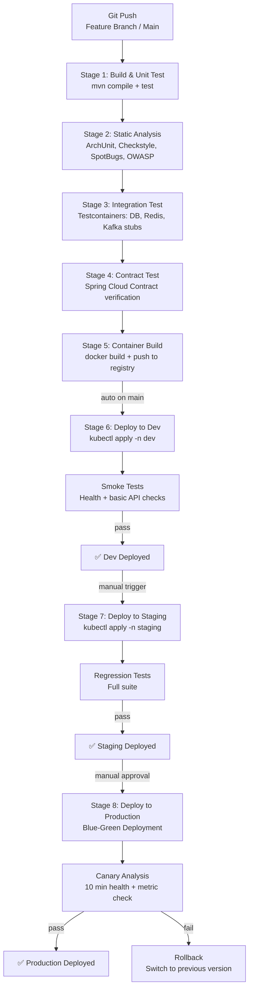
```mermaid
graph TB
    GIT[Git Push<br/>Feature Branch / Main] --> BUILD[Stage 1: Build & Unit Test<br/>mvn compile + test]
    BUILD --> STATIC[Stage 2: Static Analysis<br/>ArchUnit, Checkstyle, SpotBugs, OWASP]
    STATIC --> INT_TEST[Stage 3: Integration Test<br/>Testcontainers: DB, Redis, Kafka stubs]
    INT_TEST --> CONTRACT[Stage 4: Contract Test<br/>Spring Cloud Contract verification]
    CONTRACT --> CONTAINER[Stage 5: Container Build<br/>docker build + push to registry]

    CONTAINER -->|auto on main| DEV[Stage 6: Deploy to Dev<br/>kubectl apply -n dev]
    DEV --> SMOKE[Smoke Tests<br/>Health + basic API checks]
    SMOKE -->|pass| DEV_DONE[✅ Dev Deployed]

    DEV_DONE -->|manual trigger| STAGING[Stage 7: Deploy to Staging<br/>kubectl apply -n staging]
    STAGING --> REGRESSION[Regression Tests<br/>Full suite]
    REGRESSION -->|pass| STAGING_DONE[✅ Staging Deployed]

    STAGING_DONE -->|manual approval| PROD[Stage 8: Deploy to Production<br/>Blue-Green Deployment]
    PROD --> CANARY[Canary Analysis<br/>10 min health + metric check]
    CANARY -->|pass| PROD_DONE[✅ Production Deployed]
    CANARY -->|fail| ROLLBACK[Rollback<br/>Switch to previous version]
```

---

## View 2: Monitoring and Observability Architecture

This view shows the monitoring stack: metrics collection, aggregation, dashboards, and alerting.

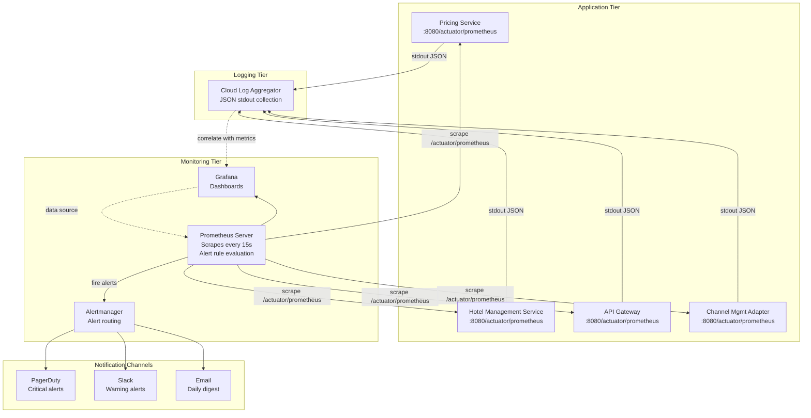
```mermaid
graph TB
    subgraph "Application Tier"
        PS[Pricing Service<br/>:8080/actuator/prometheus]
        HMS[Hotel Management Service<br/>:8080/actuator/prometheus]
        GW[API Gateway<br/>:8080/actuator/prometheus]
        CMA[Channel Mgmt Adapter<br/>:8080/actuator/prometheus]
    end

    subgraph "Monitoring Tier"
        PROM[Prometheus Server<br/>Scrapes every 15s<br/>Alert rule evaluation]
        GRAFANA[Grafana<br/>Dashboards]
        AM[Alertmanager<br/>Alert routing]
    end

    subgraph "Logging Tier"
        LOGS[Cloud Log Aggregator<br/>JSON stdout collection]
    end

    subgraph "Notification Channels"
        PD[PagerDuty<br/>Critical alerts]
        SLACK[Slack<br/>Warning alerts]
        EMAIL[Email<br/>Daily digest]
    end

    PROM -->|scrape /actuator/prometheus| PS
    PROM -->|scrape /actuator/prometheus| HMS
    PROM -->|scrape /actuator/prometheus| GW
    PROM -->|scrape /actuator/prometheus| CMA

    PROM --> GRAFANA
    PROM -->|fire alerts| AM
    AM --> PD
    AM --> SLACK
    AM --> EMAIL

    PS -->|stdout JSON| LOGS
    HMS -->|stdout JSON| LOGS
    GW -->|stdout JSON| LOGS
    CMA -->|stdout JSON| LOGS

    GRAFANA -.->|data source| PROM
    LOGS -.->|correlate with metrics| GRAFANA
```

---

## View 3: Test Architecture — Layered Test Pyramid

This view shows the test layers, their scope, and the isolation mechanisms per QA-9.

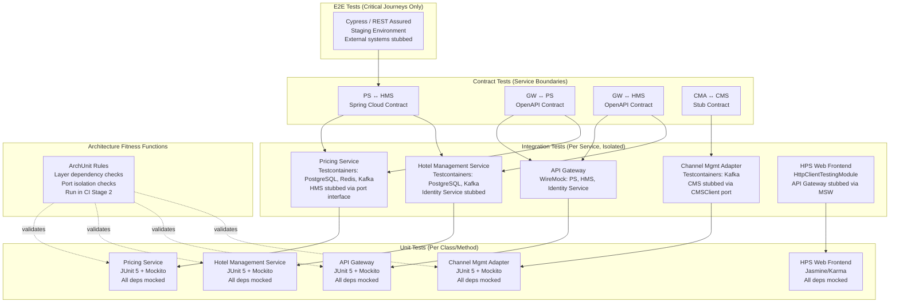
```mermaid
graph TB
    subgraph "E2E Tests (Critical Journeys Only)"
        E2E[Cypress / REST Assured<br/>Staging Environment<br/>External systems stubbed]
    end

    subgraph "Contract Tests (Service Boundaries)"
        CT_PS_HMS[PS ↔ HMS<br/>Spring Cloud Contract]
        CT_GW_PS[GW ↔ PS<br/>OpenAPI Contract]
        CT_GW_HMS[GW ↔ HMS<br/>OpenAPI Contract]
        CT_CMA_CMS[CMA ↔ CMS<br/>Stub Contract]
    end

    subgraph "Integration Tests (Per Service, Isolated)"
        IT_PS[Pricing Service<br/>Testcontainers: PostgreSQL, Redis, Kafka<br/>HMS stubbed via port interface]
        IT_HMS[Hotel Management Service<br/>Testcontainers: PostgreSQL, Kafka<br/>Identity Service stubbed]
        IT_GW[API Gateway<br/>WireMock: PS, HMS, Identity Service]
        IT_CMA[Channel Mgmt Adapter<br/>Testcontainers: Kafka<br/>CMS stubbed via CMSClient port]
        IT_FE[HPS Web Frontend<br/>HttpClientTestingModule<br/>API Gateway stubbed via MSW]
    end

    subgraph "Unit Tests (Per Class/Method)"
        UT_PS[Pricing Service<br/>JUnit 5 + Mockito<br/>All deps mocked]
        UT_HMS[Hotel Management Service<br/>JUnit 5 + Mockito<br/>All deps mocked]
        UT_GW[API Gateway<br/>JUnit 5 + Mockito<br/>All deps mocked]
        UT_CMA[Channel Mgmt Adapter<br/>JUnit 5 + Mockito<br/>All deps mocked]
        UT_FE[HPS Web Frontend<br/>Jasmine/Karma<br/>All deps mocked]
    end

    subgraph "Architecture Fitness Functions"
        ARCH[ArchUnit Rules<br/>Layer dependency checks<br/>Port isolation checks<br/>Run in CI Stage 2]
    end

    E2E --> CT_PS_HMS
    CT_PS_HMS --> IT_PS
    CT_PS_HMS --> IT_HMS
    CT_GW_PS --> IT_GW
    CT_GW_PS --> IT_PS
    CT_GW_HMS --> IT_GW
    CT_GW_HMS --> IT_HMS
    CT_CMA_CMS --> IT_CMA

    IT_PS --> UT_PS
    IT_HMS --> UT_HMS
    IT_GW --> UT_GW
    IT_CMA --> UT_CMA
    IT_FE --> UT_FE

    ARCH -.->|validates| UT_PS
    ARCH -.->|validates| UT_HMS
    ARCH -.->|validates| UT_GW
    ARCH -.->|validates| UT_CMA
```

---

## View 4: Hotel Management Service — Internal Structure

This view shows the completed internal design of the Hotel Management Service following layered architecture within Ports & Adapters.

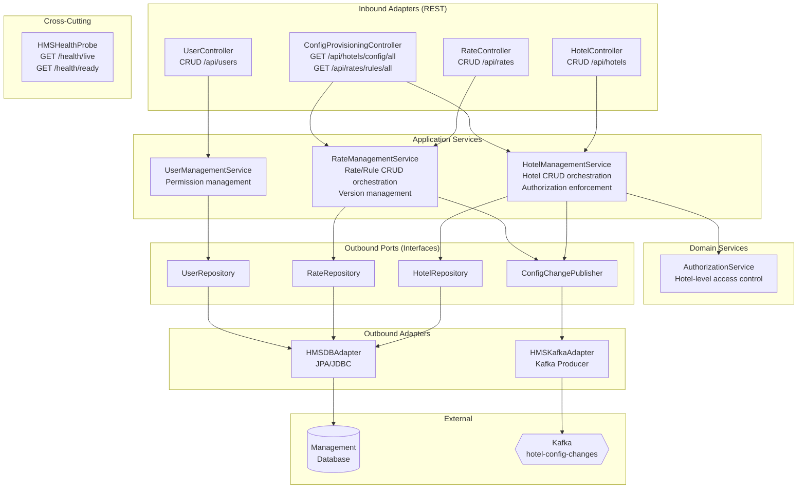
```mermaid
graph TB
    subgraph "Inbound Adapters (REST)"
        HC[HotelController<br/>CRUD /api/hotels]
        RC[RateController<br/>CRUD /api/rates]
        UC[UserController<br/>CRUD /api/users]
        CPC[ConfigProvisioningController<br/>GET /api/hotels/config/all<br/>GET /api/rates/rules/all]
    end

    subgraph "Application Services"
        HMSVC[HotelManagementService<br/>Hotel CRUD orchestration<br/>Authorization enforcement]
        RMSVC[RateManagementService<br/>Rate/Rule CRUD orchestration<br/>Version management]
        UMSVC[UserManagementService<br/>Permission management]
    end

    subgraph "Domain Services"
        AUTH[AuthorizationService<br/>Hotel-level access control]
    end

    subgraph "Outbound Ports (Interfaces)"
        HOTEL_REPO[HotelRepository]
        RATE_REPO[RateRepository]
        USER_REPO[UserRepository]
        CFG_PUB[ConfigChangePublisher]
    end

    subgraph "Outbound Adapters"
        DB_ADPT[HMSDBAdapter<br/>JPA/JDBC]
        KAFKA_ADPT[HMSKafkaAdapter<br/>Kafka Producer]
    end

    subgraph "Cross-Cutting"
        HEALTH[HMSHealthProbe<br/>GET /health/live<br/>GET /health/ready]
    end

    subgraph "External"
        MDB[(Management<br/>Database)]
        CFG_KAFKA{{Kafka<br/>hotel-config-changes}}
    end

    HC --> HMSVC
    RC --> RMSVC
    UC --> UMSVC
    CPC --> HMSVC
    CPC --> RMSVC

    HMSVC --> AUTH
    HMSVC --> HOTEL_REPO
    HMSVC --> CFG_PUB

    RMSVC --> RATE_REPO
    RMSVC --> CFG_PUB

    UMSVC --> USER_REPO

    HOTEL_REPO --> DB_ADPT --> MDB
    RATE_REPO --> DB_ADPT
    USER_REPO --> DB_ADPT

    CFG_PUB --> KAFKA_ADPT --> CFG_KAFKA
```

---

## View 5: Team Structure and Ownership Map

This view aligns the development teams with the architectural elements, showing ownership boundaries and coordination points.

```mermaid
graph TB
    subgraph "Frontend Team (2-3 devs, Angular)"
        FE[HPS Web Frontend<br/>Angular SPA<br/>7 Feature Modules]
    end

    subgraph "Pricing Team (2-3 devs, Java/Kafka)"
        PS[Pricing Service<br/>CQRS + Outbox]
        CMA[Channel Mgmt Adapter<br/>Idempotency + Retry + DLQ]
    end

    subgraph "Hotel Management Team (1-2 devs, Java)"
        HMS[Hotel Management Service<br/>Layered Architecture]
    end

    subgraph "Platform Team (1-2 devs, Java/Infra)"
        GW[API Gateway<br/>Spring Cloud Gateway]
        CICD[CI/CD Pipeline]
        MON[Monitoring + Alerting]
        CFG[Config Management]
    end

    subgraph "Shared"
        LIB[shared-lib<br/>Events + API DTOs + Test Fixtures]
    end

    subgraph "Infrastructure"
        KAFKA{{Kafka Clusters}}
        DB[(Databases)]
        REDIS[(Redis)]
    end

    FE -->|OpenAPI contract| GW
    PS -->|Contract test| HMS
    PS -->|PriceChangedEvent schema| LIB
    HMS -->|ConfigChangeEvent schema| LIB
    GW -->|OpenAPI spec| LIB
    PS --> KAFKA
    CMA --> KAFKA
    HMS --> KAFKA
    PS --> DB
    PS --> REDIS
    HMS --> DB
    CMA --> REDIS
```

---

## View 6: Complete System Architecture — Consolidated View

This is the consolidated architecture diagram incorporating all design decisions from all four iterations.

```mermaid
graph TB
    subgraph "External"
        USERS[Users<br/>Browsers]
        EXT_API[External API<br/>Consumers]
        IDP[Cloud Identity<br/>Service]
        CMS[Channel Mgmt<br/>System]
    end

    subgraph "CDN"
        CDN[Angular SPA<br/>Static Assets]
    end

    subgraph "API Gateway Tier (HA: 2+)"
        GW_LB[Cloud Load Balancer]
        GW[Spring Cloud Gateway<br/>Java<br/>Auth, Rate Limit, Circuit Breaker]
    end

    subgraph "Service Tier"
        subgraph "Pricing Service (CQRS)"
            PS_WRITE[Write Path<br/>CommandHandler + OutboxPoller]
            PS_QUERY[Query Path<br/>QueryHandler (HA: N instances)]
        end
        subgraph "Hotel Management Service (HA: 2+)"
            HMS_SVC[HMS<br/>Layered Architecture<br/>Hotels, Rates, Users]
        end
        subgraph "Channel Mgmt Adapter (HA: 2)"
            CMA_SVC[CMA<br/>Idempotency, Retry, CB, DLQ]
        end
    end

    subgraph "Data Tier (Managed, Multi-AZ)"
        PDB[(Pricing DB<br/>+ outbox)]
        MDB[(Management DB<br/>+ read replica)]
        REDIS_CLUSTER[(Redis Cluster<br/>Cache + Idempotency)]
    end

    subgraph "Messaging (Managed, Multi-AZ, RF=3)"
        KAFKA_PC{{price-changes}}
        KAFKA_CFG{{hotel-config-changes}}
        KAFKA_DLQ{{price-changes-dlq}}
    end

    subgraph "Operations Tier"
        PROM[Prometheus]
        GRAFANA[Grafana]
        CICD[CI/CD Pipeline]
    end

    USERS --> CDN
    USERS --> GW_LB
    EXT_API --> GW_LB
    GW_LB --> GW
    GW -->|JWT validation| IDP

    GW -->|REST| PS_WRITE
    GW -->|REST| PS_QUERY
    GW -->|REST| HMS_SVC

    PS_WRITE --> PDB
    PS_WRITE --> REDIS_CLUSTER
    PS_WRITE -->|OutboxPoller| KAFKA_PC
    PS_QUERY --> REDIS_CLUSTER
    PS_QUERY -.->|fallback| PDB

    HMS_SVC --> MDB
    HMS_SVC --> KAFKA_CFG

    KAFKA_PC --> CMA_SVC
    KAFKA_CFG --> PS_WRITE
    CMA_SVC --> KAFKA_DLQ
    CMA_SVC --> CMS
    CMA_SVC --> REDIS_CLUSTER

    PS_WRITE -->|metrics| PROM
    PS_QUERY -->|metrics| PROM
    HMS_SVC -->|metrics| PROM
    GW -->|metrics| PROM
    CMA_SVC -->|metrics| PROM
    PROM --> GRAFANA

    CICD -.->|deploys| GW
    CICD -.->|deploys| PS_WRITE
    CICD -.->|deploys| PS_QUERY
    CICD -.->|deploys| HMS_SVC
    CICD -.->|deploys| CMA_SVC
    CICD -.->|deploys| CDN
```

---

## Summary of Views

| View | Type | Primary Focus |
|------|------|---------------|
| View 1: CI/CD Pipeline | Flow Diagram | Build → Deploy pipeline stages (CRN-5) |
| View 2: Monitoring Architecture | Component Diagram | Metrics collection, dashboards, alerting (QA-8) |
| View 3: Test Architecture | Layered Diagram | Test pyramid with isolation mechanisms (QA-9) |
| View 4: HMS Internal Structure | Component Diagram | Completed HMS internal design (HPS-4/5/6) |
| View 5: Team Ownership Map | Allocation Diagram | Architecture-to-team mapping (CRN-3) |
| View 6: Consolidated Architecture | Component Diagram | Complete system architecture from all 4 iterations |

### ADD Step 7: Analyze Design and Review Iteration Goal

# ADD Step 7: Analyze Design and Review Iteration Goal (Iteration 4)

## Analysis Against Iteration Success Criteria

### Criterion 1: CI/CD pipeline designed ✅

**PASS** — An 8-stage container-native pipeline is designed (Section 5A, View 1) covering all 6 deployables: Build → Unit Test → Static Analysis → Integration Test → Contract Test → Container Build → Deploy to Dev → Deploy to Staging → Deploy to Production. Features trunk-based development, blue-green deployment, canary analysis, and rollback capability. Aligned with CON-3 (Git platform) and CON-4 (2-month MVP via automated dev deployments). CRN-5 satisfied.

### Criterion 2: Monitoring infrastructure fully designed ✅

**PASS** — The monitoring stack (Section 5B, View 2) uses Micrometer + Prometheus + Grafana + Alertmanager. All 14 Iteration 3 metrics are operationalized with specific alert rules, severity levels, and notification channels (PagerDuty for critical, Slack for warning, email for daily digest). Four dashboards defined: Operational Overview, Publication Reliability, System Capacity, Business Metrics. Log aggregation via cloud-native service with structured JSON logging. Health check endpoints standardized across all services. QA-8 and R18 satisfied.

### Criterion 3: Test strategy defined ✅

**PASS** — A layered test pyramid (Section 5C, View 3) covers: Unit tests (JUnit/Jasmine), Integration tests with stubbed externals using Testcontainers and port interface mocks, Contract tests (Spring Cloud Contract, OpenAPI), and limited E2E tests. Every system element's external dependencies have defined isolation mechanisms (H2/Testcontainers for DB, WireMock for REST APIs, Embedded Kafka, port stubs). Architectural fitness functions (ArchUnit) enforce layer dependency rules and port isolation in CI. QA-9 satisfied.

### Criterion 4: Externalized configuration concretely designed ✅

**PASS** — Configuration management (Section 5D) uses Kubernetes ConfigMaps for non-secret config, cloud secret manager for secrets, and environment variables with defaults for feature flags. Per-environment configuration files (`config/dev/`, `config/staging/`, `config/prod/`) ensure the same container image moves between environments without code changes. Secret rotation policies are defined. QA-7 satisfied.

### Criterion 5: Team structure defined ✅

**PASS** — Four teams are defined (Section 5F, View 5): Frontend Team (2-3 devs, Angular SPA), Pricing Team (2-3 devs, Pricing Service + CMA), Hotel Management Team (1-2 devs, HMS), Platform Team (1-2 devs, Gateway + CI/CD + Monitoring). Ownership boundaries align with service boundaries. Coordination points are identified with mechanisms (OpenAPI specs, contract tests, shared-lib schemas). A `shared-lib` module with three sub-modules (events, API DTOs, test fixtures) supports cross-team coordination. CRN-3 satisfied.

### Criterion 6: Hotel Management Service internal design completed ✅

**PASS** — HMS internal design (Section 5E, View 4) follows layered architecture within Ports & Adapters: 4 inbound REST adapters, 3 application services (Hotel, Rate, User management), 1 domain service (AuthorizationService), 3 outbound repository ports, and 2 outbound adapters (DB, Kafka). Authorization model enforces hotel-level access from propagated Gateway headers. Rate rule versioning ensures immutability for audit and cache safety. Management Database logical schema (Section 4F) covers hotels, room_types, rates, rate_rules, users, and user_hotel_permissions. HPS-4, HPS-5, HPS-6 satisfied.

### Criterion 7: Pricing Database logical schema completed ✅

**PASS** — Pricing Database schema (Section 4F) defines `prices` table with composite primary key (hotel_id, date, room_type_id, rate_id), price_type enum (BASE/DERIVED/FIXED), and self-referencing base_price_id for derived rate traceability. The `price_change_outbox` table (from Iteration 3) is integrated with indexing for efficient polling. Query-optimized index on (hotel_id, date, room_type_id).

### Criterion 8: Remaining risks resolved ✅

**PASS:**
- **R14 (OutboxPoller SPOF):** Resolved with cooperative polling — all Pricing Service instances run OutboxPoller using `SELECT ... FOR UPDATE SKIP LOCKED` for row-level distributed locking. No single process dependency.
- **R16 (CMA idempotency):** Resolved with shared Redis idempotency store (atomic `SET NX` with 48h TTL), with local LRU fallback. Periodic CMS reconciliation.
- **R18 (Full monitoring):** Resolved — see Criterion 2.
- **R4 (Gateway choice):** Resolved — Spring Cloud Gateway (Java) selected. Aligns with CRN-2, QA-6, and custom auth logic requirements. Cloud-native deployment in containers.

### Criterion 9: QA-6 Modifiability validated ✅

**PASS** — The gRPC addition walkthrough (Section 5G) demonstrates that adding gRPC support requires only: (a) a new `.proto` file, (b) a new `GrpcPricingAdapter` inbound adapter in Pricing Service, and (c) a route configuration in the API Gateway. Zero core component changes. The Ports & Adapters pattern successfully isolates protocol concerns.

### Criterion 10: Architectural fitness functions defined ✅

**PASS** — Six ArchUnit fitness functions (Section 4C) are integrated into CI Stage 2 to prevent technical debt: layer dependency enforcement, port isolation, cross-service DB access prohibition, Kafka topic ownership, API Gateway route patterns, and Angular module boundaries. CRN-4 satisfied.

---

## Driver Satisfaction Review

| Driver | Status | Evidence |
|--------|--------|----------|
| **CRN-5 (Continuous Deployment)** | ✅ | 8-stage CI/CD pipeline, trunk-based dev, blue-green deployment, canary analysis |
| **QA-8 (Monitorability)** | ✅ | Prometheus + Grafana + Alertmanager, 14 metrics operationalized with alert rules, 4 dashboards, log aggregation |
| **QA-9 (Testability)** | ✅ | Test pyramid with port stubs, Testcontainers, WireMock, contract tests, ArchUnit fitness functions |
| **QA-7 (Deployability)** | ✅ | Externalized config per environment, cloud secret manager, feature flags, same image across envs |
| **CRN-3 (Work Assignment)** | ✅ | 4 teams mapped to architectural elements, coordination points, shared-lib |
| **CRN-4 (Technical Debt)** | ✅ | 6 ArchUnit fitness functions in CI, static analysis (Checkstyle, SpotBugs, OWASP) |
| **HPS-4/5/6 (Supporting Use Cases)** | ✅ | HMS fully designed with layered architecture, authorization, DB schema |
| **CON-3 (Git Platform)** | ✅ | Monorepo structure, CI/CD integrated with proprietary Git platform |
| **CON-4 (Timeline)** | ✅ | CI/CD enables rapid dev deployments; 2-month MVP achievable with current scope |
| **R4 (Gateway choice)** | ✅ RESOLVED | Spring Cloud Gateway (Java) |
| **R14 (OutboxPoller SPOF)** | ✅ RESOLVED | Cooperative polling with row-level locks |
| **R16 (CMA idempotency)** | ✅ RESOLVED | Shared Redis + local LRU fallback |
| **R18 (Full monitoring)** | ✅ RESOLVED | Complete monitoring stack |
| **QA-6 (Modifiability validation)** | ✅ | gRPC addition walkthrough confirms zero core changes |

---

## Risks — Final Status

| ID | Description | Status | Severity |
|----|-------------|--------|----------|
| R1 | PS↔HMS dependency | ✅ Resolved (Iter 3) | — |
| R2 | CMA scope | ✅ Resolved (Iter 2) | — |
| R3 | Kafka design | ✅ Resolved (Iter 2) | — |
| R4 | Gateway choice | ✅ Resolved (Iter 4) | — |
| R5 | 100ms latency | ✅ Resolved (Iter 2) | — |
| R6 | (Not used) | — | — |
| R7 | Auth details | ✅ Resolved (Iter 2) | — |
| R8 | Cache consistency | ✅ Resolved (Iter 3) | — |
| R9 | Startup race | ✅ Resolved (Iter 3) | — |
| R10 | Publication reliability | ✅ Resolved (Iter 3) | — |
| R11 | Simulation isolation | ✅ Accepted (Iter 2) | Low |
| R12 | Gateway SPOF | ✅ Resolved (Iter 3) | — |
| R13 | HMS internals | ✅ Resolved (Iter 4) | — |
| R14 | OutboxPoller SPOF | ✅ Resolved (Iter 4) | — |
| R15 | Redis split-brain | ✅ Accepted (Iter 3) | Low |
| R16 | CMA idempotency | ✅ Resolved (Iter 4) | — |
| R17 | Config staleness | ✅ Accepted (Iter 3) | Low |
| R18 | Full monitoring | ✅ Resolved (Iter 4) | — |
| R19 | DB failover latency | ✅ Accepted (Iter 3) | Low |

**All 18 identified risks are either resolved or accepted at low severity.** No high or medium severity risks remain.

---

## Iteration Goal: PASSED ✅

The iteration goal — "Complete all remaining architectural design and establish the development and operational foundation" — has been achieved:

### Development Foundation:
- **CI/CD pipeline:** 8-stage container-native pipeline with automated dev deployments, manual staging/production promotion, blue-green deployment, and canary analysis.
- **Team structure:** 4 teams (Frontend, Pricing, Hotel Management, Platform) with clear ownership, coordination points, and a shared library.
- **Architectural fitness functions:** 6 ArchUnit rules in CI prevent layer violations, port coupling, and cross-service DB access.
- **Repository structure:** Monorepo with 6 modules, trunk-based development on proprietary Git platform (CON-3).

### Operational Foundation:
- **Monitoring:** Prometheus + Grafana + Alertmanager with 14 operationalized metrics, 4 dashboards, alert rules with PagerDuty/Slack/email routing, and structured JSON log aggregation.
- **Configuration management:** Kubernetes ConfigMaps + cloud secret manager + feature flags. Same container image across dev/staging/production (QA-7).
- **Health checks:** Standardized `/health/live` and `/health/ready` across all services.

### Completed Designs:
- **Hotel Management Service:** Full internal design with layered architecture, 11 internal elements, hotel-level authorization, rate rule versioning, and complete Management Database schema.
- **Pricing Database:** Complete schema with prices table, outbox table, and optimized indexes.
- **API Gateway:** Technology decision resolved (Spring Cloud Gateway).
- **QA-6 validated:** gRPC addition scenario confirms zero core changes.

### Final Architecture Status:
- **All 6 use cases** mapped to architectural elements
- **All 9 quality attributes** addressed with concrete design decisions
- **All 5 architectural concerns** satisfied
- **All 6 constraints** met
- **All 18 identified risks** resolved or accepted at low severity
- **4 iterations** completed across **28 ADD steps**
- **22 architectural views** produced across all iterations

**The Hotel Pricing System architecture is construction-ready.**

## Interaction Cost Analysis

| Field | Value |
|-------|-------|
| AI paradigm | Single Agent (Sequential Reasoning + Self-Reflection) |
| LLM model | deepseek/deepseek-v4-pro |
| Human interactions (turns) | 4 |
| LLM calls | 4 |
| Total tokens (K) | 136.06 |
| Session start | 2026-06-10T17:05:39.516+08:00 |
| Session end | 2026-06-10T18:40:17.155+08:00 |

| Iteration | Duration (ms) | LLM calls | Tokens |
|-----------|---------------|-----------|--------|
| 1 | 912506 | 1 | 6412 |
| 2 | 960775 | 1 | 22347 |
| 3 | 997359 | 1 | 42417 |
| 4 | 915790 | 1 | 64882 |


## Personal Reflection

_To be completed by each team member (see assignment appendix)._
