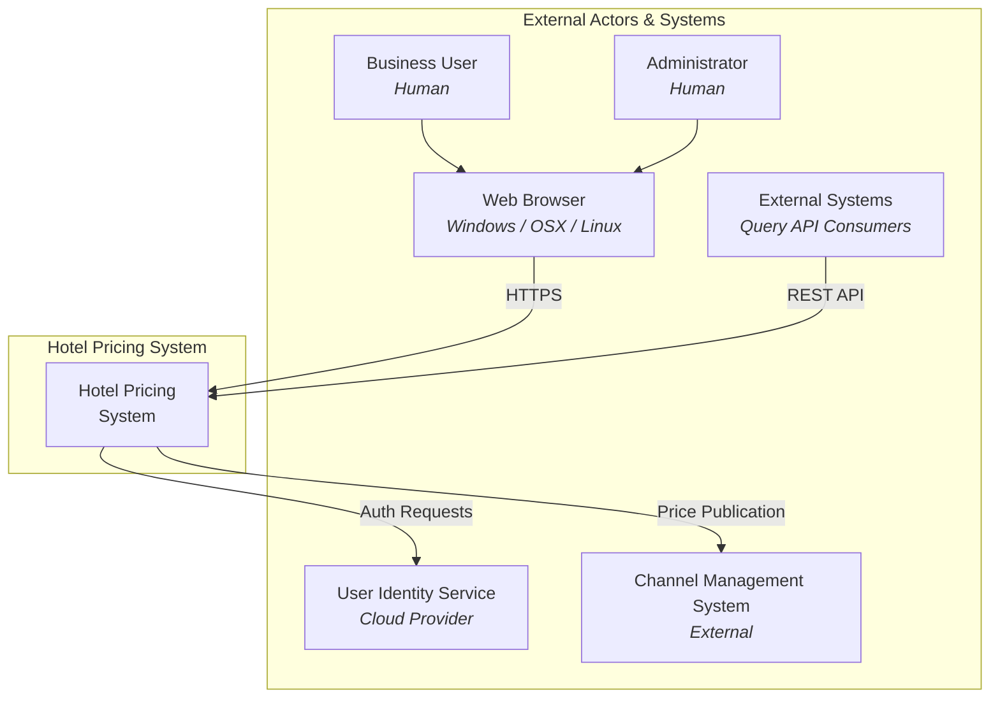
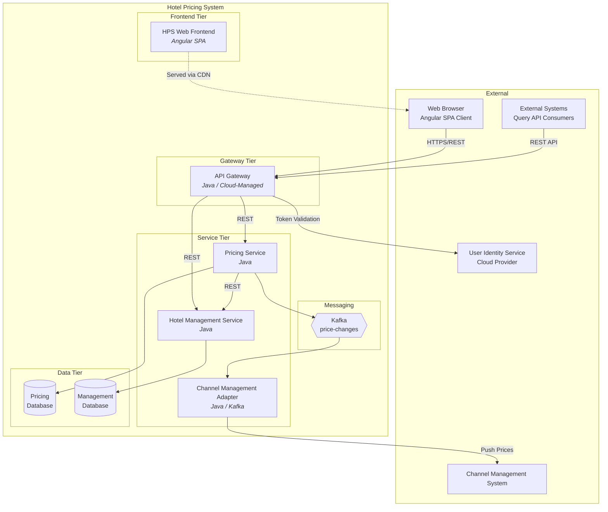
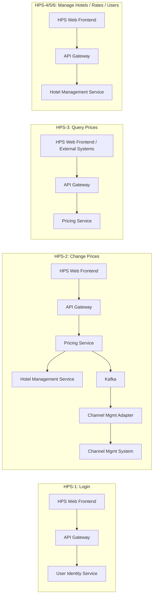

# ADD Step 6: Sketch Views and Perspectives (Iteration 1)

## View 1: System Context Diagram

The system context diagram shows the Hotel Pricing System as a single entity interacting with all external actors and systems identified in Step 3.



---

## View 2: Primary Module/Decomposition View

This view shows the top-level decomposition of the Hotel Pricing System into its 5 constituent architectural elements, their data stores, internal communication paths, and external integrations.



---

## View 3: Use Case Allocation View

This view maps each use case to the architectural elements involved, showing the flow through the system.



---

## View 4: Deployment View (Cloud-Native)

This deployment view illustrates the cloud-native deployment topology per CON-6. All services are containerized and deployed in the cloud, with the Angular SPA served via CDN.

```mermaid
graph TB
    subgraph "Cloud Environment"
        subgraph "CDN"
            CDN[Angular SPA<br/>Static Assets]
        end

        subgraph "Container Orchestration Cluster"
            subgraph "Gateway Pods"
                GW1[API Gateway<br/>Instance 1]
                GW2[API Gateway<br/>Instance 2]
            end

            subgraph "Pricing Pods"
                PS1[Pricing Service<br/>Instance 1]
                PS2[Pricing Service<br/>Instance 2]
            end

            subgraph "Management Pods"
                HMS1[Hotel Mgmt Service<br/>Instance 1]
            end

            subgraph "Adapter Pods"
                CMA1[Channel Mgmt Adapter<br/>Instance 1]
            end
        end

        subgraph "Managed Services"
            KAFKA_SVC[Managed Kafka<br/>Service]
            PDB_SVC[Managed Pricing<br/>Database]
            MDB_SVC[Managed Management<br/>Database]
            IDP[Cloud Identity<br/>Provider]
        end
    end

    subgraph "External"
        USERS[Users<br/>Browsers]
        EXT_API[External API<br/>Consumers]
        CMS_EXT[Channel Mgmt<br/>System]
    end

    USERS --> CDN
    USERS --> GW1
    USERS --> GW2
    EXT_API --> GW1
    EXT_API --> GW2

    GW1 --> PS1
    GW1 --> PS2
    GW2 --> PS1
    GW2 --> PS2
    GW1 --> HMS1
    GW2 --> HMS1

    PS1 --> PDB_SVC
    PS2 --> PDB_SVC
    HMS1 --> MDB_SVC

    PS1 --> KAFKA_SVC
    PS2 --> KAFKA_SVC
    KAFKA_SVC --> CMA1
    CMA1 --> CMS_EXT

    GW1 --> IDP
    GW2 --> IDP
```

---

## Summary of Views

| View | Type | Purpose |
|------|------|---------|
| System Context | Context Diagram | Define system boundary and external entities |
| Module/Decomposition | Component-and-Connector | Show top-level elements, their relationships, and data stores |
| Use Case Allocation | Allocation View | Trace use cases to architectural elements |
| Deployment | Deployment Diagram | Show cloud-native topology with containerization, scaling, and managed services |