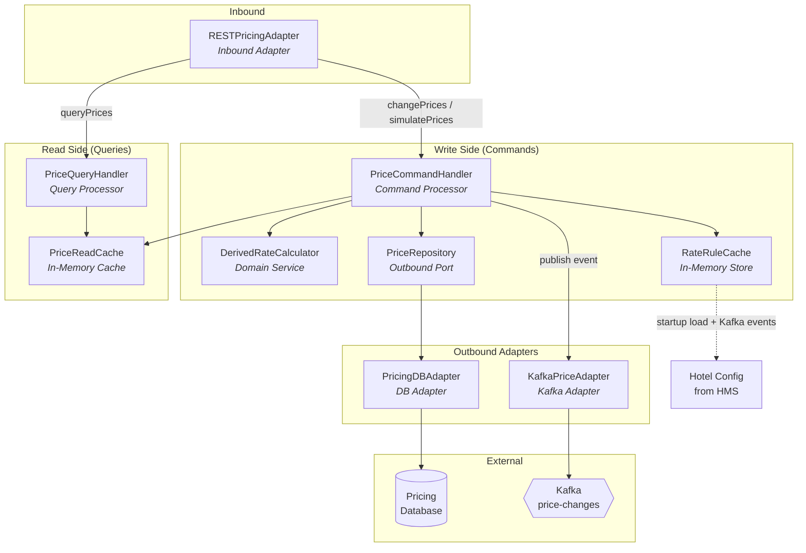
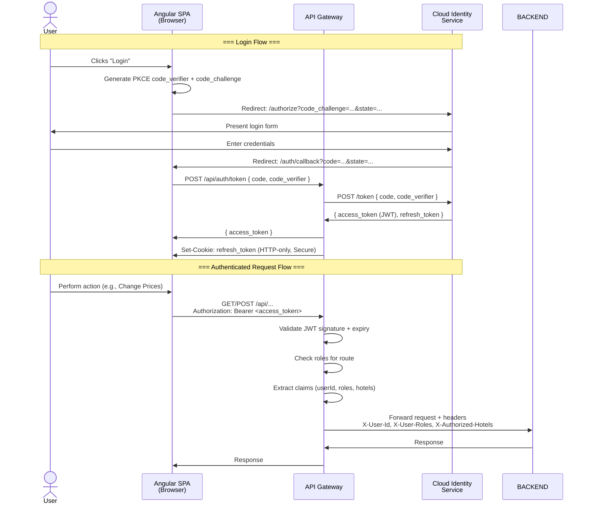
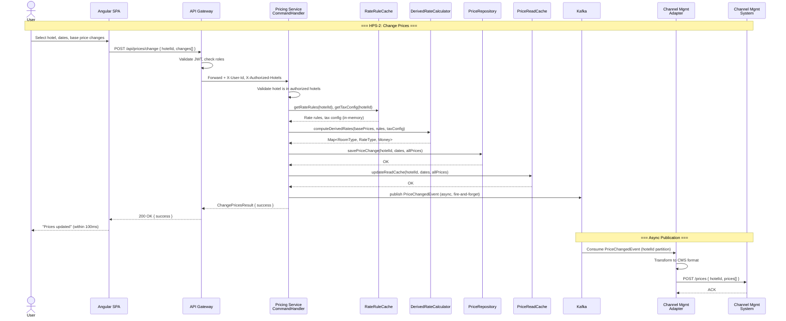
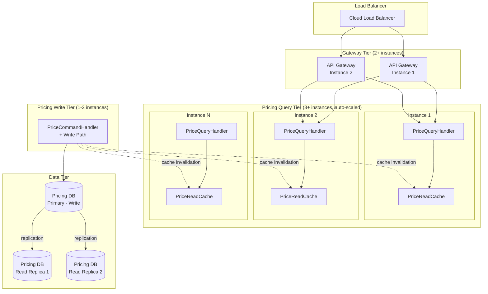
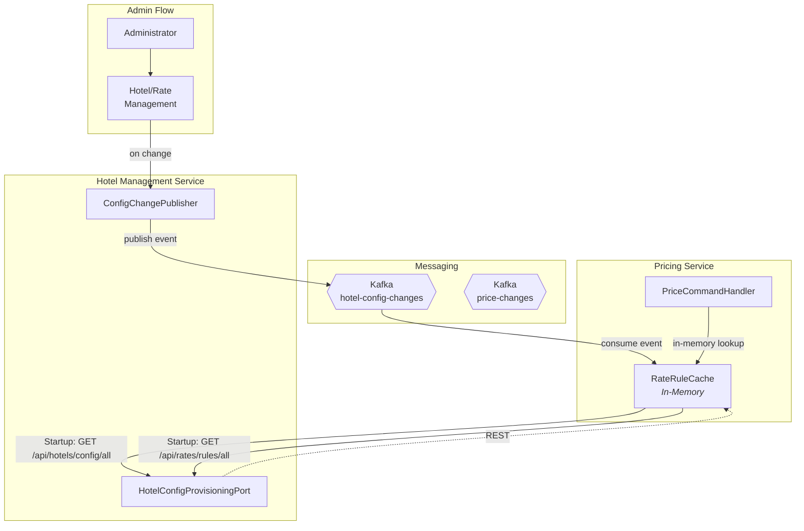
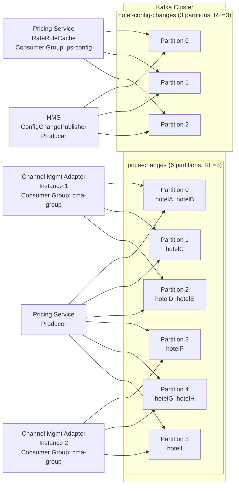

# ADD Step 6: Sketch Views and Perspectives (Iteration 2)

---

## View 1: Pricing Service Internal Structure (CQRS)

This view shows the internal decomposition of the Pricing Service using the CQRS pattern, with clear separation of write (command) and read (query) paths, and in-memory computation of derived rates.

---

## View 2: Authentication Flow (Sequence)

This sequence diagram shows the end-to-end OAuth2 Authorization Code flow with PKCE, from the user's browser through the Angular SPA, API Gateway, and Cloud Identity Service.

---

## View 3: Price Change Flow — Component Interaction (HPS-2)

This component interaction diagram shows the end-to-end flow for the Change Prices use case, tracing through all refined elements.

---

## View 4: Query Path Scalability (HPS-3)

This deployment view focuses on the query path, showing how stateless query handling and in-memory caches enable horizontal scaling for QA-4.

---

## View 5: Integration — Pricing Service ↔ Hotel Management Service

This view shows how the Pricing Service obtains hotel configuration and rate rules from the Hotel Management Service, including the caching and change notification mechanism.

---

## View 6: Kafka Topic and Consumer Topology

---

## Summary of Views

| View | Type | Primary Purpose |
|------|------|----------------|
| View 1: Pricing Service CQRS | Component Diagram | Internal structure of the critical Pricing Service |
| View 2: Authentication Flow | Sequence Diagram | End-to-end OAuth2/PKCE flow for QA-5 |
| View 3: Price Change Flow | Sequence Diagram | End-to-end HPS-2 flow through all refined elements |
| View 4: Query Path Scalability | Deployment Diagram | Horizontal scaling of read path for QA-4 |
| View 5: PS↔HMS Integration | Component Diagram | Cached reference data with change notification |
| View 6: Kafka Topology | Component Diagram | Topic partitioning, consumer groups |