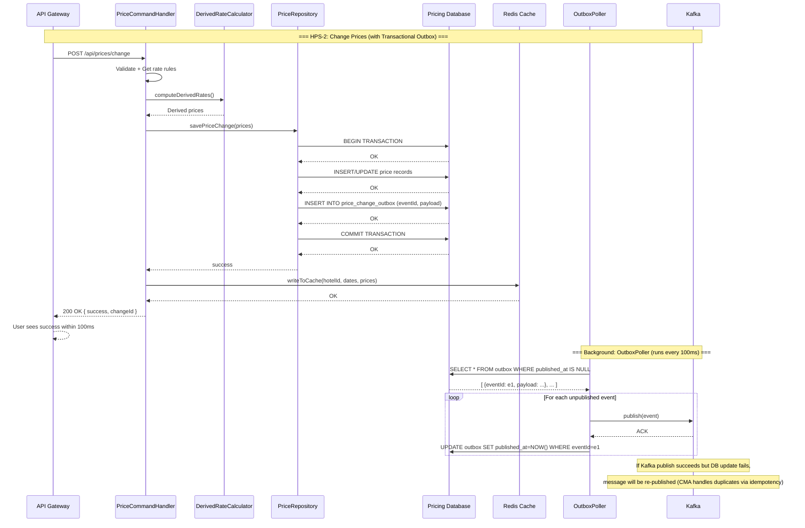
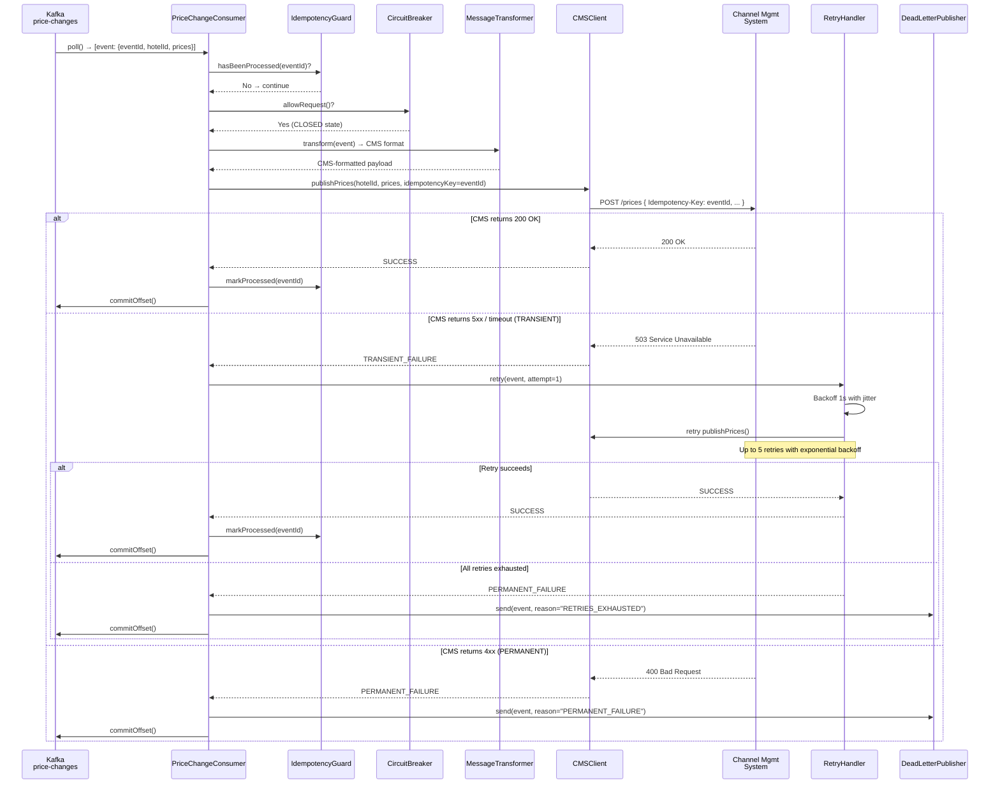
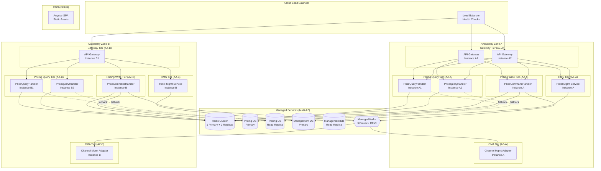
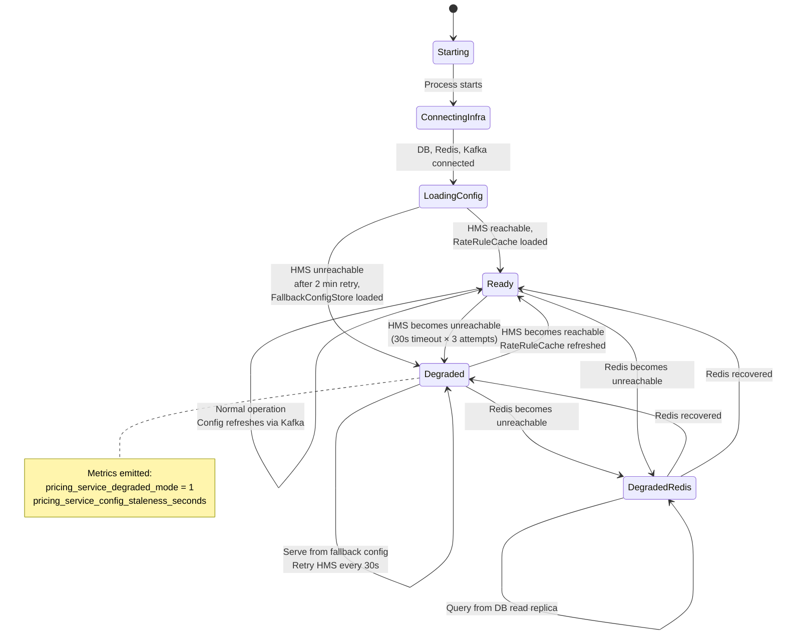
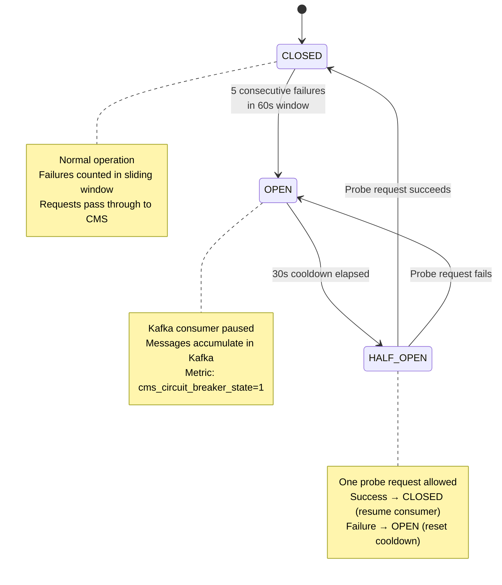
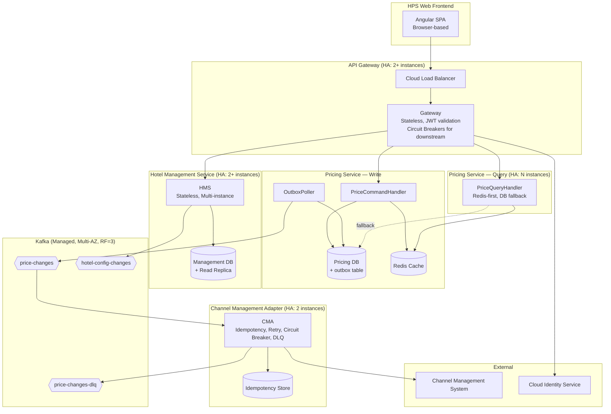

# ADD Step 6: Sketch Views and Perspectives (Iteration 3)

---

## View 1: Transactional Outbox — Reliable Price Publication

This sequence diagram shows how the Transactional Outbox pattern guarantees that every price change is published to Kafka, even in the face of failures.

---

## View 2: Channel Management Adapter — Reliable CMS Delivery

This sequence diagram shows how the CMA ensures guaranteed delivery to the Channel Management System with idempotency, retry, circuit breaker, and dead letter handling.

---

## View 3: High Availability Deployment Topology

This deployment view shows the multi-instance, multi-AZ deployment topology that achieves 99.9% availability (QA-3). All tiers are redundant.

---

## View 4: Pricing Service Startup and Degraded Mode

This state diagram shows the Pricing Service startup sequence and transitions between normal and degraded modes.

---

## View 5: Circuit Breaker State Machine (CMA)

---

## View 6: End-to-End Reliability — Component Overview

This diagram consolidates all reliability mechanisms across the system into a single view.

---

## Summary of Views

| View | Type | Primary Focus |
|------|------|---------------|
| View 1: Transactional Outbox | Sequence Diagram | Atomic DB+Kafka publication (QA-2) |
| View 2: CMA Reliable Delivery | Sequence Diagram | Idempotency, retry, circuit breaker, DLQ flow (QA-2) |
| View 3: HA Deployment Topology | Deployment Diagram | Multi-AZ redundancy for 99.9% uptime (QA-3) |
| View 4: Startup & Degraded Mode | State Diagram | Graceful startup and dependency failure handling (R1, R9) |
| View 5: Circuit Breaker | State Diagram | CMA circuit breaker states and transitions |
| View 6: End-to-End Reliability | Component Diagram | Consolidated view of all reliability mechanisms |