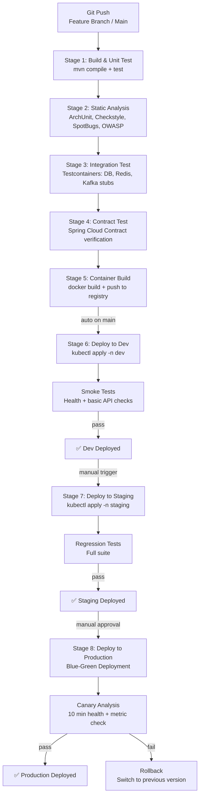
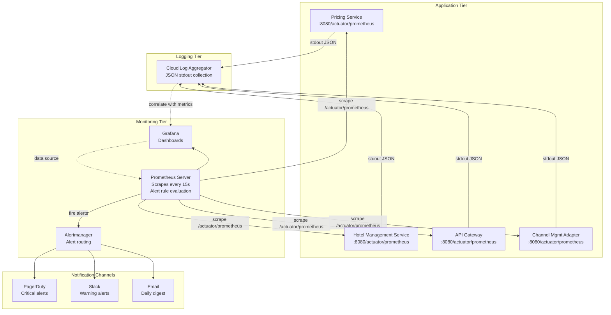
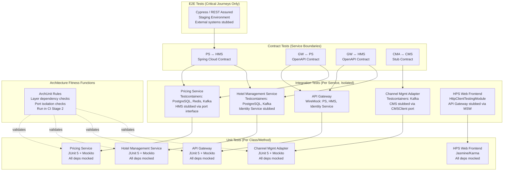
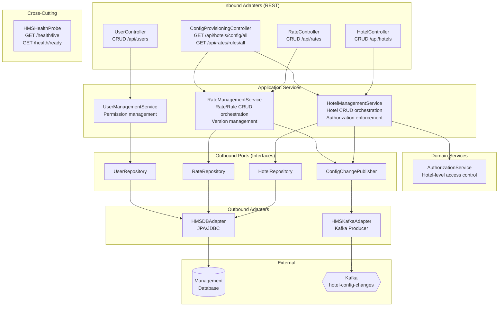
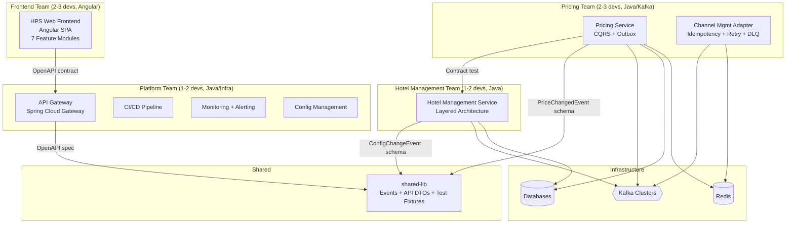

# ADD Step 6: Sketch Views and Perspectives (Iteration 4)

---

## View 1: CI/CD Pipeline Flow

This view shows the pipeline stages from commit to production for a backend service (applies to Pricing Service, HMS, CMA, and API Gateway).



---

## View 2: Monitoring and Observability Architecture

This view shows the monitoring stack: metrics collection, aggregation, dashboards, and alerting.



---

## View 3: Test Architecture — Layered Test Pyramid

This view shows the test layers, their scope, and the isolation mechanisms per QA-9.



---

## View 4: Hotel Management Service — Internal Structure

This view shows the completed internal design of the Hotel Management Service following layered architecture within Ports & Adapters.



---

## View 5: Team Structure and Ownership Map

This view aligns the development teams with the architectural elements, showing ownership boundaries and coordination points.



---

## View 6: Complete System Architecture — Consolidated View

This is the consolidated architecture diagram incorporating all design decisions from all four iterations.

```mermaid
graph TB
    subgraph "External"
        USERS[Users<br/>Browsers]
        EXT_API[External API<br/>Consumers]
        IDP[Cloud Identity<br/>Service]
        CMS[Channel Mgmt<br/>System]
    end

    subgraph "CDN"
        CDN[Angular SPA<br/>Static Assets]
    end

    subgraph "API Gateway Tier (HA: 2+)"
        GW_LB[Cloud Load Balancer]
        GW[Spring Cloud Gateway<br/>Java<br/>Auth, Rate Limit, Circuit Breaker]
    end

    subgraph "Service Tier"
        subgraph "Pricing Service (CQRS)"
            PS_WRITE[Write Path<br/>CommandHandler + OutboxPoller]
            PS_QUERY[Query Path<br/>QueryHandler (HA: N instances)]
        end
        subgraph "Hotel Management Service (HA: 2+)"
            HMS_SVC[HMS<br/>Layered Architecture<br/>Hotels, Rates, Users]
        end
        subgraph "Channel Mgmt Adapter (HA: 2)"
            CMA_SVC[CMA<br/>Idempotency, Retry, CB, DLQ]
        end
    end

    subgraph "Data Tier (Managed, Multi-AZ)"
        PDB[(Pricing DB<br/>+ outbox)]
        MDB[(Management DB<br/>+ read replica)]
        REDIS_CLUSTER[(Redis Cluster<br/>Cache + Idempotency)]
    end

    subgraph "Messaging (Managed, Multi-AZ, RF=3)"
        KAFKA_PC{{price-changes}}
        KAFKA_CFG{{hotel-config-changes}}
        KAFKA_DLQ{{price-changes-dlq}}
    end

    subgraph "Operations Tier"
        PROM[Prometheus]
        GRAFANA[Grafana]
        CICD[CI/CD Pipeline]
    end

    USERS --> CDN
    USERS --> GW_LB
    EXT_API --> GW_LB
    GW_LB --> GW
    GW -->|JWT validation| IDP

    GW -->|REST| PS_WRITE
    GW -->|REST| PS_QUERY
    GW -->|REST| HMS_SVC

    PS_WRITE --> PDB
    PS_WRITE --> REDIS_CLUSTER
    PS_WRITE -->|OutboxPoller| KAFKA_PC
    PS_QUERY --> REDIS_CLUSTER
    PS_QUERY -.->|fallback| PDB

    HMS_SVC --> MDB
    HMS_SVC --> KAFKA_CFG

    KAFKA_PC --> CMA_SVC
    KAFKA_CFG --> PS_WRITE
    CMA_SVC --> KAFKA_DLQ
    CMA_SVC --> CMS
    CMA_SVC --> REDIS_CLUSTER

    PS_WRITE -->|metrics| PROM
    PS_QUERY -->|metrics| PROM
    HMS_SVC -->|metrics| PROM
    GW -->|metrics| PROM
    CMA_SVC -->|metrics| PROM
    PROM --> GRAFANA

    CICD -.->|deploys| GW
    CICD -.->|deploys| PS_WRITE
    CICD -.->|deploys| PS_QUERY
    CICD -.->|deploys| HMS_SVC
    CICD -.->|deploys| CMA_SVC
    CICD -.->|deploys| CDN
```

---

## Summary of Views

| View | Type | Primary Focus |
|------|------|---------------|
| View 1: CI/CD Pipeline | Flow Diagram | Build → Deploy pipeline stages (CRN-5) |
| View 2: Monitoring Architecture | Component Diagram | Metrics collection, dashboards, alerting (QA-8) |
| View 3: Test Architecture | Layered Diagram | Test pyramid with isolation mechanisms (QA-9) |
| View 4: HMS Internal Structure | Component Diagram | Completed HMS internal design (HPS-4/5/6) |
| View 5: Team Ownership Map | Allocation Diagram | Architecture-to-team mapping (CRN-3) |
| View 6: Consolidated Architecture | Component Diagram | Complete system architecture from all 4 iterations |