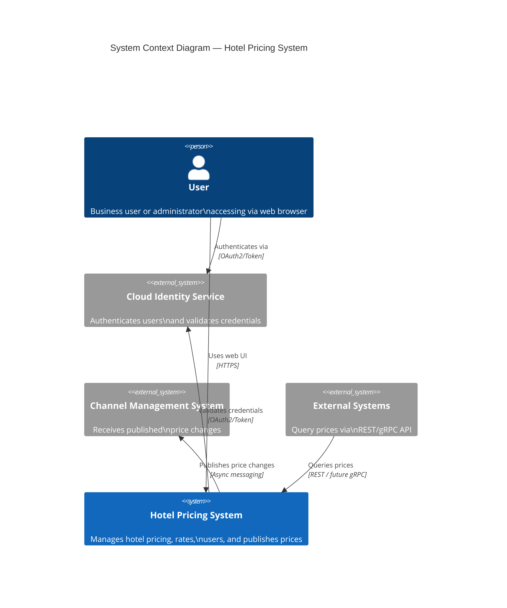

# ADD Step 3: Choose System Elements to Refine

## Iteration 1

### Context

This is a greenfield development — the system does not yet exist. Per ADD 3.0 guidance, for greenfield systems we start by establishing the system context, then select the only available element: the **system itself** (the "Hotel Pricing System" as a black box). The iteration goal is to decompose this single element into a top-level structure.

### Element Selected for Refinement

**Element**: `Hotel Pricing System` (the entire system as a single black-box element)

### Rationale

- This is the first design iteration for a greenfield system. No pre-existing architectural elements exist to refine.
- The system is treated as a single element whose boundaries and external interactions must first be understood before internal decomposition.
- The selected drivers (CRN-1, QA-5, QA-4/QA-1, QA-6, QA-2, CRN-2, CON-2/CON-6, CON-1, CON-5) all apply at the system level.

### System Context (External Entities)

Before decomposing the system internally, we identify all external entities the system interacts with:

| External Entity | Interaction Type | Related Drivers / Use Cases |
|-----------------|-----------------|-----------------------------|
| **User (Web Browser)** | Human user interacting via browser (Windows, OSX, Linux) | CON-1, HPS-1 through HPS-6 |
| **Cloud Identity Service** | Authentication and user identity validation | CON-2, QA-5, HPS-1 |
| **Channel Management System** | Pushed price changes | HPS-2, QA-2 |
| **External Systems (Query API consumers)** | Query prices via REST API (future gRPC) | HPS-3, QA-4, CON-5, QA-6 |

### System Context Diagram

### What We Will Decompose Into

In Step 4, we will select design concepts that decompose the `Hotel Pricing System` into a set of top-level architectural elements. Based on the drivers selected in Step 2, the decomposition must produce elements that:

1. Separate the **user-facing frontend** from the backend (browser-based UI — CON-1; Angular — CRN-2).
2. Separate **read (query)** and **write (command)** concerns to enable independent scaling (QA-4, QA-1).
3. Isolate **core business logic** behind a ports-and-adapters boundary for protocol independence (QA-6, CON-5).
4. Use **asynchronous messaging** for reliable publication to the channel management system (QA-2, CRN-2 — Kafka).
5. Integrate with the **cloud identity service** for authentication (CON-2, QA-5).

---

## Self-Reflection (Step 3)

- **Whether only prior knowledge was used**: Yes. The system context entities (Users, Cloud Identity Service, Channel Management System, External Systems) are all derived directly from the use cases and constraints in the prior knowledge. No external entities were invented.
- **Whether current iteration drivers are addressed**: Yes. The system context diagram captures all external interactions driven by the selected drivers (CON-1 → browser users; CON-2/QA-5 → identity service; QA-2/HPS-2 → channel management; QA-4/CON-5/HPS-3 → external API consumers). The planned decomposition directions map directly to the selected drivers.
- **Whether diagrams use correct Mermaid/PlantUML format**: Yes. A C4Context diagram is used with correct Mermaid syntax for system context modeling.
- **Whether any undeclared assumptions were made**: None. All external entities and interactions are documented in the use cases (HPS-1 through HPS-6) and quality attribute scenarios.
